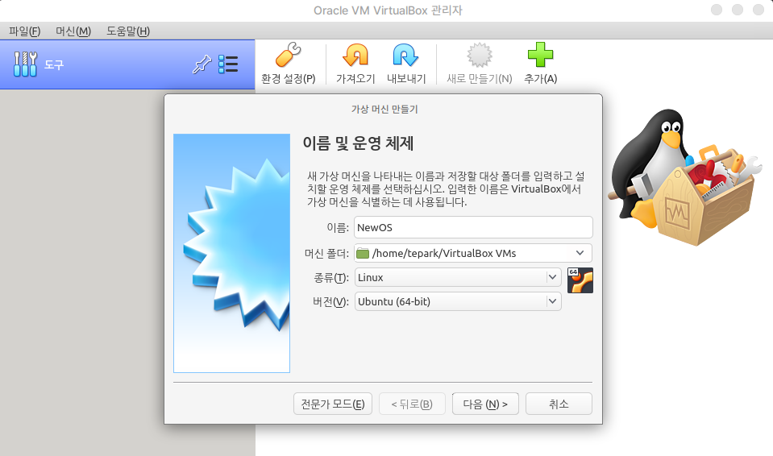
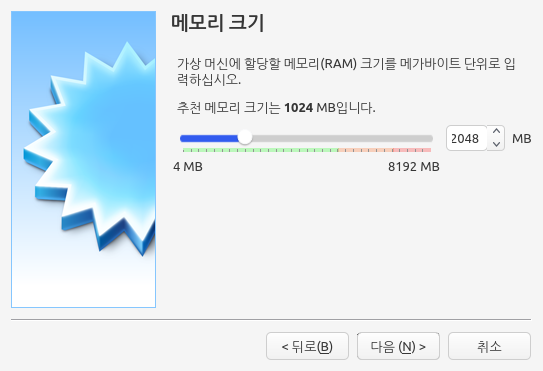
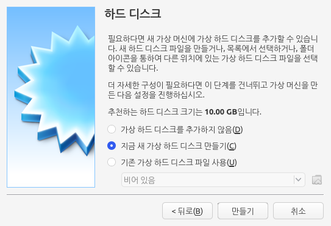
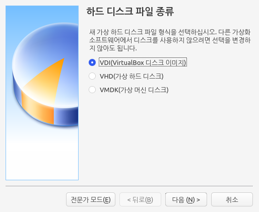
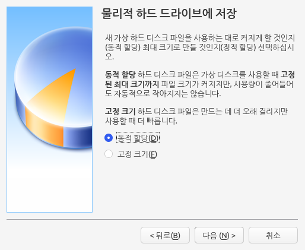
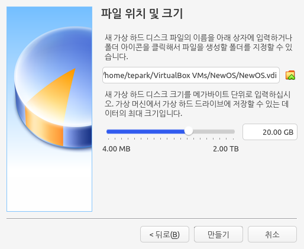
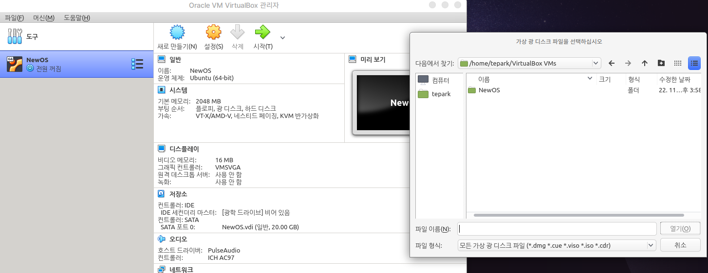
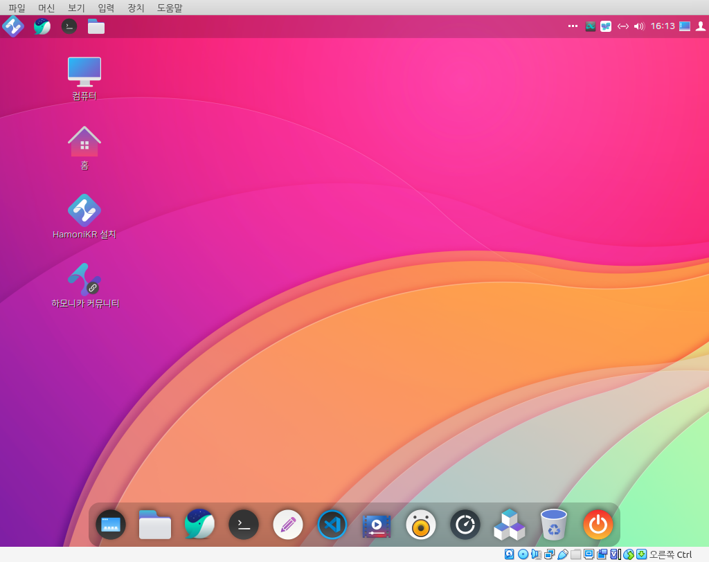

# VirtualBox

버추얼박스(VirtualBox)는 리눅스, MacOS, 윈도우 등을 게스트 운영체제로 가상화하는 x86 가상화 소프트웨어입니다.&#x20;

사용중인 노트북이나 PC에서 다른 운영체제를 체험해보고 싶거나, 새로운 운영체제를 설치하기 전에 버추얼박스를 활용하여 운영체제 환경을 경험해볼 수 있습니다.&#x20;

## 실행

버추얼박스를 실행하고 새로만들기를 선택합니다. 가상머신의 이름과 종류를 선택합니다.&#x20;

<figure><figcaption></figcaption></figure>

다음을 선택하여 메모리의 크기를 설정합니다. 2048MB를 권장합니다.&#x20;

<figure><figcaption></figcaption></figure>

다음을 설택하여 '지금 새 가상 하드 디스크 만들기'를 선택합니다.&#x20;

<figure><figcaption></figcaption></figure>

'만들기'를 눌러 하드디스크 파일 종류 VDI(VirtualBox 디스크 이미지)를 선택합니다.&#x20;

<figure><figcaption></figcaption></figure>

다음을 눌러 '동적 할당' 을 선택합니다.&#x20;

<figure><figcaption></figcaption></figure>

다음을 눌러 파일이 생성될 위치와 가상머신의 크기를 설정합니다.&#x20;

<figure><figcaption></figcaption></figure>

이제 '저장소' 메뉴에서 설치할 운영체제의 설치 파일(.iso 등)을 불러들여 설치를 시작합니다.&#x20;

<figure><figcaption></figcaption></figure>

운영체제 설치를 위한 ISO 파일을 불러들여 가상머신을 시작하면 설치가 시작됩니다.&#x20;

<figure><figcaption></figcaption></figure>
