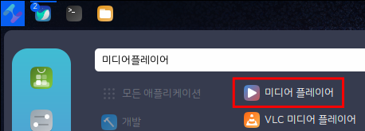
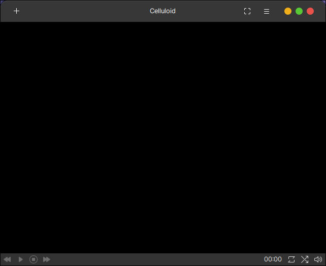
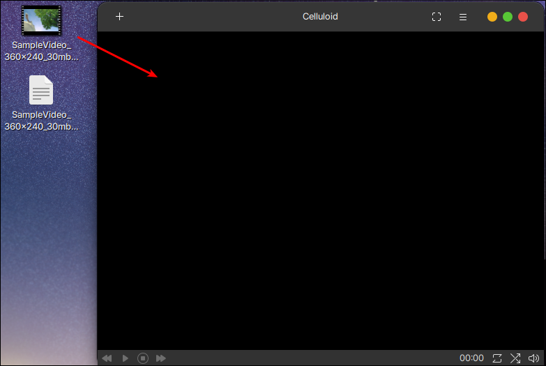
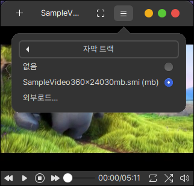
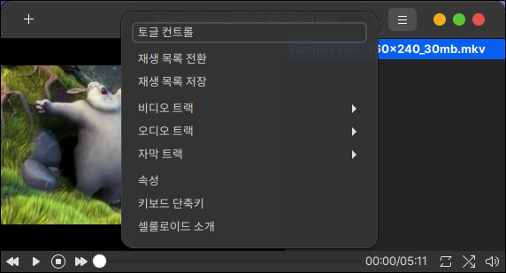

# 미디어 플레이어 (Celluloid)

## 설치

터미널을 열어 다음과 같이 입력합니다.

```bash
sudo apt install celluloid
```

## 실행

Celluloid는 최근에 생긴 오픈소스 미디어 플레이어 입니다.

지금도 꾸준한 오픈소스 활동이 이루어지고 있으며 버그 수정과 추가 기능들이 생겨나고 있습니다.

하모니카 팀에서 사용하기 쉽도록 한글로 번역하였습니다.

<figure><figcaption></figcaption></figure>

Celluloid 실행화면입니다.

좌측 상단의 + 버튼을 눌러 동영상을 실행할 수 있습니다.

우측 상단의 ... 버튼을 눌러 재생 목록을 열거나, 자막설정, 환경설정 등을 변경하실 수 있습니다.

<figure><figcaption></figcaption></figure>

드래그 앤 드롭으로 동영상을 실행할 수 있습니다.

<figure><figcaption></figcaption></figure>

&#x20;동영상 파일의 이름과 자막파일의 이름이 동일하고 같은 폴더에 있다면 자동으로 자막이 등록됩니다.

<figure><figcaption></figcaption></figure>

**재생목록 전환** : 우측에 재생 목록 창을 보이게 하는 기능입니다.

**자막 트랙** : 자막 파일을 선택하여 등록하는 부분입니다.

**속성** : Celluloid의 전반적인 인터페이스 화면과 옵션 등을 설정해 줄 수 있습니다.

**키보드 단축키** : Celluloid에서 사용할 수 있는 단축키 조합을 모아놓은 도움말입니다.

<figure><figcaption></figcaption></figure>
