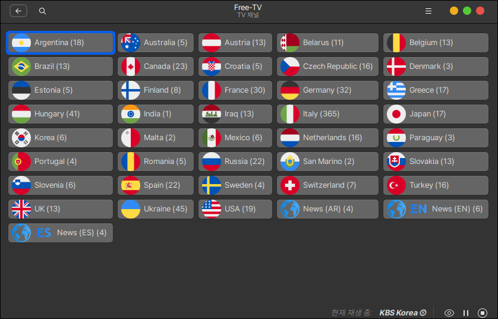

# IPTV 보기

전 세계의 TV를 인터넷으로 볼 수 있는 IPTV 프로그램입니다.

## 설치

터미널에서 다음과 같이 입력하여 프로그램을 설치합니다.

```
sudo apt install hypnotix
```

## 실행

설치가 완료되면 음악과 비디오 메뉴에 IPTV 보기가 표시됩니다.

<figure><figcaption></figcaption></figure>

IPTV에서 약 1000개가 넘는 전 세계의 TV채널을 시청할 수 있습니다.

<figure><figcaption></figcaption></figure>

국가를 선택 후 첫 화면 왼쪽 TV 아이콘을 클릭하면 시청이 가능한 국가별 TV채널 목록이 나타납니다.

<figure><figcaption></figcaption></figure>
