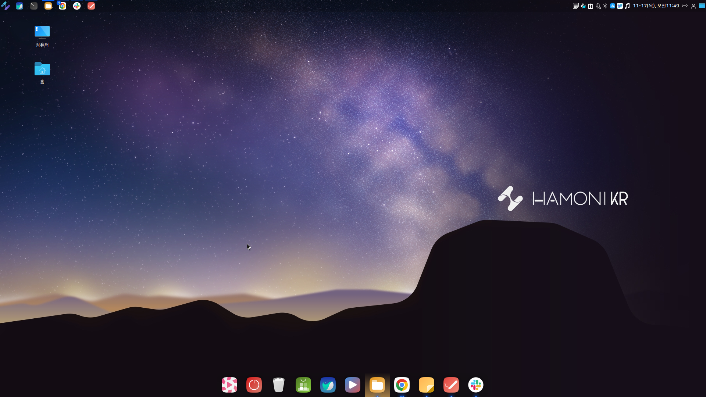
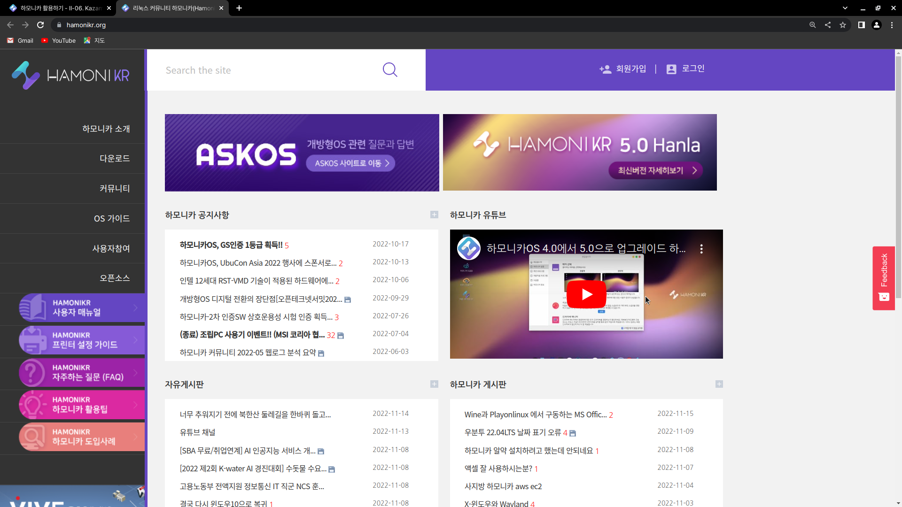

# Kazam

&#x20;Kazam은 화면의 내용을 캡처하고 VP8/WebM 비디오 포맷을 지원하는 비디오 플레이어에 의해 재생할 수 있는 비디오 파일을 기록하는 간단한 화면 녹화 프로그램입니다.

### 1. 화면 구성

<figure><figcaption></figcaption></figure>

* File : 세부 설정을 하거나 종료합니다.
* Help : 프로그램 정보를 보여줍니다.
* Screencast : 화면을 녹화합니다.
* Screenshot : 화면을 저장합니다.
* Fullscreen : 1개의 모니터 화면
* All Screens : 2개 이상의 모니터&#x20;
* Window : 현재 작업중인 창 선택
* Area : 현재 화면의 일부분 선택
* 캡처 시작 전 대기시간 선택 - 5초(초기값), "+-"버튼으로 변경&#x20;
* Capture : 버튼 클릭시 Screencast 또는 Screenshot 작업을 시작합니다.

&#x20;

### 2. 설정

화면 좌측 상단의 File -> Preferences를 클릭하면 설정 화면이 보여집니다.&#x20;

**일반 (General)**

<figure><figcaption></figcaption></figure>

* 발언자 : 사운드 장치 선택 및 소리의 크기를 조절합니다.&#x20;
* 마이크로폰 : 마이크 장치 선택 및 소리의 크기를 조절합니다.
*   &#x20;countdown splash (켬/끔) : 캡처 시작전 카운트다운(대기시간)을 화면에 보여주거나(켬)

    &#x20;                                                보이지 않게(끔) 선택합니다.

**Screencast (스크린캐스트) - 화면을 동영상으로 녹화하여 저장**

<figure><figcaption></figcaption></figure>

* 프레임 속도 : 녹화시 초당 프레임 수를 조절합니다.
* 녹음하기 : 녹화 파일의 유형을 선택합니다. (_※ 권장 : **H264(MP4)**로 설정하여 사용하십시오.)_&#x20;
* &#x20;Automatic file saving : 녹화한 파일의 저장방식을 자동(켬)으로 할 것인지 수동(끔)으로 할 것인지 선택합니다.

**Screenshot - 화면을 정지된 사진(그림)으로 촬영하여 저장**

<figure><figcaption></figcaption></figure>

* Shutter sound (켬/끔) : 스크린샷 사용시 셔터 소리를 켜거나 끕니다.
* Shutter type : 셔터의 유형을 선택합니다.
* Automatic file saving (켬/끔) : 캡처 파일의 저장방식을 자동(켬)으로 할 것인지 수동(끔)으로 할 것인지 선택합니다.&#x20;

&#x20;                                       &#x20;

### 3. 전체화면, 창, 범위의 차이

a. 전체화면 : 현제 디스플레이에서 출력되는 전체 화면으로 대상으로 녹화하거나 캡처합니다.

<figure><figcaption></figcaption></figure>

b. 창 : 현재 디스플레이에서 출력되는 프로그램 창을 지정하여 해당 창만을 녹화, 캡처합니다.

<figure><figcaption></figcaption></figure>

&#x20;※ 창 선택 방법

Kazam 프로그램 창에서 "창"버튼을 클릭하면 선택화면(아래)이 나타납니다. 여기서, 녹화 또는 캡처할 프로그램 창의 위치를 마우스로 클릭합니다. "esc"를 클릭하면 취소됩니다.

_<주의> 디스플레이 및 그래픽카드의 성능에 따라 배경화면이 보이지 않을 수 있습니다._

<figure><figcaption></figcaption></figure>

c. 범위 : 현재 디스플레이에서 출력되는 화면에서 지정한 일부분을 대상으로 녹화, 캡처합니다.

※ 범위 선택 방법

* Kazam 프로그램 창에서 "범위"버튼을 클릭하면 선택화면(아래)이 나타납니다. 여기서, 녹화또는 캡처할 범위를 마우스 클릭후 드레그합니다. 범위 지정이 완료되면 "Enter"를 클릭합니다.&#x20;
* "enter"를 클릭하기 전 까지는 해당 범위의 이동 및 축소, 확대하여 수정할 수 있습니다 "esc"를 클릭하면 취소됩니다.

_<주의> 디스플레이 및 그래픽카드의 성능에 따라 배경화면이 보이지 않을 수 있습니다._

<figure><figcaption></figcaption></figure>

### 4. 스크린캐스트 또는 스크린샷 사용하기

1\. 화면을 동영상으로 녹화(스크린캐스트)할 것인지 화면을 촬영(스크린샷)할 것인지 선택합니다.

2\. 대상 범위(전체화면, 창, 범위 중 택일)를 선택합니다.

3\. 추가 옵션을 선택합니다. (변경이 필요한 경우)

&#x20;      ※ 녹화전 파일 형식이 MP4 형식인지 확인하십시오.

4\. "Capture"버튼을 클릭하여 선택한 작업(녹화 또는 촬영)을 시작합니다.

### 5. 종료하기

**스크린캐스트(화면 녹화) 종료**

a. 녹화가 시작되면, 알림영역에 카잠 아이콘이 "빨간색(REC)"으로 점등됩니다.

b. 알림영역의 아이콘을 우클릭하면 메뉴가 나타납니다.

* 기록 잠시 중지 : 일시 정지 기능입니다.
* 모든 기록 마침 : 현재 녹화중인 작업을 종료합니다.

<figure><figcaption></figcaption></figure>

c. "모든 기록 마침"을 클릭하면 \[Recording finished]창이 나타납니다.&#x20;

* 취소 : 녹화된 내용을 저장하지 않고 종료합니다.
* 계속하기 : 녹화된 내용을 저장합니다.

d. "계속하기"를 클릭하여 \[스크린캐스트 저장하기]창에서 원하는 파일명을 입력하고 "저장"버튼을 클릭합니다. \
※ \[설정]-\[Screencast]-\[Automatic file saving]을 "켬"으로 한 경우에는 자동으로 지정된 폴더와 이름으로 저장합니다.

**스크린샷(화면 촬영) 종료**

1\. 화면 촬영이 종료되면, \[녹화 저장]창이 나타납니다.

2\. 원하는 이름과 폴더를 지정하고 "저장"버튼을 클릭하여 종료합니다.
