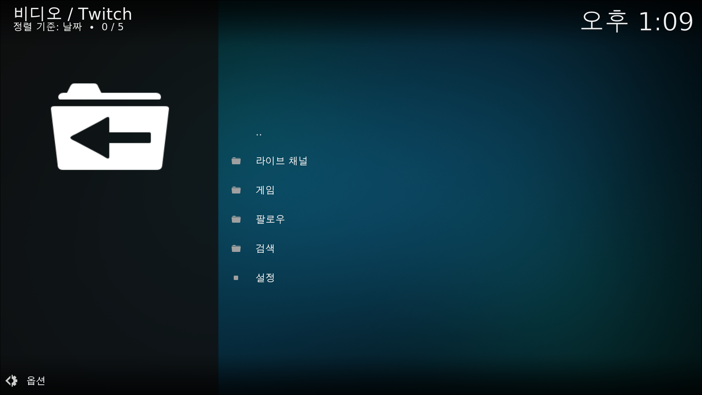

# Kodi (코디)


해당 문서는 코디 19.4 버전을 기준으로 작성되었습니다.

아래의 저장소 추가를 하여 설치하지 않는 경우 18.6 버전이 설치 되며 한글 변환에 문제가 있습니다.


코디는 PC에 있는 동영상이나 음악 사진등을 볼 수 있는 프로그램 입니다.

애드온 기능으로 일반 TV 방송, 라디오, 콘솔게임, 트위치, 유튜브 방송, 영화 등을 추가하여 볼 수 있습니다.

애드온은 코디에서 공식으로 지원하는 애드온이 존재하며 따로 애드온을 추가하여 사용하는 방법이 있습니다.

## 설치

```
# 저장소 추가 및 갱신
sudo add-apt-repository -y ppa:team-xbmc/ppa
sudo apt update

# 코디 설치
sudo apt install kodi
```

## 실행

시작메뉴에서 코디를 검색하여 확인하실 수 있습니다.

<figure><figcaption></figcaption></figure>

### 한글 설정

코디를 실행하면 가장먼저 해야할 일은 국가별 사용 언어를 선택하는 것입니다.

검색을 위해 키보드 자판의 언어도 추가적으로 설정을 해야 합니다.

아래 화면에서 보이는 톱니바퀴를 클릭합니다.

<figure><figcaption></figcaption></figure>

Sytem에 Interface 버튼을 클릭합니다.

<figure><figcaption></figcaption></figure>

먼저 첫번째 항목인 스킨(Skin) 탭에서 Fonts를 Arial based로 변경합니다.

Arial based를 설정하지 않고 한글을 변경시 글씨가 깨져서 내용을 확인할 수 없는 문제가 발생합니다.

<figure><figcaption></figcaption></figure>

두번째 탭인 지역(Regional)로 이동하 언어(Language) 항목을 Korean으로 변경합니다.

변경이 완료되면 인터페이스가 한국어로 표시가 됩니다.

추가적으로 키보드 레이아웃(Keyboard layout) 설정에 Korean을 추가하여 한국어 키보드를 사용할 수 있게 진행합니다.

<figure><figcaption></figcaption></figure>

### 애드온 설치(트위치)

여러가지 애드온이 있지만 대중적 인터넷 방송인 트위치를 설치하고 실행해 보겠습니다.

먼저 기본 화면에서 애드온을 선택해야 합니다.

<figure><figcaption></figcaption></figure>

애드온을 다운받아야 합니다.

다운로드를 선택합니다.

<figure><figcaption></figcaption></figure>

아래쪽으로 내리다보면 Twitch가 존재합니다.

클릭합니다.

<figure><figcaption></figcaption></figure>

설치 버튼을 누릅니다.

<figure><figcaption></figcaption></figure>

열기 버튼을 누릅니다.

<figure><figcaption></figcaption></figure>

OAuth 토큰이 필요하다는 메세지가 나옵니다.

코디에서 트위치를 시청하려면 자신의 계정에 로그인이 필요하고 애드온의 로그인 방식은 OAuth 토큰을 사용해서 로그인하기 때문입니다.

<figure><figcaption></figcaption></figure>

설정을 눌러줍니다.

<figure><figcaption></figcaption></figure>

OAuth 토큰은 받은 토큰을 입력해주는 곳입니다.

먼저 OAuth 토큰을 가져와야 하기 때문에 아래에 있는 OAuth 토큰을 클릭합니다.

<figure><figcaption></figcaption></figure>

OAuth 토큰을 받기위해서는 트위치에 먼저 로그인을 하고 아래의 주소로 접속해달라는 팝업창이 나옵니다.

<figure><figcaption></figcaption></figure>

트위치에 로그인 하고 해당 페이지로 접속시 연동에 동의 하는 페이지가 나오며 동의시 아래와 같이 OAuth Token 이라는 항목 토큰이 표시됩니다.

해당 내용을 복사해서 사용할 수 있으면 좋겠지만 복사가 되지 않기 때문에 일일히 입력을 해줘야 하는 문제가 있습니다.

해당 토큰은 유지가 되기 때문에 **보안에 주의**하시기 바랍니다.

<figure><figcaption></figcaption></figure>

받은 토큰을 이전 로그인 창의 OAuth 토큰 눌러 입력하고 확인을 눌러 주고 다시 열기 버튼을 눌러 다음 창이 나오면 정상적으로 로그인이 된 것입니다.

일반적인 라이브채널, 게임채널을 직접 선택하실 수 있고 팔로우 해놨던 사람이 방송중이라면 팔로우 항목에서 확인하실 수 있으며 직접 검색을 하실 수 있습니다.

<figure><figcaption></figcaption></figure>

다음과 같이 현재 방송중인 목록이 뜹니다.

시청하고자 하는 방송을 클릭합니다.

<figure><figcaption></figcaption></figure>

직접 해상도를 선택하는 부분이 존재합니다.

아쉽게도 최근 트위치가 한국에서는 망 사용료 문제로 인해 1080p 시청을 제거했기 때문에 코디에서도 720p 까지만 시청하실 수 있습니다.

<figure><figcaption></figcaption></figure>

로딩될때까지 잠시 기다립니다.

<figure><figcaption></figcaption></figure>

영상을 시청하실 수 있습니다.

<figure><figcaption></figcaption></figure>
