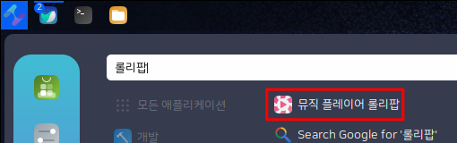
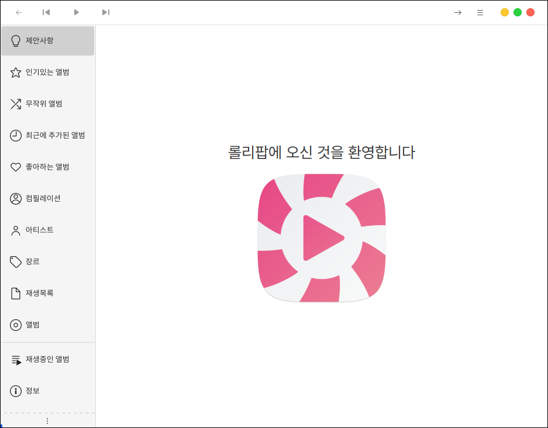
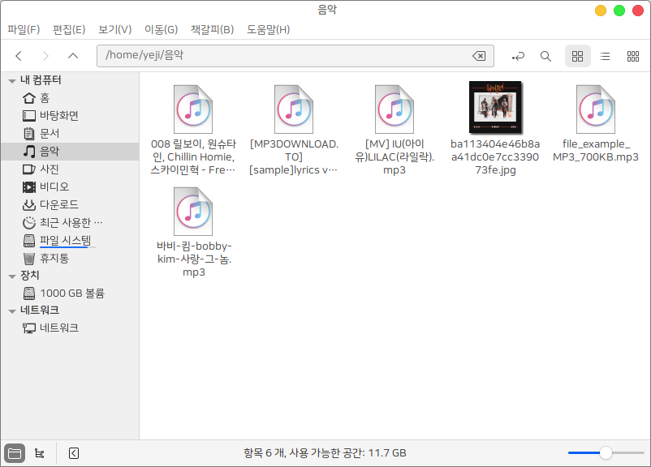
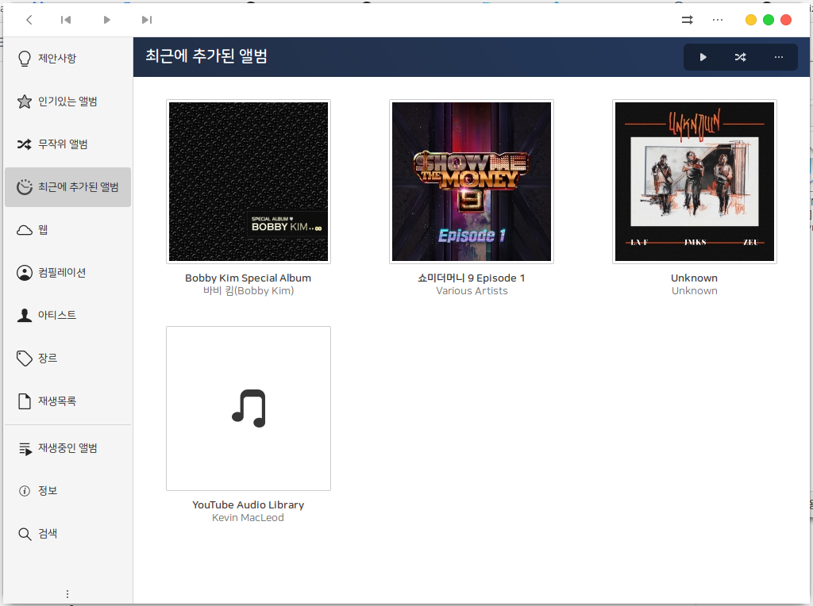
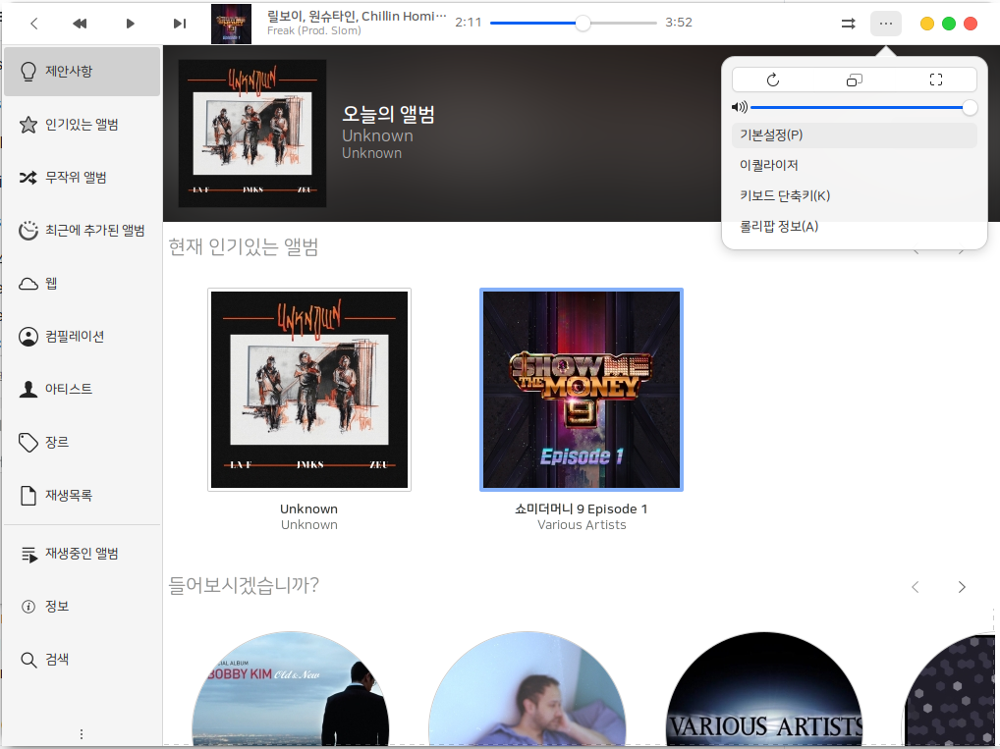
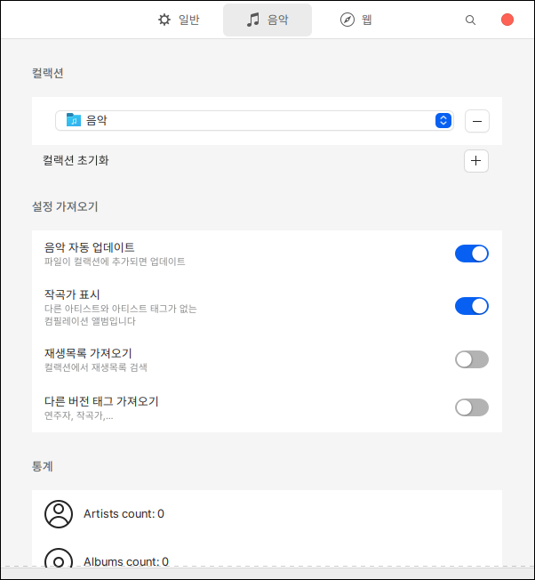
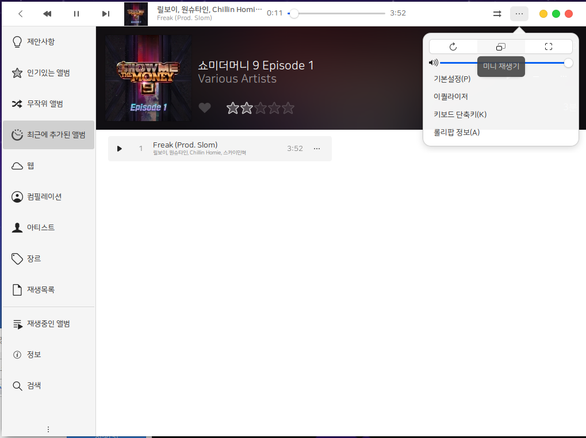
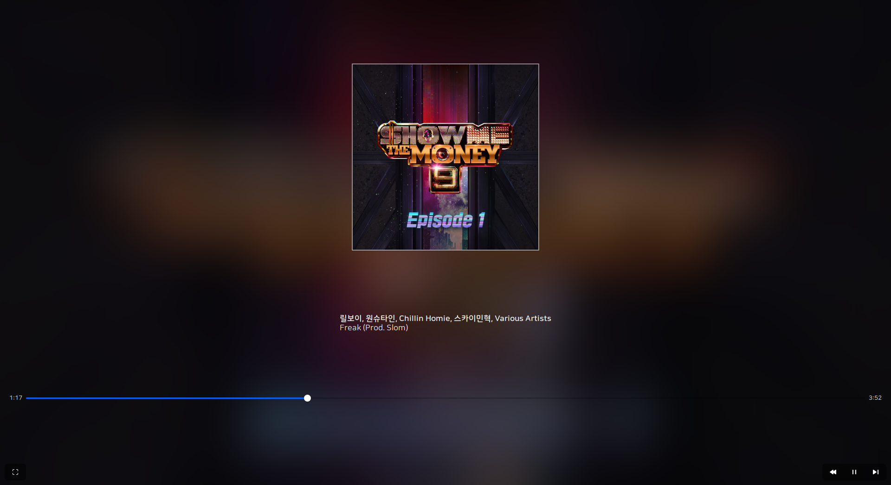

# 뮤직 플레이어 롤리팝

## 설치

```bash
sudo apt install lollypop
```

## 실행

롤리팝은 하모니카에 기본으로 설치되어 있는 음악 플레이어 입니다.

시작메뉴에서 검색창에 롤리팝을 입력하면 쉽게 찾을 수 있습니다.

<figure><figcaption></figcaption></figure>

처음 실행시 다음과 같이 막대사탕 아이콘이 뱅글뱅글 돌면서 시작됩니다.

화면이 작은 경우 좌측 메뉴만 나오거나 우측 막대상자만 나오기 때문에 큰 화면에서 설정하는것이 좋습니다.

<figure><figcaption></figcaption></figure>

### 음악추가

mp3, mp4, ogg, flac 등 다양한 형식의 음악파일을 음악 폴더 안에 저장 가능합니다.

<figure><figcaption></figcaption></figure>

음악 폴더에 넣고나서 롤리팝을 확인하면 상단에 새로고침 버튼이 나오게 되고 누르게 되면 앨범이 추가됩니다.

<figure><figcaption></figcaption></figure>

### 음악 저장 위치 변경

음악 폴더가 아닌 다른 위치에 음악 파일을 저장하고 플레이어로 사용할 수 있습니다.

또한 특정 폴더를 추가로 지정할 수도 있습니다.

프로그램 상단의 ... 아이콘을 클릭한 후 기본설정을 클릭하여 설정 창을 엽니다.

<figure><figcaption></figcaption></figure>

컬렉션의 음악 항목을 다른 곳으로 이동하거나 + 버튼을 이용하여 폴더를 추가합니다.

<figure><figcaption></figcaption></figure>

### 다양한 형태로 사용

음악을 재생한 상태에서 상단의 ... 아이콘을 클릭하여 미니 재생기 아이콘을 클릭합니다.

<figure><figcaption></figcaption></figure>

작은 플레이어 상태로 이용하실 수 있습니다.

<figure><figcaption></figcaption></figure>

작아진 화면을 더블클릭하면 전체 화면에서 재생됩니다.

<figure><figcaption></figcaption></figure>
