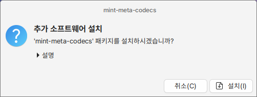

# 멀티미디어 코덱 설치

멀티미디어 코덱은 멀티미디어와 관련된 라이브러리나 추가 패키지를 모아놓은 메타패키지입니다.

<figure><figcaption></figcaption></figure>

간단하게 시작메뉴에 있는 멀티미디어 코덱 아이콘을 클릭하면 아래와 같은 창이 뜨며 설치 버튼을 통해 설치를 하실 수 있습니다.

설치가 완료되면 시작메뉴에 있는 멀티미디어 코덱 설치 아이콘은 사라집니다.

<figure><figcaption></figcaption></figure>
