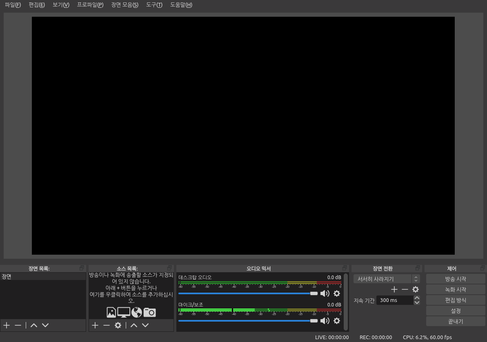
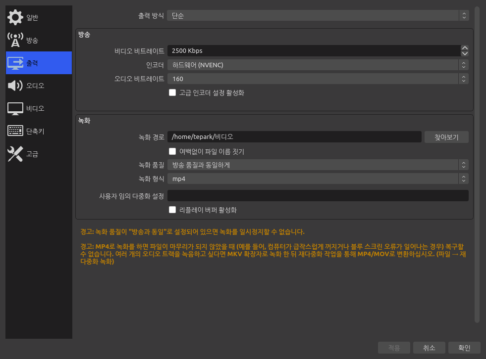
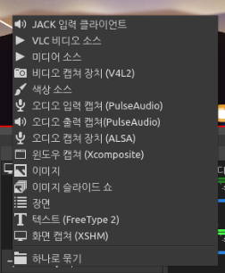
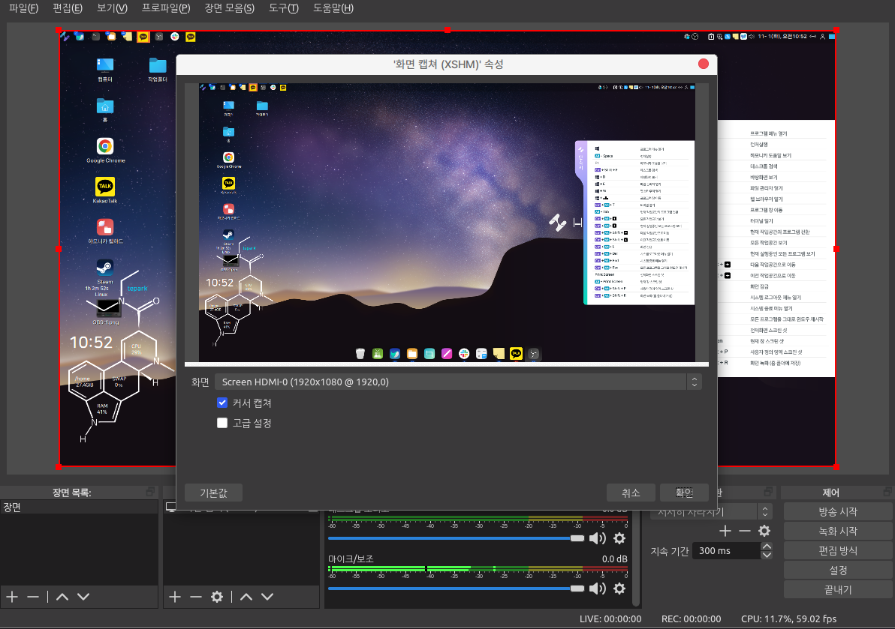

# OBS Studio

OBS(Open Broadcaster Software)는 방송 보조 및 동영상 캡처(녹화) 등 인터넷 방송을 위한 기능을 제공하는 소프트웨어입니다.

## 실행

프로그램을 실행시키면 비디오, 오디오 장치를 추가하여 연동할 수 있는 기능과 현재 화면을 동영상으로 녹화를 하거나 방송을 할 수 있는 설정기능이 나타납니다.

<figure><figcaption></figcaption></figure>

우측하단에 설정 기능에서는 일반설정, 방송 스트림 설정, 동영상파일 저장 경로, 오디오/비디오 장치 설정, 단축키 등을 제공합니다.&#x20;

<figure><figcaption></figcaption></figure>

실행화면 하단의 '소스목록'에서 '+' 버튼을 눌러 '화면캡처' 를 추가하여 현재 PC화면을 동영상으로 녹화할 수 있습니다. &#x20;

모니터 2개를 사용하는 경우에 어떤 모니터의 출력화면을 녹화할 것인지 선택할 수 있습니다.&#x20;

<figure><figcaption></figcaption></figure>

녹화시작 버튼을 눌러 녹화를 시작합니다. 녹화된 동영상은 설정에서 지정한 폴더에 저장됩니다.&#x20;

<figure><figcaption></figcaption></figure>
