# VLC 미디어 플레이어

VLC 미디어 플레이어는 2001년에 만들어진 매우 오래된 오픈소스 미디어 플레이어 입니다.

오래된 만큼 안정적인 사용성과 다양한 기능들을 지원합니다.

VLC 미디어 플레이어는 동영상 플레이어 기능에도 충실하지만 추가 기능을 사용하는 것으로 활용되고 있습니다.

## 설치

터미널에서 다음을 입력하여 설치합니다.

```bash
sudo apt install vlc
```

## 실행

시작메뉴에 vlc를 검색하여 실행합니다.

<figure>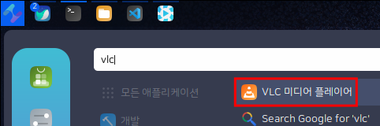<figcaption></figcaption></figure>

처음 실행화면입니다.

<figure>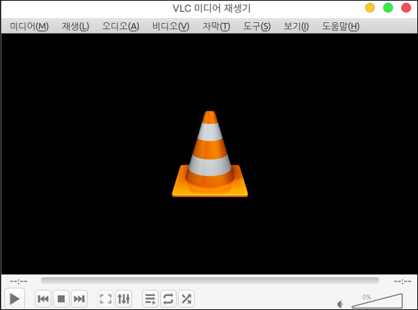<figcaption></figcaption></figure>

### 미디어 재생

드래그 앤 드롭으로 간편하게 동영상을 추가하여 시청하실 수 있습니다.

<figure>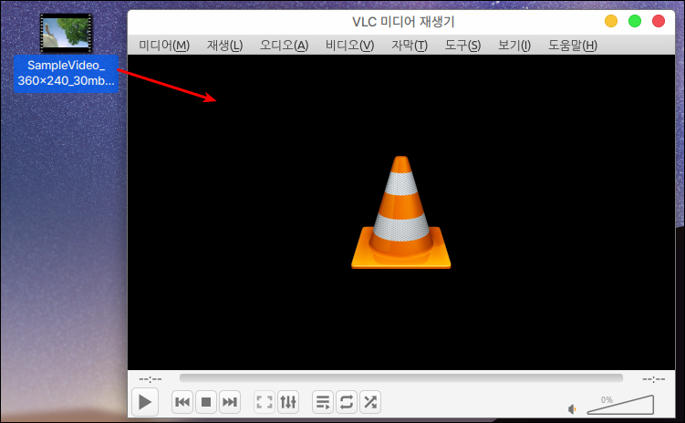<figcaption></figcaption></figure>

동영상 파일의 이름과 자막파일의 이름이 동일하고 같은 폴더에 있다면 자동으로 자막이 등록됩니다.

자막 파일의 이름이 같지 않다면 자막 파일을 드래그 앤 드롭으로 추가하거나 자막 파일을 추가할 수 있습니다.

<figure>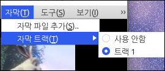<figcaption></figcaption></figure>

### 유튜브 영상 재생

VLC 미디어 플레이어는 유튜브 동영상 주소를 가져와서 재생할 수 있습니다.

유튜브의 동영상 주소를 가져와야 합니다.

**공유**를 클릭합니다.

<figure>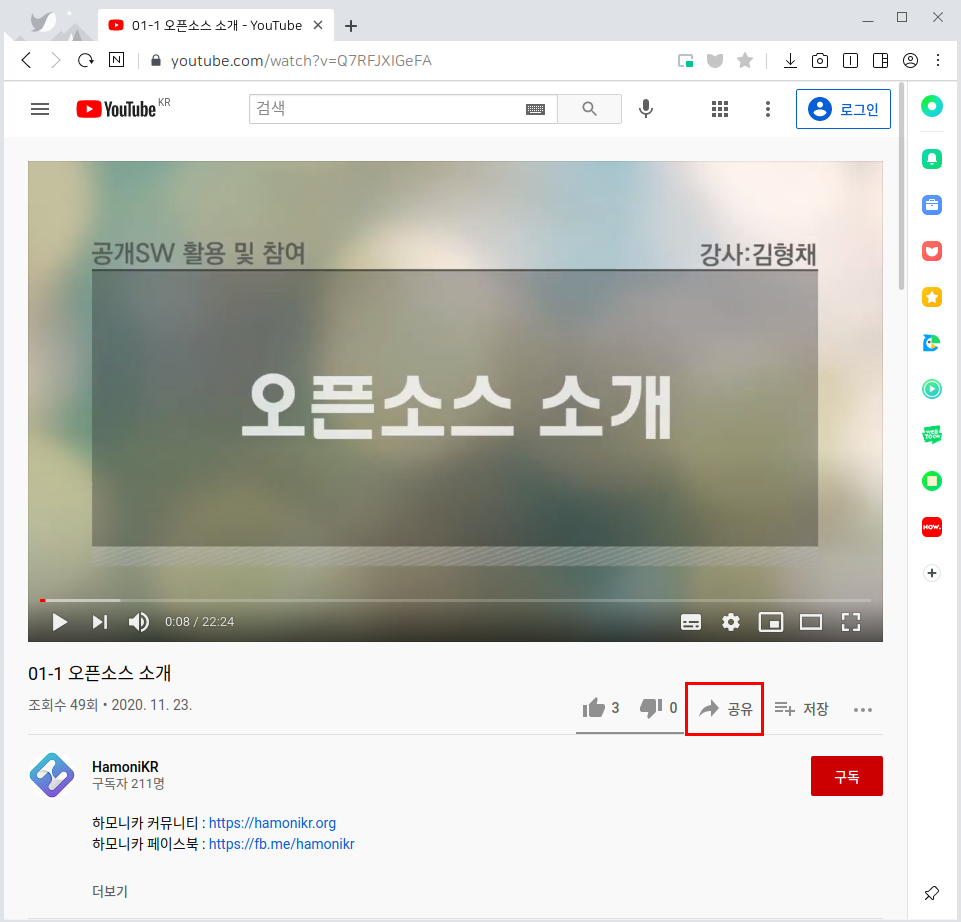<figcaption></figcaption></figure>

**복사**를 합니다

<figure>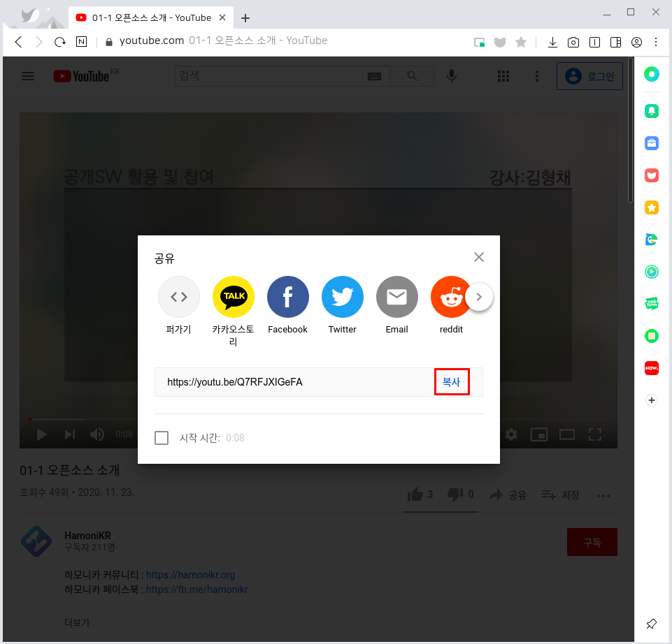<figcaption></figcaption></figure>

VLC 미디어 플레이어를 실행합니다.

좌측 상단의 **미디어 > 네트워크 스트림 열기**를 클릭합니다.

<figure>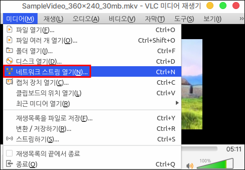<figcaption></figcaption></figure>

복사한 주소를 붙여넣고 재생버튼을 누릅니다.

<figure>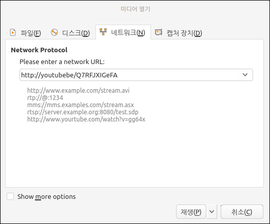<figcaption></figcaption></figure>

재생 버튼을 눌러 실행합니다.

반복 재생을 통해 동영상을 계속 재생할 수 있습니다.

다음 과정을 반복하여 동영상을 추가할 수 있습니다.

<figure>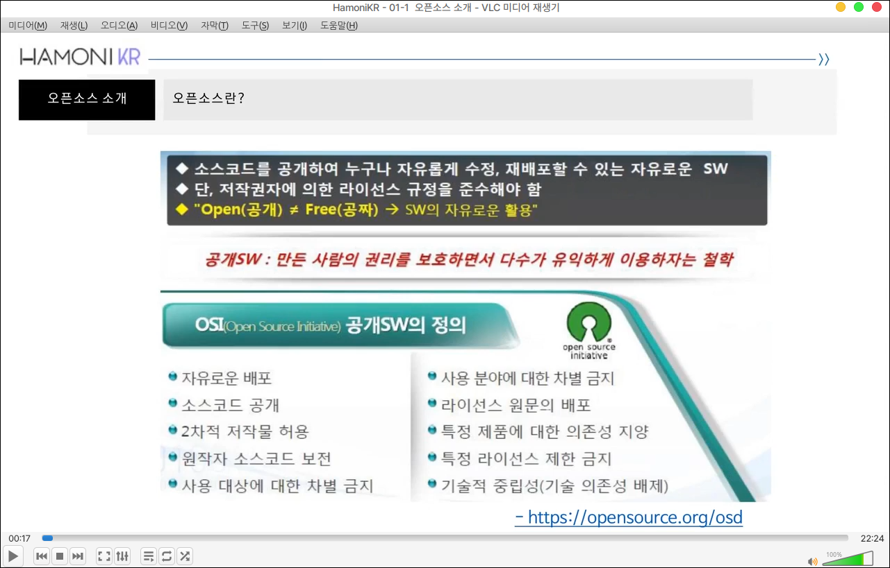<figcaption></figcaption></figure>

### 유튜브 영상 재생 오류

유튜브 영상 재생시 다음과 같은 오류가 날 수 있습니다.

<figure>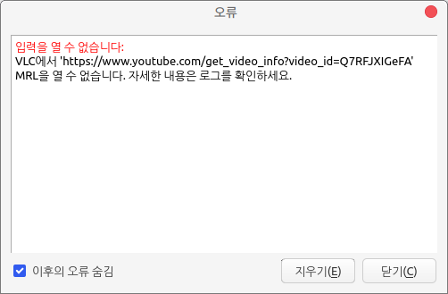<figcaption></figcaption></figure>

다음 명령어를 순서대로 입력해주세요.

```bash
#1 파일삭제
sudo rm /usr/lib/x86_64-linux-gnu/vlc/lua/playlist/youtube.luac

#2 올바른 파일 다운로드(지정한 위치에 다운로드 포함)
sudo wget https://raw.githubusercontent.com/videolan/vlc/master/share/lua/playlist/youtube.lua \
-O /usr/lib/x86_64-linux-gnu/vlc/lua/playlist/youtube.lua

#3 vlc 미디어 플레이어 재실행
```

### 유튜브 다운로드

유튜브 영상 재생을 통하여 추가된 동영상을 다운로드 하는 방법입니다.

**도구 > 코덱 정보**를 클릭합니다.

<figure>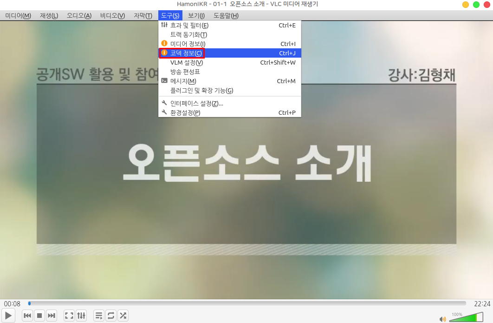<figcaption></figcaption></figure>

&#x20;하단의 위치 주소를 복사하여 인터넷 브라우저 주소창에 붙여넣습니다.

<figure><figcaption></figcaption></figure>

<figure>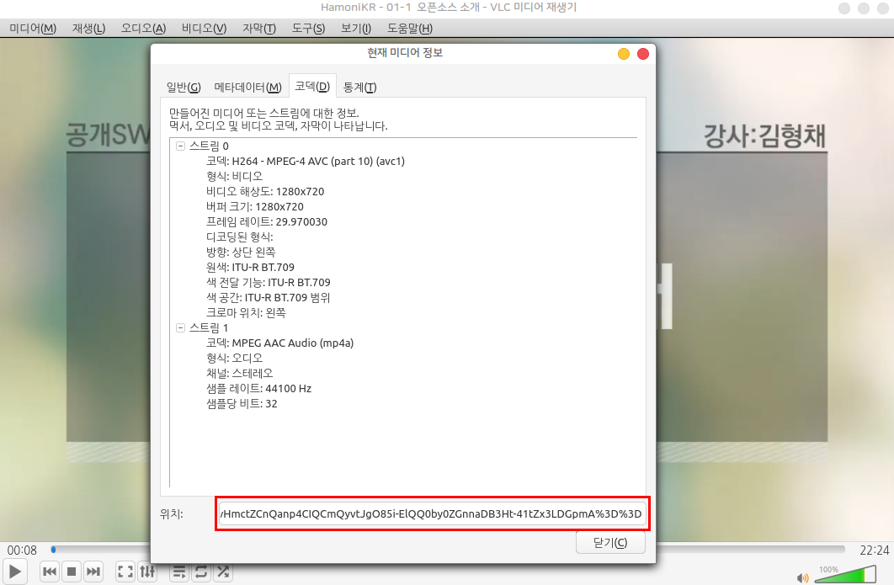<figcaption></figcaption></figure>

동영상이 나오면 우측 클릭하여 동영상을 다운로드 합니다.

<figure>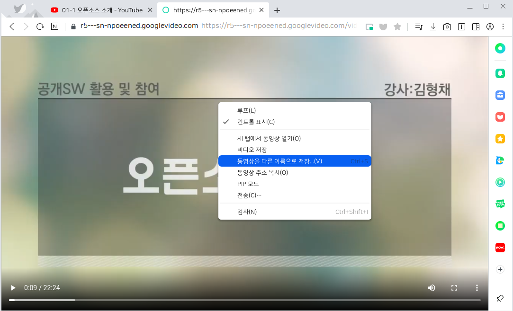<figcaption></figcaption></figure>
