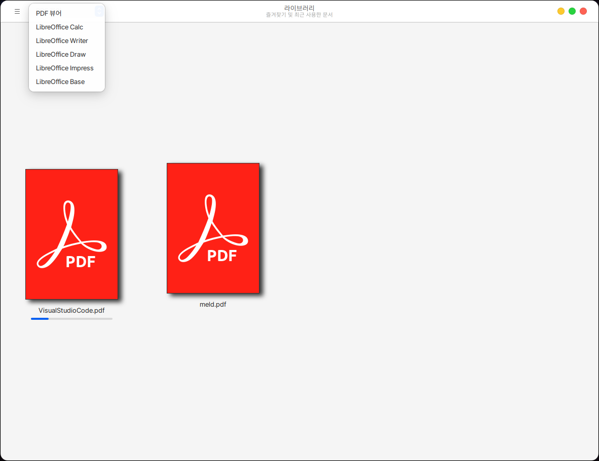

# 라이브러리

라이브러리는 즐겨찾기하거나 열어본 문서의 목록을 확인할 수 있는 프로그램입니다.

## 설치

터미널을 열어 다음과 같이 입력합니다.

```
sudo apt install thingy
```

## 실행

시작 메뉴에서 확인하실 수 있습니다.

<figure><figcaption></figcaption></figure>

즐겨찾기 하거나 열어본 문서만 확인하실 수 있습니다.

지원하는 파일은 PDF, LibreOffice 파일 입니다.

<figure><figcaption></figcaption></figure>
