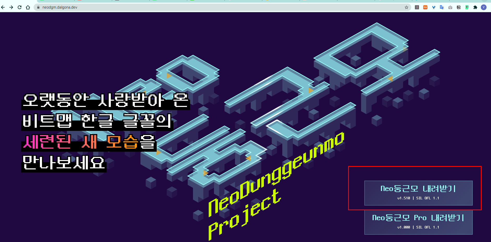
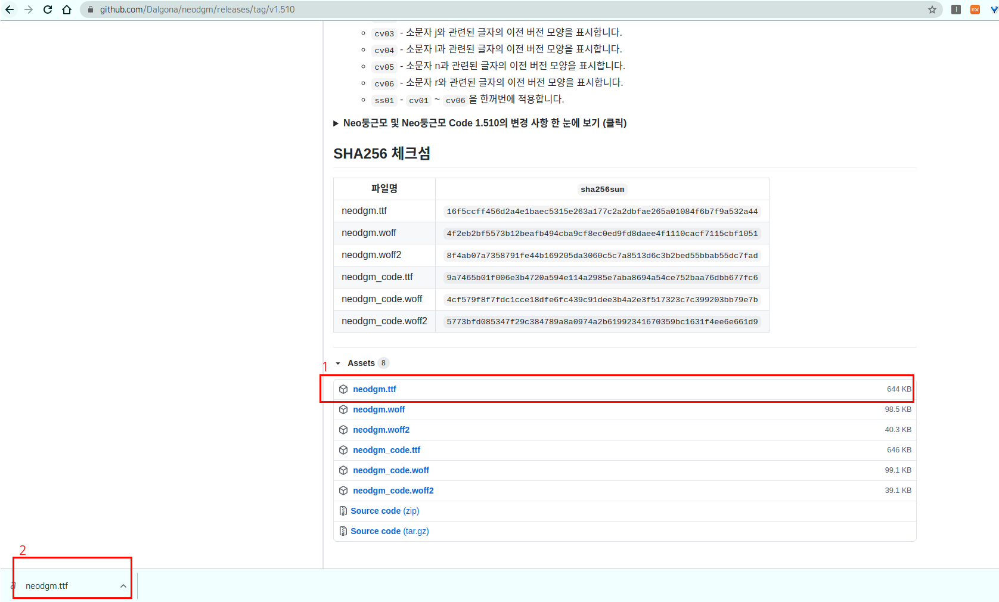

# LibreOffice Writer

**글쓰기**

글쓰기는 한글과 MS의 Word에 대응하는 리브레 오피스의 라이터를 사용하여 문서를 작성할 수 있습니다.

<figure><figcaption></figcaption></figure>

**시작하기**

새 문서를 선택하여 시작해 보겠습니다.&#x20;

* 빈 문서를 선택하여 문서를 처음부터 만듭니다.
* 서식 파일 중 하나를 선택합니다. (보고서 구조화에 유용합니다)

<figure><figcaption></figcaption></figure>

<figure><figcaption></figcaption></figure>

* 둘러보기를 선택하여 라이터 사용에 관한 팁을 봅니다

<figure><figcaption></figcaption></figure>

**기본 사항**

이제 텍스트를 추가하고 서식 지정하겠습니다. 빈 페이지에서 커서를 놓고 일부 텍스트를 입력하여 이를 수행할 수 있습니다.

특정 단어 수에 도달하려는 경우, 문서의 맨 아래에 있는 상태 표시줄에는 해당 페이지와 지금까지의 워드 수가 표시됩니다.

<figure><figcaption></figcaption></figure>

* 텍스트 서식을 지정하고 모양을 변경하려면 해당 텍스트를 선택한 다음 홈 탭에서 옵션을 선택합니다.

&#x20;           굵게, 기울임꼴, 글머리 기호, 번호 매기기 등.

<figure><figcaption></figcaption></figure>

* 사진, 도형 또는 기타 미디어를 추가하려면, 삽입 탭으로 이동한 다음, 문서에 미디어를 추가할 옵션을 선택하십시오.

<figure><figcaption></figcaption></figure>

<figure><figcaption></figcaption></figure>

**폰트 추가하기**

리브레 오피스에서도 커스텀 폰트를 추가할 수 있습니다.

예시로 무료 폰트인 Noe둥근모 폰트를 추가하는 방법입니다. 그외 기타 다른 폰트도 동일한 방법으로 추가할 수 있습니다.

( [https://neodgm.dalgona.dev/](https://neodgm.dalgona.dev/) )

<figure><figcaption></figcaption></figure>

1\. 위의 사이트에서 Noe둥근모 내려받기 > GitHub 하단 Assets 에서 neodgm.ttf 파일을 선택하세요.

(\* truetypefont = ttf)

2\. /usr/share/fonts 폴더에서 마우스 우클릭하여 \[ 관리자권한으로 열기 ]를 클릭하세요. &#x20;

<figure><figcaption></figcaption></figure>

3\. 마우스 우클릭을 하여 "neodgm" 폴더를 생성하고 다운받은 neodgm.ttf 파일을 해당 폴더로 옮기세요.

그리고 "neodgm" 폴더를 \[ truetype ] 폴더 하위로 이동시키세요.

(이때 적용하려는 폰트의 타입이 .ttf 이면  \[truetype] 폴더로 .otf 이면 \[opentype] 폴더로 옮기시면 됩니다.)

<figure><figcaption></figcaption></figure>

4\. 이제 라이터에서 새로 적용한 폰트를 확인할 수 있습니다.

<figure><figcaption></figcaption></figure>

**pdf 파일로 저장하기**

라이터는 기본 문서의 확장자가 .odt 입니다. PDF 형식으로 변환이 필요한 경우 다음과 같이 진행하시면 됩니다.

변경 하고자하는 파일을 실행시켜 \[] "PDF파일 형식으로 직접 내보내기" 아이콘을 클릭하세요.

<figure><figcaption></figcaption></figure>

파일을 pdf 형식으로 저장한뒤에

<figure><figcaption></figcaption></figure>

파일이 저장된 폴더로 가면 .pdf 형식으로 생성된 파일을 확인할 수 있습니다.

<figure><figcaption></figcaption></figure>

<figure><figcaption></figcaption></figure>

