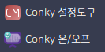
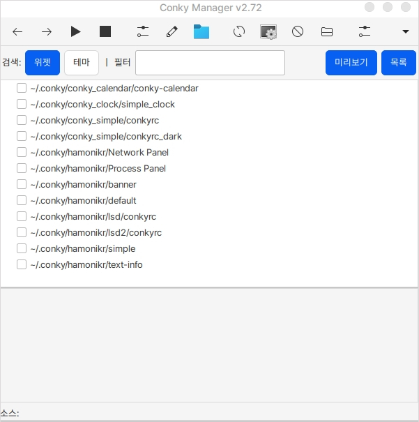
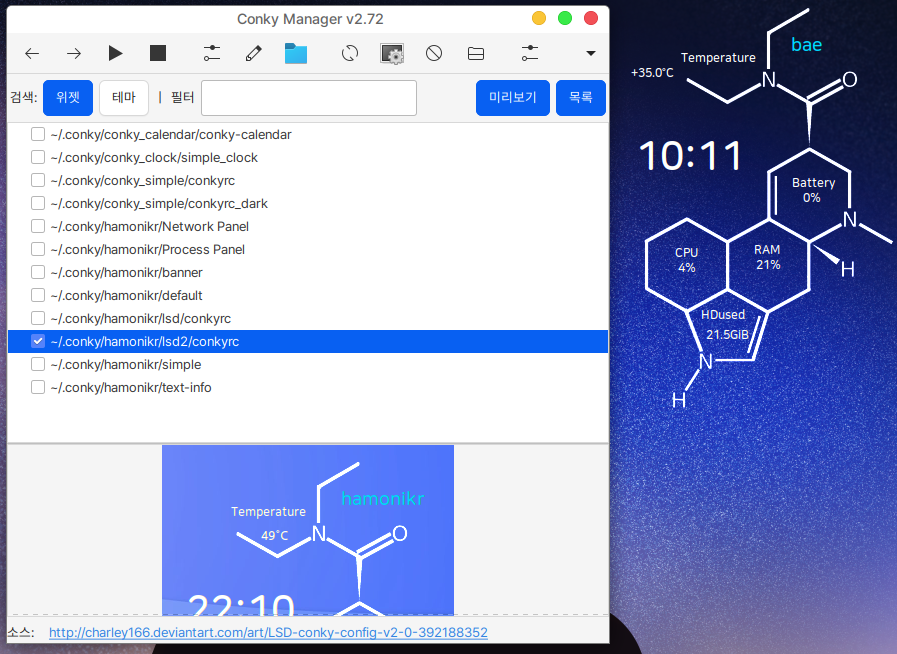
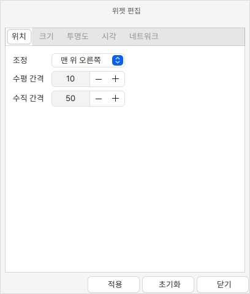

# Conky 설정도구, 온/오프

## 설치

Conky는 바탕화면 모니터링 도구입니다.

하모니카는 hamonikr-conky를 통해 Conky 설정을 돕는 도구를 제공합니다.

**HamoniKR** 사용자는 터미널에서 다음 명령어를 통해 설치할 수 있습니다.

```
sudo apt install hamonikr-conky
```

설치가 완료되면 시작 메뉴 > 보조 프로그램에서 **Conky 설정도구**와 **Conky 온/오프**가 추가된 것을 확인하실 수 있습니다.

Conky 설정도구는 추가되어 있는 모니터링 위을 체크하여 바탕화면에 배치할 수 있습니다.

Conky 온/오프는 바탕화면에 배치된 모니터링 위젯을 키고 끌 수 있습니다.

<figure><figcaption></figcaption></figure>

## 실행

Conky 설정도구를 클릭하면 Conky Manager가 실행됩니다.

<figure><figcaption></figcaption></figure>

### 위젯 추가

원하는 위젯을 하단의 미리보기를 통해 확인을 하고 체크버튼을 누르게 되면 바탕화면에 표시가 됩니다.

<figure><figcaption></figcaption></figure>

### 설정

Conky Manager에서 편집할 위젯 항목을 선택하고 상단의 버튼  을 누르게 되면 편집 창이 실행됩니다.

위젯 편집창에서는 위젯의 위치, 크기, 투명도, 시간, 네트워크 설정을 변경하실 수 있습니다.

<figure><figcaption></figcaption></figure>

### 온/오프

Conky의 온/오프 기능은 Conky Manager에 체크되어 바탕화면에 표시된 위젯을 켜거나 끌 수 있습니다.

시작 메뉴 > 보조 프로그램 > Conky 온/오프를 클릭합니다.

<figure><figcaption></figcaption></figure>

## 테마 추가

아래와 같은 사이트에서 다양한 Conky 테마 오픈소스를 탐색할 수 있습니다.

* devianart.com
* gnome-look.org
* github.com

테마를 다운받고, 파일이 압축된 상태라면 압축을 풉니다.

보통 하나의 테마의 구성은 아래와 같습니다.


`start_conky.sh` 파일은 해당 테마를 실행시키는 스크립트 파일입니다.

`conkyrc`는 conky 테마의 설정파일입니다. 해당 파일에서 테마의 대부분을 그립니다.

`cups_n_saucers.lua` 파일은 테마의 심화 기능을 수행하는 스크립트 파일입니다. lua 파일은 테마에 따라 없을 수도 있습니다.


### 테마 추가, 적용하기

위 파일들이 포함된 폴더를 \~/.conky 폴더에 복사합니다.


아래와 같이 `Conky 설정도구`에 해당 테마가 추가된 것을 확인할 수 있습니다.


테마를 체크하여 실행시켜도 아래와 같이 테마가 완전히 출력되지 않을 수 있습니다.

.png>)

테마를 에러 없이 호환시키기 위해 conkyrc 파일을 수정하겠습니다.

conkyrc 파일의 lua 파일을 로드하는 부분에 경로가 로컬의 경로와 다른것을 확인할 수 있습니다.


아래와 같이 로컬의 경로에 맞게 수정하고 저장하였습니다.


아래와 같이 정상 출력되는 것을 확인할 수 있습니다.

.png>)

한글이 깨지는 문제를 해결하기 위해 한글이 깨지는 부분에 폰트 설정을 추가하겠습니다.

원하는 폰트를 다운받을 수도 있고, `~/.conky/fonts/` 에 있는 폰트 중 하나를 선택할 수도 있습니다.


아래와 같이 한글이 깨지지 않고 출력되는 것을 확인할 수 있습니다.

.png>)


&#x20;
