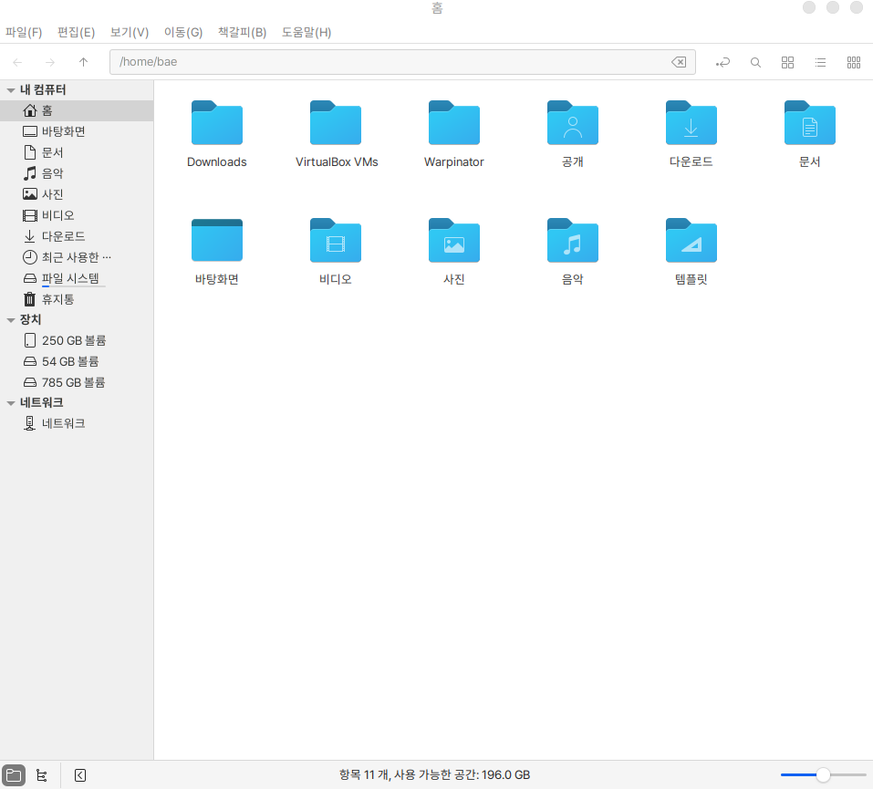
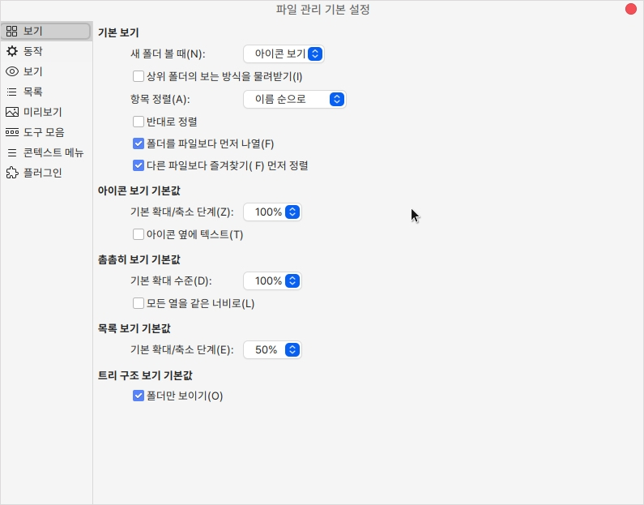
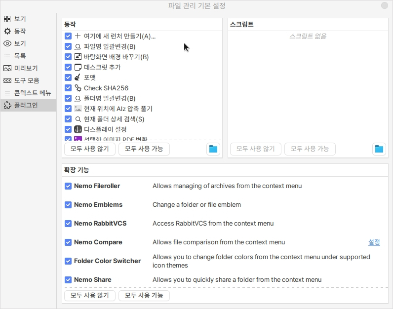
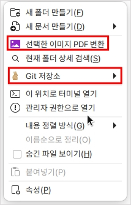

# 파일

하모니카의 기본 파일 탐색기입니다.

## 실행

처음 실행시 사용자의 home으로 열립니다.

<figure><figcaption></figcaption></figure>

## 설정

편집 > 기본 설정에서 파일 탐색기의 기본으로 되어있는 설정을 변경할 수 있습니다.

<figure><figcaption></figcaption></figure>

## 플러그인

하모니카에는 다양한 nemo 파일 탐색기 플러그인이 설치되어 있습니다.

<figure><figcaption></figcaption></figure>

대표적인 기능으로는 이미지를 모아 PDF로 변환하는 기능과 git을 쉽게 사용할 수 있게 도와주는 확장기능이 있습니다.

이외에도 폴더명을 일괄 변경하거나, 상세검색, 파일 비교, 공유 등 다양한 확장기능을 이용하실 수 있습니다.

<figure><figcaption></figcaption></figure>
