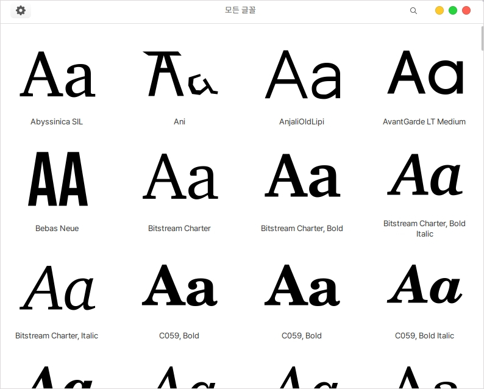
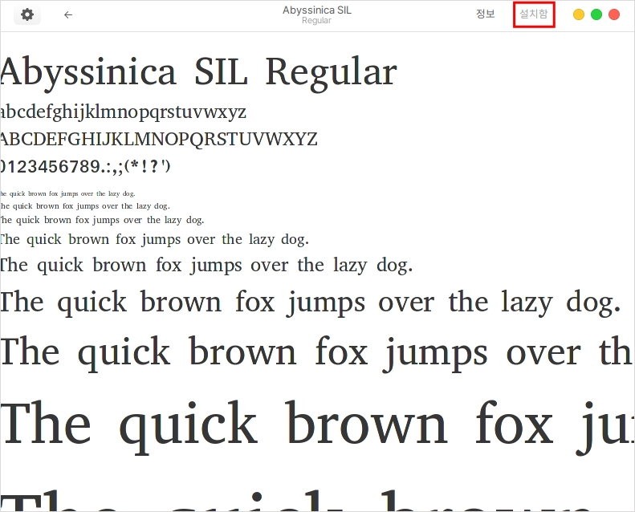

# 글꼴

글꼴은 현재 설치되어 있는 글꼴을 모두 확인할 수 있습니다.

<figure><figcaption></figcaption></figure>

외부에서 제공하고 있는 무료폰트를 다운받아 더블클릭하면 다음과 같은 창이 나오게 됩니다.

우측 상단의 설치 버튼을 이용하여 설치를 진행하면 됩니다.

<figure><figcaption></figcaption></figure>
