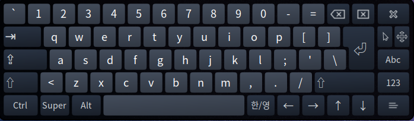

# 가상 키보드(OnBoard)

## 설치

온보드는 실제 키보드를 사용하지 못할 때 임시로 활용할 수 있는 가상키보드입니다.

```
# 온보드 설치
sudo apt install onboard

# 한글 레이아웃 설치
sudo apt install hamonikr-onboard-layout-ko
```

## 실행

실행화면입니다.

키보드 대신 마우스로 클릭하여 문자를 입력할 수 있습니다.

<figure><figcaption></figcaption></figure>
