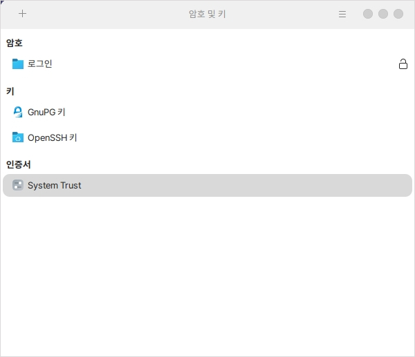
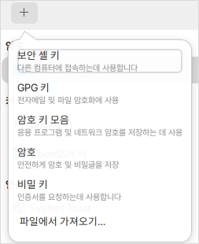

# 암호 및 키 관리

암호 및 키 프로그램은 사용자가 등록한 키들을 관리할 수 있습니다.

## 실행

기본 실행 화면입니다.

각 항목에 맞게 사용자가 등록한 키를 확인, 추가, 삭제할 수 있습니다.

<figure><figcaption></figcaption></figure>

사용자가 직접 키를 등록하여 사용할 수 있습니다.

<figure><figcaption></figcaption></figure>
