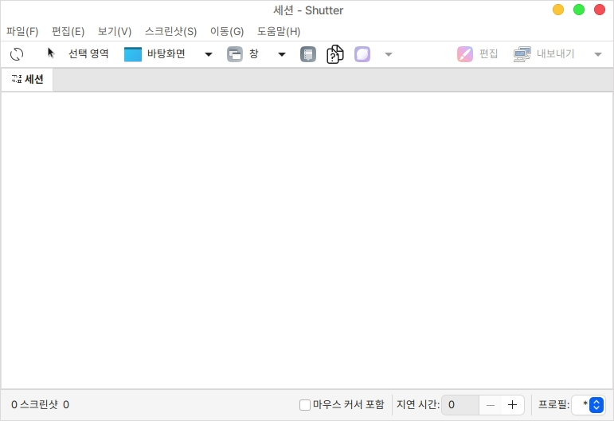
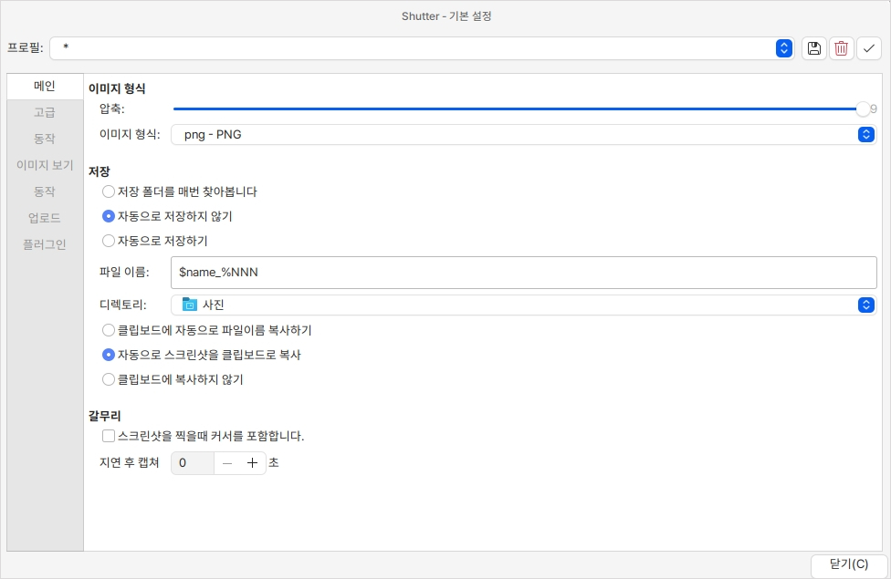
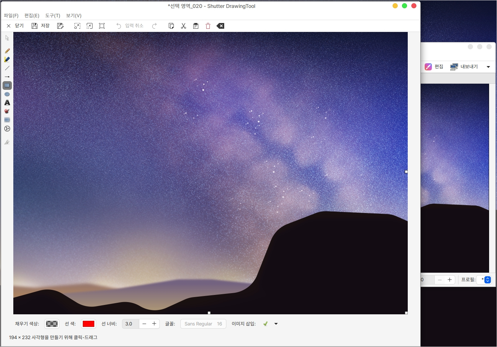

# Shutter

## 설치

Shutter는 캡쳐할 때 필요한 다양한 기능들이 내장되어 있는 캡쳐 도구입니다.

기본 캡쳐도구의 기능보다 더욱 사용성이 좋습니다.

```bash
# shutter 저장소 추가
sudo add-apt-repository ppa:shutter/ppa

# 설치
sudo apt update
sudo apt install shutter

# shutter 편집 기능을 사용하기 위한 패키지
sudo apt install gnome-web-photo
```

## 실행

처음 실행 화면입니다.

상단의 선택영역, 바탕화면, 창 등을 사용하여 캡쳐를 진행 할 수 있습니다.

상단 좌측 좌측 버튼의 경우 가장 마지막에 캡쳐했던 작업을 다시 실행하는 버튼입니다.

<figure><figcaption></figcaption></figure>

&#x20;설정을 통해 캡쳐 이미지의 저장 방식, 캡쳐 시간 등을 설정할 수 있습니다.

<figure><figcaption></figcaption></figure>

캡쳐한 이미지는 편집 버튼을 통하여 바로 수정할 수 있습니다.

<figure><figcaption></figcaption></figure>
