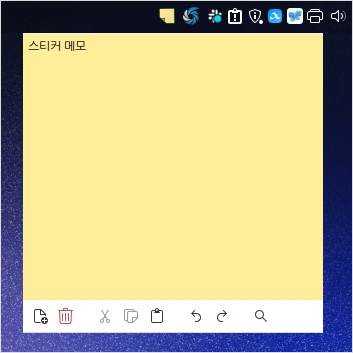
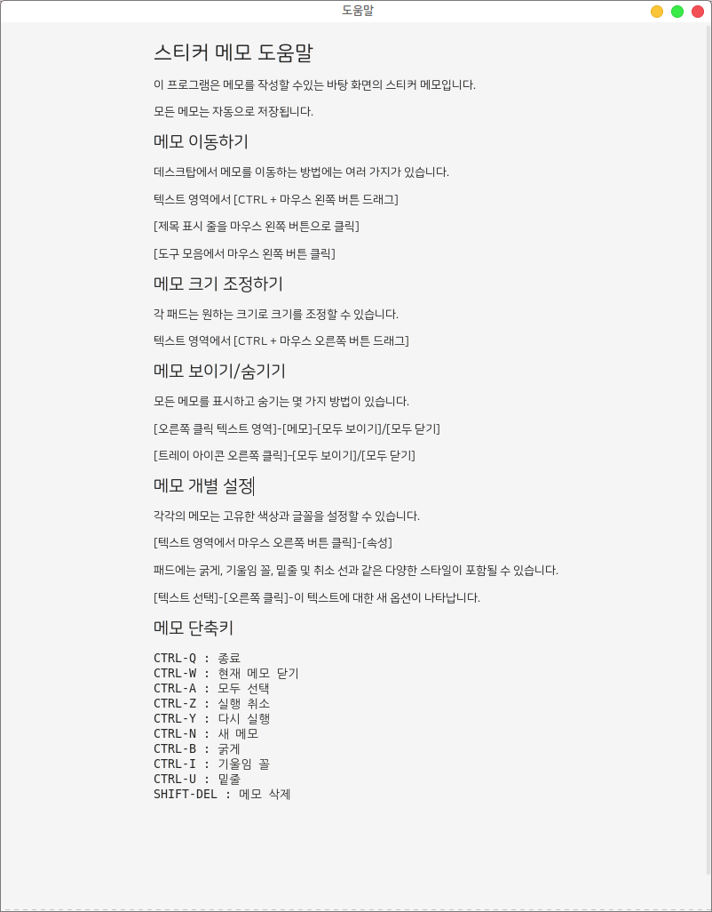
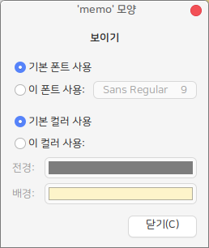
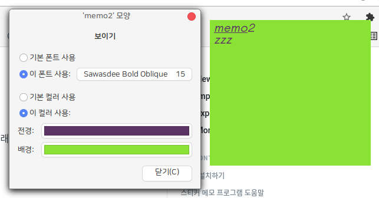
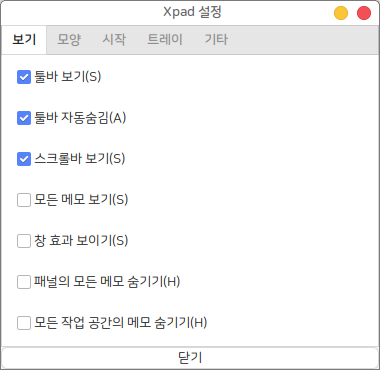

# 스티커 메모

## 설치

하모니카에서 다음 명령어로 xpad를 설치하실 수 있습니다.

```
sudo apt install xpad
```

## 실행

실행시 트레이 아이콘에 표시되며 우클릭을 통해 새 메모를 추가할 수 있습니다.

<figure><figcaption></figcaption></figure>

### 도움말

트레이 아이콘 우클릭시 도움말 항목을 확인하실 수 있습니다.

간단하게 사용하는 방법에 대해 설명되어 있습니다.

<figure><figcaption></figcaption></figure>

### 메모 이동

Ctrl 키를 누른 상태에서 드래그 하여 메모의 위치를 이동할 수 있습니다.

### 메모 크기 조정

메모의 오른쪽 하단에서 드래그, 또는 Ctrl 키를 누른 상태에서 마우스 오른쪽 키로 드래그하여 메모의 크기를 조정할 수 있습니다.

### 메모 보이기/숨기기

아래 방법으로 메모를 보이거나 숨길 수 있습니다.

* 메모 위에서 우클릭 > 메모 > 모두 보여주기 > 모두 닫기
* 시스템 트레이의 아이콘 우클릭 > 모두 보여주기 > 모두 닫기

## 설정 변경

### 텍스트 스타일 변경

작성한 메모 중 스타일을 변경 할 텍스트를 선택한 후

마우스 우클릭 또는 단축키를 통해 텍스트의 스타일을 변경할 수 있습니다.

텍스트 스타일을 변경하는 단축키는 다음과 같습니다.

* Ctrl + B : 굵게
* Ctrl + I : 기울임
* Ctrl + U : 밑줄

### 메모 모양 변경

메모 위에서 우클릭 > 고치기 > 모양을 클릭하여 해당 메모의 모양을 변경할 수 있습니다.

해당 메모의 폰트와 크기, 배경과 텍스트 색상을 변경할 수 있습니다.

<figure><figcaption></figcaption></figure>

<figure><figcaption></figcaption></figure>

### 프로그램 설정 변경

시스템 트레이 아이콘 우클릭 > 설정 클릭\
(메모 위에서 우클릭 > 설정 클릭)

프로그램의 각종 설정을 변경할 수 있습니다.

<figure><figcaption></figcaption></figure>
