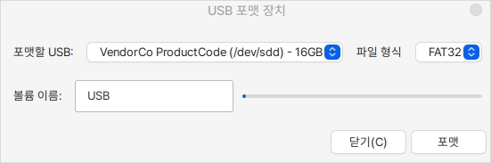

# USB 포맷

## 실행

하모니카에서 간단하게 USB를 포맷할 수 있는 프로그램입니다.

포맷할 USB를 추가하고 어떤 파일형식으로 포맷할지를 지정합니다.

사용할 수 있는 포맷 형식은 FAT32, exFAT, NTFS, EXT4 입니다.

볼륨 이름을 설정하고 포맷 버튼을 누르면 포맷이 진행됩니다.

<figure><figcaption></figcaption></figure>
