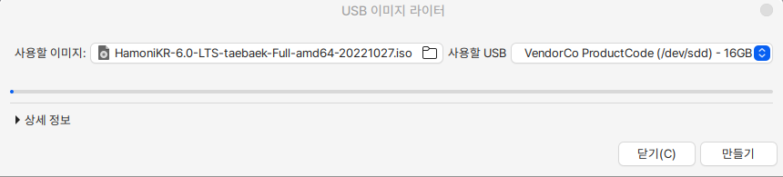

# USB 이미지 쓰기

## 실 행

하모니카에서 간단하게 USB에 ISO 이미지를 쓸 수 있는 도구입니다.

상세한 설정을 할 수 없고 이미지를 USB 쓰고나서 해당 USB를 윈도우에서 확인할 경우 보이지 않을 수 있습니다.

USB를 컴퓨터에 꽂고 사용할 이미지를 등록하고 만들기 버튼을 누르면 진행됩니다.

<figure><figcaption></figcaption></figure>
