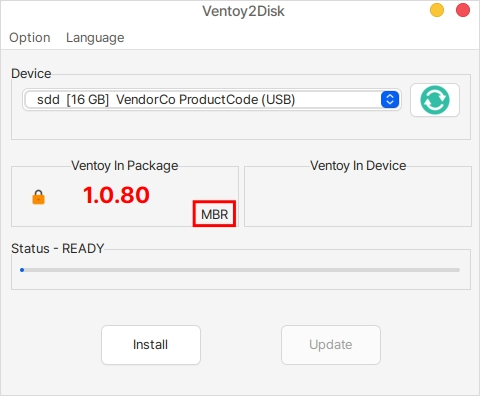
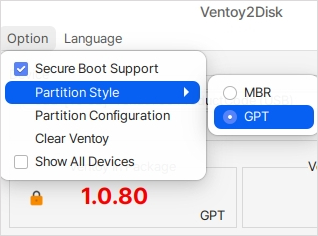
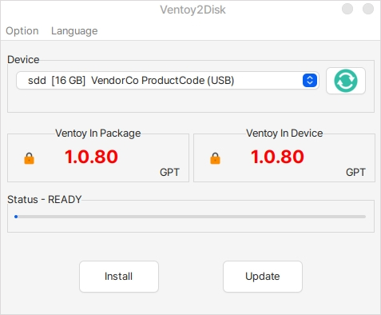
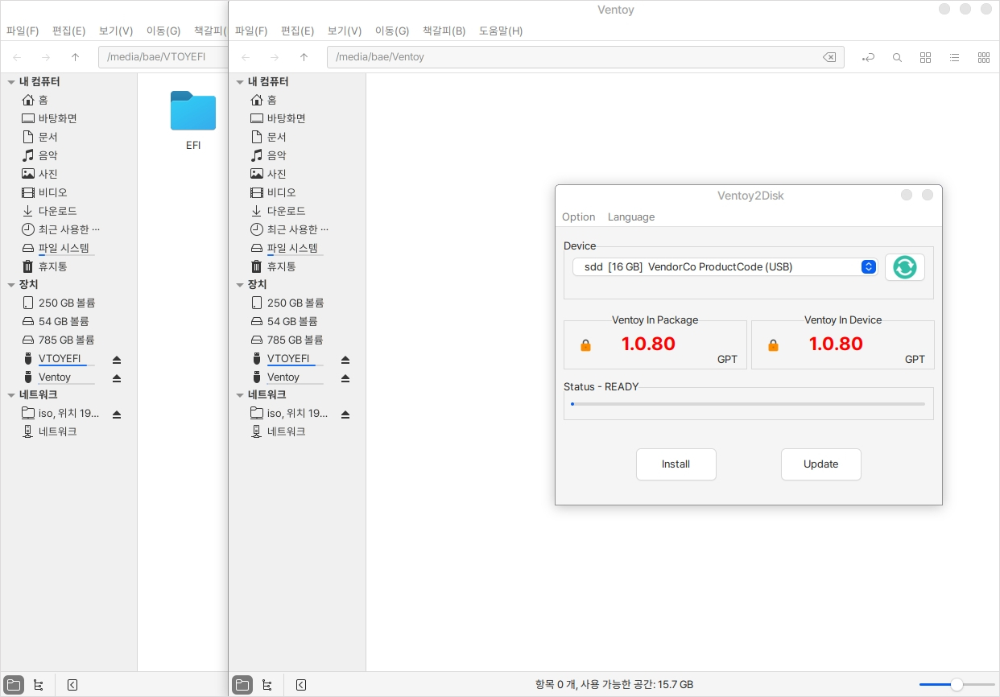
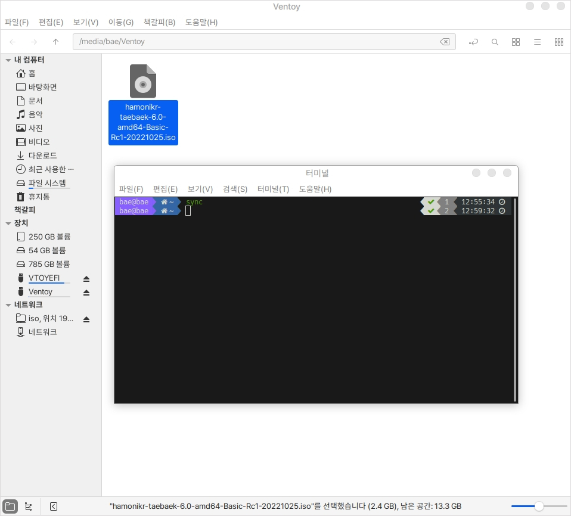
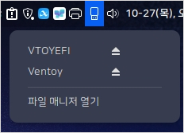
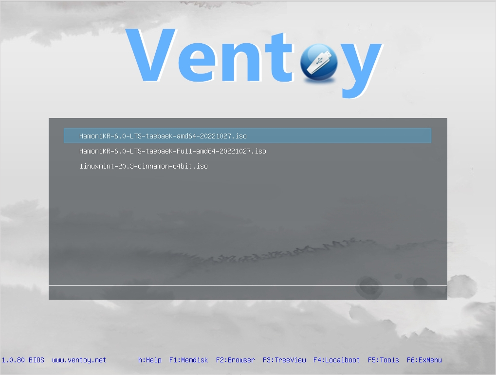

# Ventoy 부팅 USB 제작

## 설치

Ventoy는 ISO를 USB에 쓰지 않고 그대로 USB에 넣어도 사용할 수 있는 부팅 USB를 제작하는 프로그램입니다.

용량이 큰 하나의 USB에 여러개의 ISO를 추가하여 OS를 설치할 수 있는 멀티 부팅 USB를 만들 수 있습니다.

Ventoy가 설치가 되어있지 않다면 다음 명령어를 통해 설치를 진행하실 수 있습니다.

```
sudo apt install ventoy
```

## 사용

### 부팅 USB 제작

처음 실행화면입니다.

화면에 빨간색 네모표시와 같이 **MBR**로 설정되어 있습니다.

요즘 나오는 컴퓨터들은 전부 **GPT** 방식을 사용하기 때문에 사용에 주의해주시기 바랍니다.

컴퓨터에 USB를 꽂고 우측의 새로고침 버튼을 누르게 되면 USB가 자동으로 적용됩니다.

두 개 이상의 USB 사용시 직접 선택해야 합니다.

<figure><figcaption></figcaption></figure>

MBR 설정을 바꾸기 위해서는 좌측 상단의 Option 버튼을 누르고 Partition Style을 선택한 후 GPT로 변경을 해주세요.

<figure><figcaption></figcaption></figure>

하단의 Install 버튼을 누르면 부팅 USB가 만들어집니다.

Status 상태가 100%가 되면 USB를 뽑았다가 다시 꽂아주세요

<figure><figcaption></figcaption></figure>

USB를 다시 꽂게되면 MBR 방식은 하나의 창이, GPT 방식은 2개의 창이 뜹니다.

GPT의 경우 VTOYEFI는 건드리지 않고 Ventoy라고 되어있는 창에 ISO를 복사해 넣습니다.

<figure><figcaption></figcaption></figure>

ISO는 대용량 파일이기 때문에 USB에 복사하는 시간도 오래 걸리며 다 복사된 줄알고 뽑았을 경우 복사가 제대로 되지 않는 경우도 존재할 수 있습니다.

안전하게 복사를 하기위해서는 다음 과정을 추가적으로 진행하실 수 있습니다.

터미널을 열고 sync 를 입력합니다.

sync 작업이 완료되면 터미널 입력창이 다음줄로 넘어갑니다.

해당 작업은 약 몇분의 시간이 소요됩니다.

<figure><figcaption></figcaption></figure>

작업이 완료되면 트레이 아이콘의 USB 모양을 클릭하여 Ventoy의 마운트를 해제해 줍니다.

삼각형 모양의 화살표를 누르지 않을 경우 Ventoy 창이 뜰 수 있습니다.

<figure><figcaption></figcaption></figure>

### ISO 선택 부팅

bios에 들어가서 부팅 순서를 꽂은 USB로 변경 후 저장하고 재부팅합니다.

재부팅하게 되면 다음과 같이 USB에 넣어놨던 ISO 이미를 선택해서 부팅하실 수 있습니다.

<figure><figcaption></figcaption></figure>

