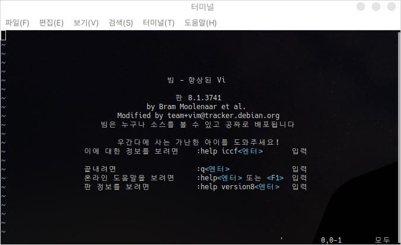
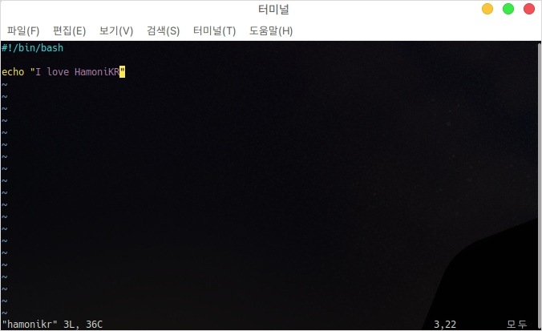
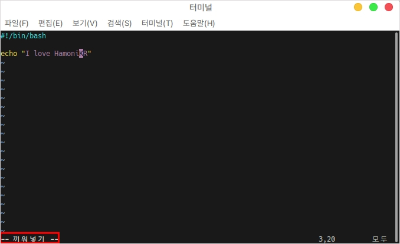
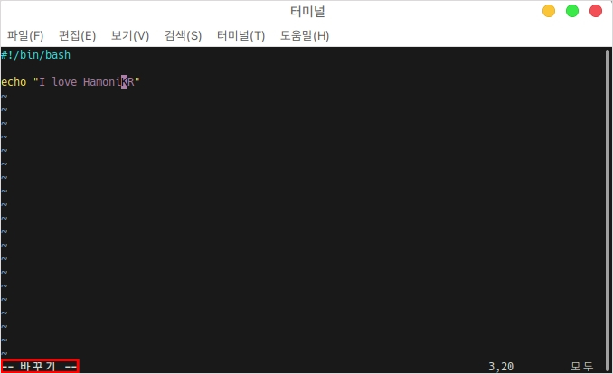
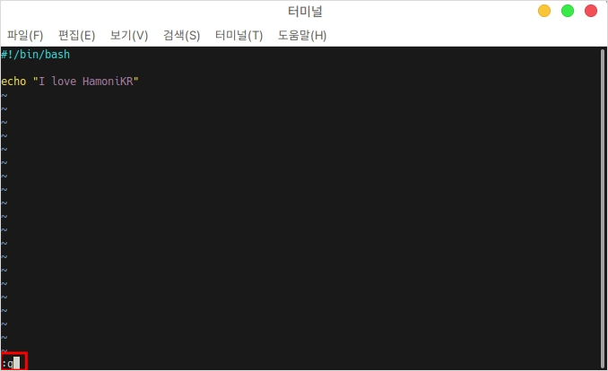

# Vim

## 설치

Vim 입력기는 사용자가 터미널 환경에서 텍스트 문서를 좀 더 수정하기 쉽게 만들어주는 에디터 프로그램입니다.

또한 특정 언어환경을 지정할 경우 가독성이 좋게 색상 표시됩니다.

터미널에서 다음 명령어를 입력하여 설치합니다.

```bash
sudo apt install vim
```

## 실행

터미널을 열고 vim 이라고 입력하면 나오는 기본 실행화면입니다.

<figure><figcaption></figcaption></figure>

### vi 실행

```bash
# 일반적인 실행
vi 파일이름

# sudo 권한이 필요한 실행
sudo vi 파일이름
```

<figure><figcaption></figcaption></figure>

### vi 삽입/수정

```
# 삽입(끼워넣기)
# 수정(바꾸기)

Insert 키를 눌러서 전환한다.
```

<figure><figcaption></figcaption></figure>

<figure><figcaption></figcaption></figure>

### vi 저장

```
# 삽입이나 수정등의 작업을 하고 있다면 Esc키를 먼저 눌러야 한다.
:w
```

<figure><figcaption></figcaption></figure>

### vi 종료

```
# 삽입이나 수정등의 작업을 하고 있다면 Esc키를 먼저 눌러야 한다.
:q
```

<figure><figcaption></figcaption></figure>

###
