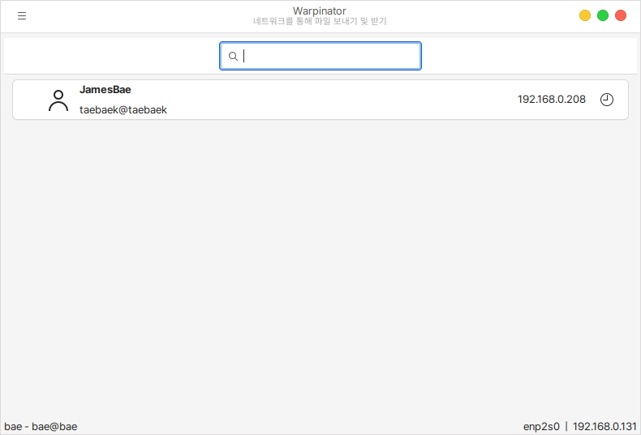
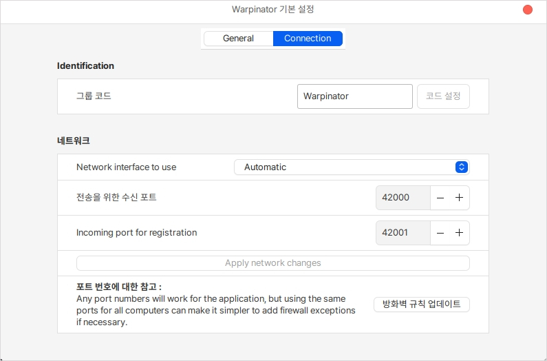
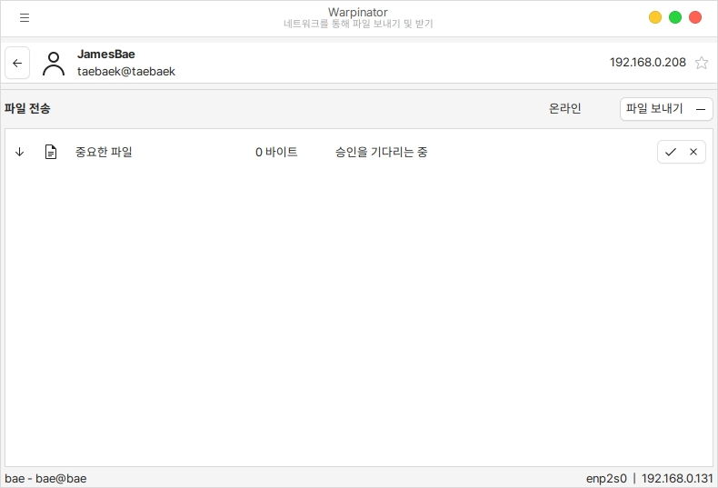
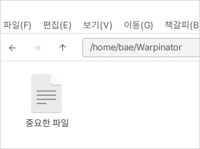

# 기기간 파일전송 (Warpinator)

기기간 파일 전송은 같은 망에 있는 기기간의 파일들을 쉽게 이동할 수 있도록 제공하는 프로그램입니다.

해당 프로그램을 이용하기 위해서는 다음과 같은 조건이 필요합니다.

1. 같은 공유기 내의 인터넷 망을 사용해야 한다.
2. 방화벽을 사용하지 않거나 방화벽 규칙이 업데이트 되어 있어야한다.
3. 전송하는자와 받는자 모 warpinator 프로그램이 실행되어 있어야 한다.

## 실행

기기간 파일 전송 프로그램인 Warpinator 실행 화면입니다.

현재 연결된 사용자가 있기 때문에 표시가 됩니다.

<figure><figcaption></figcaption></figure>

### 방화벽 설정

방화벽에 활성화 되어 있는 경우 기기간의 연결이 되지 않습니다.

실행 화면에서 좌측 상단의 버튼을 클릭하고 환경 설정 버튼을 누릅니다.

연결(Connection) > 방화벽 규칙 업데이트 버튼을 클릭합니다.

<figure><figcaption></figcaption></figure>

### 파일 전송/받기

보내고자 하는 파일을 드래그앤 드롭으로 끌어다 놓습니다.

파일을 받는 상대는 다음과 같음 메세지가 표시됩니다.

<figure><figcaption></figcaption></figure>

실행화면에서 보내는 사람의 버튼을 클릭하면 보내고자 하는 파일의 이과 우측에 승인을 할지 안할지에 대한 내용이 나오게 됩니다.

<figure><figcaption></figcaption></figure>

다운로드가 완료되면 다음과 같이 전송 완 알림창이 뜨게 됩니다.

<figure><figcaption></figcaption></figure>

다운로드 한 파일은 따로 지정하지 않는 이상 사용자 홈 폴더의 Wapinator 폴더 안에 들어있습니다.

<figure><figcaption></figcaption></figure>
