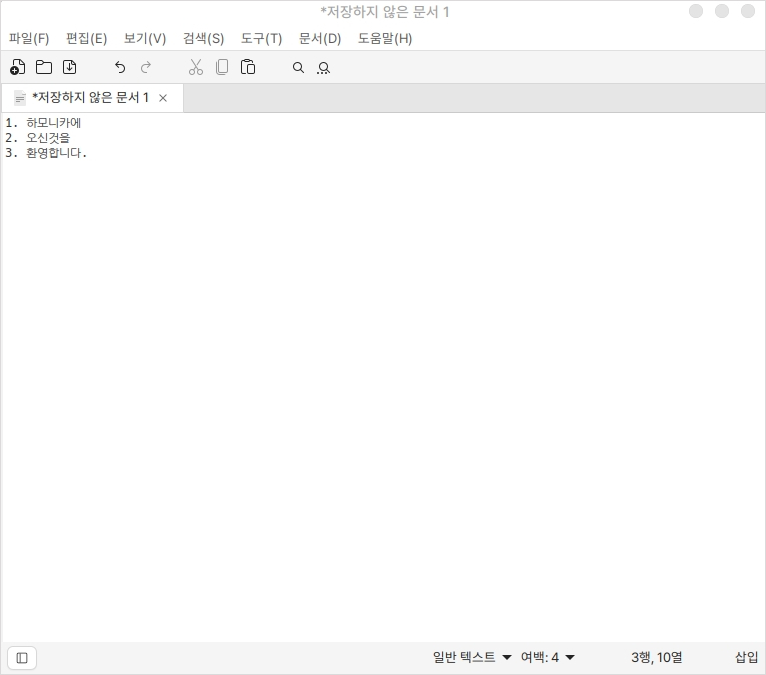

# 텍스트 편집기 (xed)

하모니카에서 제공되고 있는 기본 텍스트 편집기 입니다.

간단한 텍스트 작업과 몇가지의 간편한 기능을 사용하실 수 있습니다.

## 실행

기본 텍스트 편집기 실행화면입니다.

윈도우에서 사용하던 메모장과 큰차이가 없을 정도로 평범한 UI를 가지고 있습니다.

<figure><figcaption></figcaption></figure>

### 줄 정렬

줄 정렬 기능은 선택되어있는 라인을 숫자, 알파벳, 한글 순서로 정렬해주는 기능입니다.

정렬하고 싶은 라인을 드래그해서 선택하고 편집 > 줄 정렬 기능을 클릭합니다.

### 줄 연결

줄 연결 기능은 선택되어 있는 라인을 하나의 라인으로 만드는 기능입니다.

기본적으로 라인을 병합할 한칸이 띄워집니다.

연결하고 싶은 라인을 드래그해서 선택하고 보기 > 줄 연결 기능을 클릭합니다.
