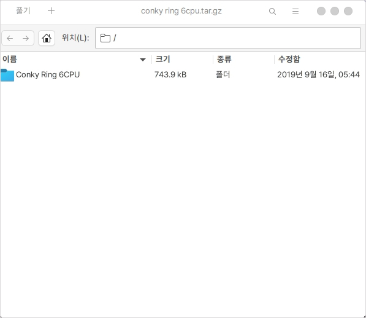

# 압축 관리자

## 실행

다양한 확장자의 파일을 압축하거나 풀 수 있습니다.

다음의 확장자를 지원합니다.

* 7z
* apk
* ar
* cbz
* cpio
* crx
* ear
* epub
* exe
* iso
* jar
* tar
* tar.7z
* tar.gz
* tar.lz
* tar.lz4
* tar.lzma
* tar.lzo
* tar.xz
* tar.zst
* war
* zip

압축 관리자를 통해 다음과 같이 파일을 열면 내용을 확인해 보실 수 있습니다.

풀기를 통해 압축을 풀 수 있으며 + 버튼을 통해 기존 압축에 다른 파일을 추가할 수 있습니다.

<figure><figcaption></figcaption></figure>
