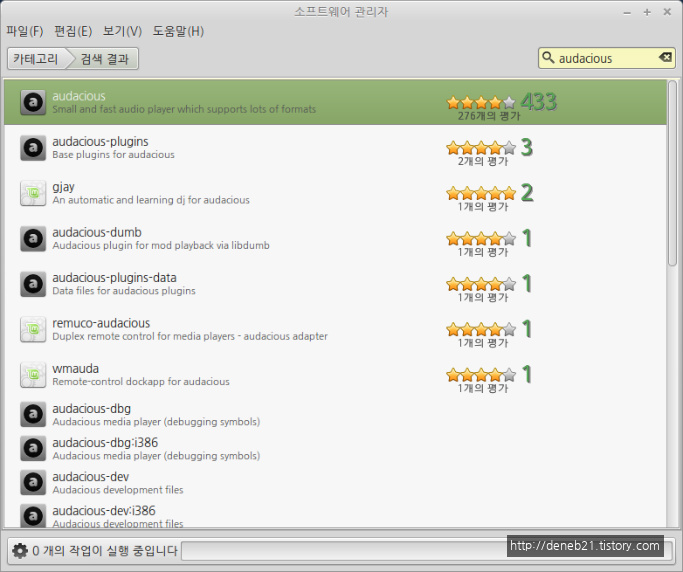

# 음악 플레이어 - Audacious (오데이셔스)

리눅스 민트를 깔고 나서 이것 저것 소프트웨어 들을 깔아보고 괜찮은 것들을 계속 소개하고 있습니다. 리눅스 민트 라고는 하지만 다른 리눅스 계열에서도 다 활용이 가능한 소프트웨어들 입니다. 그래서 제목에 괄호를 치고 '민트' 라고 써 놓았다는... 음...  컴퓨터를 하면서 음악 들으시는 분들 많을 텐데요. 그 유명한 Winamp, Foobar, Windows Media Player 등등 많은 좋은 플레이어 들이 있죠. 리눅스에도 좋은게 있을 겁니다. 물론 웬만한 음악 파일들은 VLC 같은 동영상 플레이어로도 플레이가 되는데요. 그래도 기왕이면 음악전용 플레이어에서 듣는게 저는 좋더라구요. 실행도 빠르고 시스템 자원도 적게 먹고 장점이 많이 있죠. 찾아보니 Audacious 라는 좀 괴상한 이름의 플레이어가 있는데 참 괜찮은 프로그램 이네요. 발음은 오데이셔스 랍니다. \

소프트웨어 관리자에서 audacious 를 검색 합니다. 맨 위에 audacious 가 나옵니다. 더블클릭해서 들어갑니다.\

MP3, OGG, FLAC 등 거의 모든 오디오 포맷을 지원 합니다.  설치 버튼을 눌러서 설치를 해 줍니다.\

메뉴 버튼을 눌러보면 '음악과 비디오' 카테고리에 Audacious' 라고 설치가 되어 있습니다. 클릭해서 실행해 봅니다.\

마치 Foobar 같은 느낌의 창이 뜹니다. 스킨도 바꿀 수 있다는데 저는 그냥 이런 단순한 화면이 좋습니다.  사용법은 다른 음악 플레이어들과 다를 바 없습니다. 음악 파일을 열어서 듣거나 스트리밍 URL 을 열어서 들을 수 있습니다. \

이전에 설치했던 [RecordMyDesktop](http://deneb21.tistory.com/372) 으로 무손실 음악파일인 FLAC 파일을 열어서 플레이 하는 것을 캡쳐해 보았습니다.  응답하라 1988... 쌍팔년도 시절에 듣던 Wham! 의 노래들 입니다. 역시 좋네요. ^^

이상으로 리눅스에서 쓸만한 음악 플레이어 소프트웨어 Audacious (오데이셔스)에 대해서 알아보았습니다.

\
\
출처: [http://deneb21.tistory.com/373](http://deneb21.tistory.com/373)
