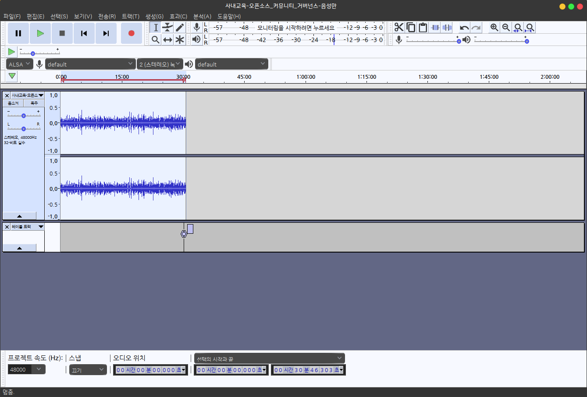

# 음성파일 자르기 audacity

소리 녹음과 편집을 할 수 있는 오픈소스 프로젝트 audacity  를 이용하면

음성파일을 자르는 편집을 쉽게 할 수 있습니다.

프로그램 상단 메뉴의 파일> 열기를 선택하여 편집할 파일을 고르고

자르고 싶은 영역을 마우스로 드래그 한 후 Ctrl + T 키를 이용하여 선택부분을 남기면 아래 그림과 같이 원하는 부분이 남게됩니다.

이 상태에서 파일 > Export > mp3 또는 wav 를 선택하여 저장하면 원하는 부분의 음성만 잘라진 상태로 저장됩니다.

