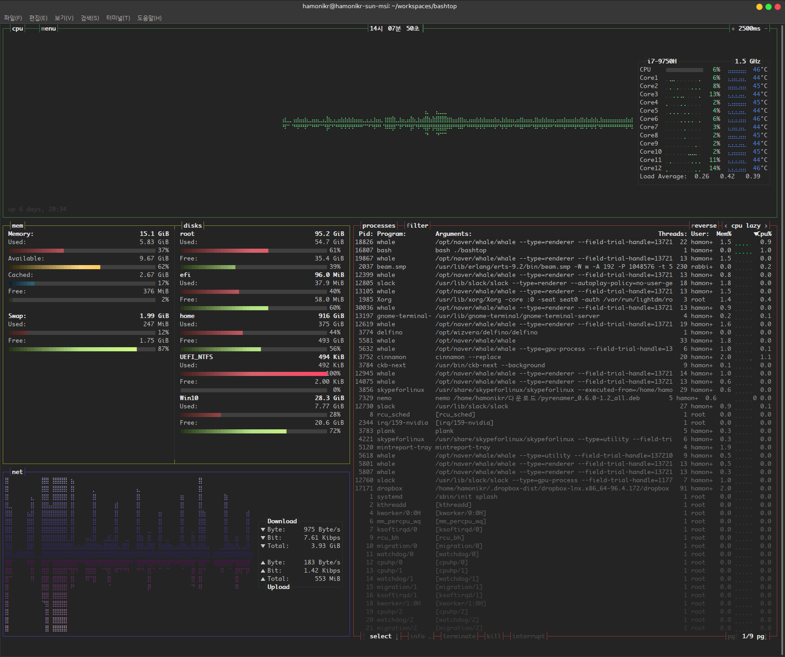

# 서버 모니터링 프로그램 bashtop

하모니카를 서버로 사용하는 경우 시스템 모니터링을 위한 도구가 필요하게 되는데

이 때 간단하게 사용할 수 있는 htop 의 경우 기본으로 제공되고 있습니다.

htop 도 좋지만 보다 시각적인 효과를 추가한 터미널용 모니터링 프로그램이 있는데 아래 링크의 bashtop 입니다.

[https://github.com/aristocratos/bashtop#description](https://github.com/aristocratos/bashtop#description)

## Features <a href="#id-bashtop-features" id="id-bashtop-features"></a>

* Easy to use, with a game inspired menu system.
* Fast and "mostly" responsive UI with UP, DOWN keys process selection.
* Function for showing detailed stats for selected process.
* Ability to filter processes.
* Easy switching between sorting options.
* Send SIGTERM, SIGKILL, SIGINT to selected process.
* UI menu for changing all config file options.
* Auto scaling graph for network usage.
* Shows message in menu if new version is available

## 설치 <a href="#id-bashtop" id="id-bashtop"></a>

deb 설치

```
sudo add-apt-repository ppa:bashtop-monitor/bashtop
sudo apt update
sudo apt install bashtop
```

소스코드

```
git clone https://github.com/aristocratos/bashtop
cd bashtop
./bashtop
```

## 스크린샷 <a href="#id-bashtop" id="id-bashtop"></a>


