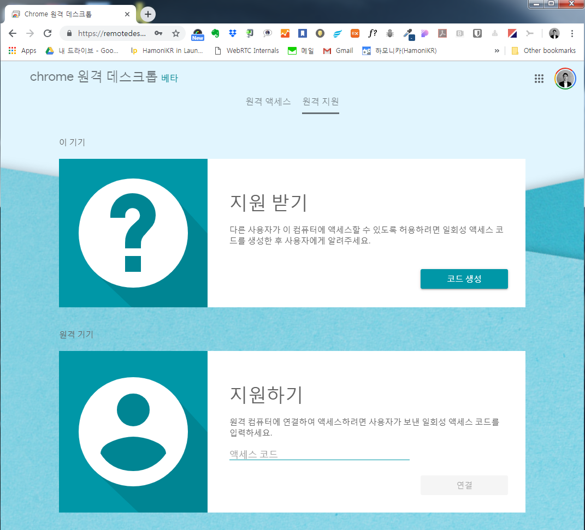
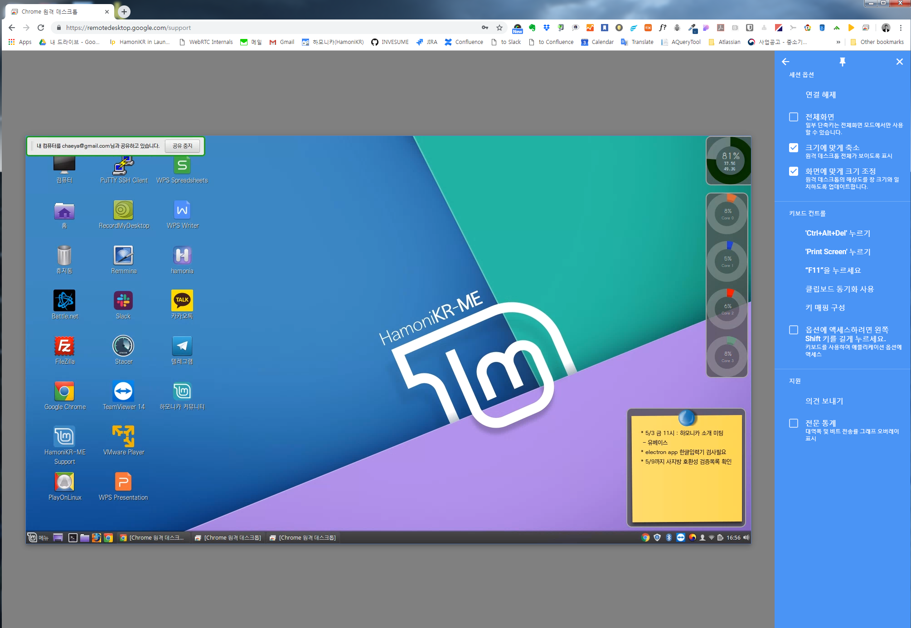
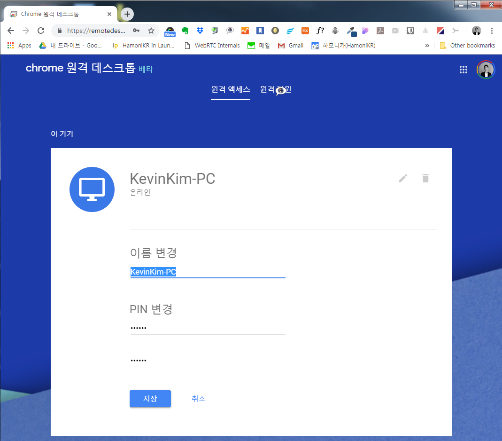

# 하모니카 PC 크롬 원격 데스크톱 접속 기능 사용하기

하모니카 PC에 원격으로 접속하여 기술지원을 받기 위한 쉬운 방법 중 하나는 크롬의 원격 데스크톱 접속 기능을 이용하는 것입니다.

앱스토어의 크롬 원격데스크톱 접속 프로그램을 이용하는 방법도 있지만, 아래 링크의 방법을 사용하는 것이 훨씬 쉽게 사용가능합니다. (구글 계정 로그인 필요)

[https://remotedesktop.google.com/support/](https://remotedesktop.google.com/support/)

화면과 같이 원격 지원을 요청하는 경우에는 코드생성 버튼을 누른후 생성된 코드를 상대방에게 알려주면 됩니다.

원격 접속을 하고자 하는 상대는 위 주소에 접속한 후 알려 준 코드를 입력하고 연결하기 를 누르면  다음과 같은 접속화면이 나옵니다.

## 추가기능 

아래 링크에 접속하신 후 원격 액세스 메뉴에서 아래 화면과 같이 설정하면 동일한 구글 계정으로 로그인 하신 경우 쉽게 접속이 가능합니다.

