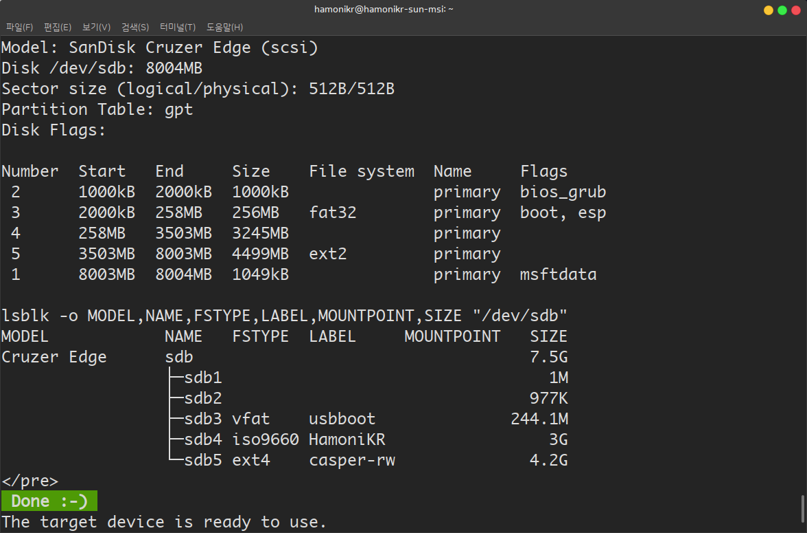
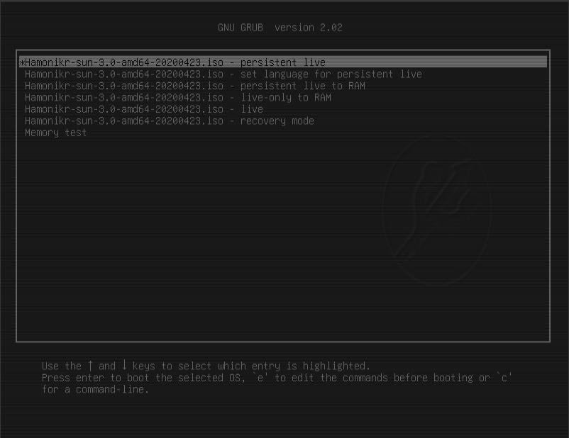

# USB에 설치된 하모니카로 크롬북처럼 사용하기

이 문서는 하모니카OS를 USB에 담아서 어느 장소에 가던 자신만의 데스크탑을 사용할 수 있는 방법을 알려드립니다.

MS윈도우도 USB에 담아서 윈도우를 사용하는 방식으로 사용하는 PE 버전이 있죠.

하모니카OS도 윈도우 PE 처럼 USB로 부팅해서 설치하지 않고 라이브 상태로 바로 사용하는 방식을 기본으로 제공하고 있습니다.

현재 배포되는 하모니카 3.0을 부팅 USB로 만들어서 사용하셔도 되지만 사용중에 문서나 다른 데이터를 저장할 수 없는 단점이 있죠.

하지만 USB 제작방식을 조금 고치면 USB에 자신의 데이터를 쉽게 보관하면서 필요할 때 하모니카OS를 부팅해서 사용할 수 있습니다.

이 방식은 일반적인 부팅 USB를 만드는 방식과 다르게 데이터 저장을 위한 공간을 별도로 생성하는 과정이 필요하며

이런 방식으로 USB 제작을 마치면 아래 이미지와 같이 USB에 파티션이 여러개 만들어 지게 됩니다.

## 리눅스에서 USB 하모니카OS 제작 

sudo add-apt-repository ppa:mkusb/ppa

sudo apt-get update

sudo apt install --install-recommends mkusb mkusb-nox usb-pack-efi

아래 영상은 리눅스에서 USB로 구동되는 하모니카OS를 제작하는 방법을 설명하는 영상이니 참고하세요.

제작을 마친 후 BIOS에서 USB로 부팅하도록 설정하고 부팅하면 아래와 같은 화면이 나타납니다.

가장 위의 메뉴를 선택하고 부팅하면 USB로 하모니카를 사용하면서 데이터를 저장할 수 있는 환경으로 부팅됩니다. (사용자 홈에 일반 하드디스크 처럼 사용하면 됩니다.)

기타) 만약 별도 파티션으로 나누어진 casper-rw 파티션을 사용하고 싶은 경우 현재 라이브 부팅 사용자의 폴더를 생성해야 합니다.

터미널을 열고 다음과 같이 권한을 변경하고 사용할 수 있는 폴더를 생성해줍니다.

sudo mkdir mydata

sudo chown $USER:$USER mydata

## 윈도우에서 USB 하모니카OS 제작 

데이터를 USB에 저장할 수 있는 형식의 USB를 제작하기 위해서 윈도우라면 LiLi USB Creator ([http://www.linuxliveusb.com/en/home](http://www.linuxliveusb.com/en/home)) 를 사용할 수 있습니다.

Select the USB drive you want to use in the “Step 1: Choose Your Key” box.

Provide your downloaded Ubuntu ISO file. Click the “ISO / IMG / ZIP” button under “Step 2: Choose a Source”, browse to the .ISO file on your computer, and double-click it.

Use the options in the “Step 3: Persistence” section to select how much space you want to use for persistent storage on the USB drive. Drag the slider all the way to the right to select the maximum amount of storage.

You’ve now configured all the settings you need to configure. To create your live USB drive with persistent storage, click the lightning icon under “Step 5: Create”.

Give the tool some time to create the drive. When the process is done, you’ll see a “Your LinuxLive key is now up and ready!” message. You can now either reboot your computer and boot from the USB drive or unplug the USB drive, take it to another computer, and boot it there.

To confirm that persistent storage is working properly, boot the USB drive and create a folder on the desktop, or save a file to the desktop. Then, shut down your system and boot the live USB drive again. You should see the folder or file you placed on the desktop.

참고

[https://www.howtogeek.com/howto/14912/create-a-persistent-bootable-ubuntu-usb-flash-drive/](https://www.howtogeek.com/howto/14912/create-a-persistent-bootable-ubuntu-usb-flash-drive/)
