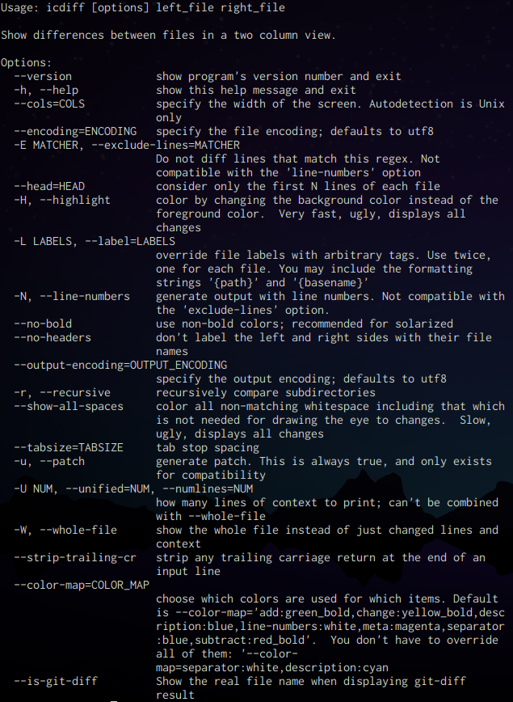

# icdiff (color diff)

## icdiff란? <a href="#id-icdiff-icdiff" id="id-icdiff-icdiff"></a>

`icdiff`는 GUI가 없는 터미널 환경에서 사용할 수 있는 파일을 비교하는 프로그램 입니다.

일반적인 `diff` 명령어와는 다르게 좌우로 비교하고 색을 입혀 구분합니다.

## 명령어

`ifdiff --help`명령어를 통하여 사용 방법을 확인할 수 있습니다.

<div align="left">



</div>

주요 명령어를 확인하고 사용하기 쉽게 예시를 포함하여 한국어로 번역했습니다.

```
# 도움말 명령어
--help

# 버전 확인
--version

# 비교하는 화면의 너비 지정
--cols=COLS
ex) icdiff --cols=100 {비교a,비교b}

# 인코딩 타입을 지정합니다. (default : UTF-8)
--encoding=ENCODING
ex) icdiff --encoding=utf-8 {비교a,비교b}

# 특정 문자(숫자)를 포함하고 있는 라인은 모두 제외합니다.
-E MATCHER, --exclude-lines=MATCHER
ex) icdiff --exclude-lines=문자 {비교a,비교b}

# 특정 라인 까지만 비교합니다. (비교할 라인이 동일하다면 아무것도 표시되지 않습니다.)
--head=HEAD
icdiff --head=5 {비교a,비교b}

# 색을 입혀 비교하는 부분을 글자색 대신 배경색으로 변경합니다.
-H, --highlight
ex) icdiff -H {비교a,비교b}

# 비교할 파일의 이름의 표기를 변경합니다.(비교할 파일 두개를 모두 변경해 주어야 합니다.)
-L=LABELS, --label=LABELS
ex) icdiff --label=변경파일이름1 원본파일이름1 --label=변경할파일이름2 원본파일이름2

# 줄 번호를 생성합니다.
-N, --line-numbers
ex) icdiff --line-numbers {비교a,비교b}

# 비교 글씨 굵게 강조되지 않도록 합니다.
--no-bold
ex) icdiff --no-bold {비교a,비교b}

# 파일 제목이 표시되지 않습니다.
--no-headers
ex) icdiff --no-headers {비교a,비교b}

# 다른 encoding 타입으로 출력합니다. (default : utf-8)
--output-encoding=ENCODING
ex) icdiff --output-encoding=cp949 {비교a,비교b}

# 하위 디렉토리의 파일 반복해서 비교합니다.(비교한 위치의 서로 다른 파일과 디렉토리 이름만 표기됩니다.)
-r, --recrusive
ex) icdiff --recrusive {비교a,비교b}

# 비교할 대상의 빈 공간(스페이스바,탭)을 색상입혀 표시해줍니다.
--show-all-spaces
ex) icdiff --show-all-spaces {비교a,비교b}

# 빈공간에 탭이 되어 있으면 표시해 주고 간격을 표시할 수 있습니다.
--tabsize=TABSIZE
ex) icdiff --tabsize=4 {비교a,비교b}

# 같게 표시된 라인을 표시, 제거 할 수 있습니다.
-U NUM, --unified=NUM
ex) icdiff --unified=0 {비교a,비교b}
```
