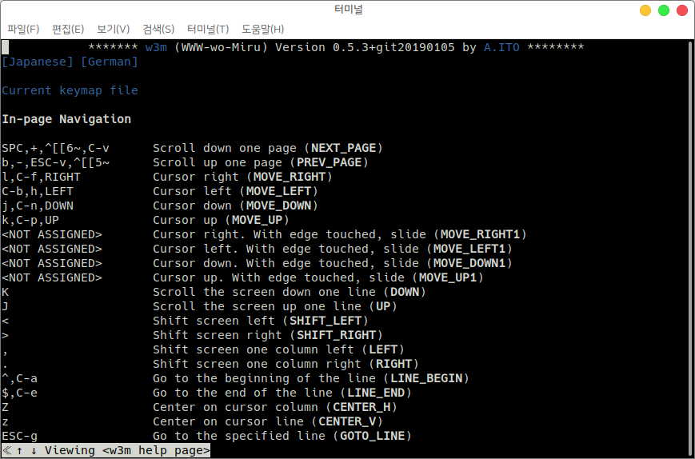

# w3m (terminal web browser)

## w3m이란?

w3m은 터미널 기반의 웹 브라우저 입니다.&#x20;

### w3m 설치하기&#x20;

sudo apt-get install w3m

## w3m로 웹 브라우저 접속하기&#x20;

w3m으로 웹 브라우저에 접속하기 위해 "w3m 접속하고자 하는 url 주소" 형태로 입력하면 해당 url이 터미널 내에서 보여집니다.&#x20;

<figure><figcaption></figcaption></figure>

<figure><figcaption></figcaption></figure>

웹 브라우저 내에서 화살표 키를 사용하여 커서를 이동하거나 원하는 위치를 클릭해서 커서를 이동할 수 있습니다.

검색을 하기 위해서 검색창을 클릭하고 Enter를 누른 후 검색어를 입력하고 한번 더 Enter를 누릅니다.&#x20;

그 다음 \[google 검색] 버튼을 누르면 해당 페이지로 이동됩니다.

(Tab 버튼을 이용해 페이지의 다음 하이퍼링크 위에 커서를 놓을 수 있습니다.)

<figure><figcaption></figcaption></figure>

<figure><figcaption></figcaption></figure>

Shift+B를 누르면 이전 페이지로 이동할 수 있고, Shift+U를 누르면 다른 url로 이동할 수 있습니다.&#x20;

<figure><figcaption></figcaption></figure>

Shift-H를 눌러 도움말 페이지를 확인할 수 있습니다.&#x20;

<figure><figcaption></figcaption></figure>

