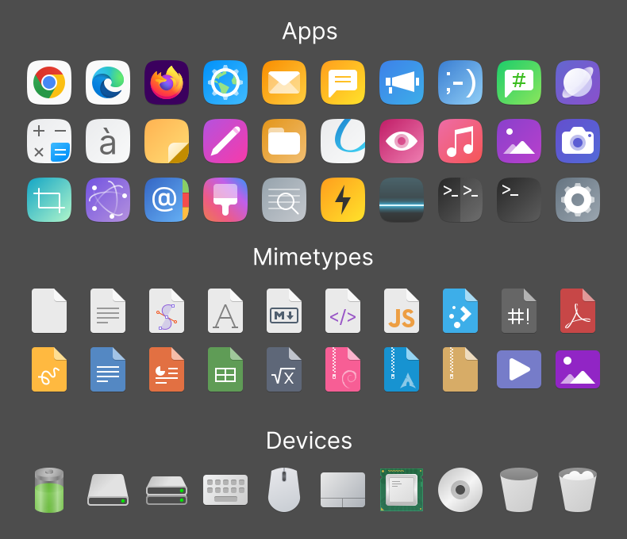

# 국내 오픈소스 개발자(@kuroehanako) 님의 아이콘 적용

하모니카 7.0 의 아이콘은 국내 오픈소스 개발자(@kuroehanako)님의 아이콘을 적용했습니다.&#x20;

* [**@kuroehanako**](https://github.com/kuroehanako/Stylish-icon-theme) **님의 아이콘 깃허브 주소**([https://github.com/kuroehanako/Stylish-icon-theme](https://github.com/kuroehanako/Stylish-icon-theme/tree/HamoniKR-Modded))

<figure><figcaption></figcaption></figure>
