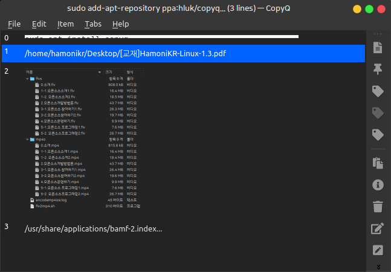
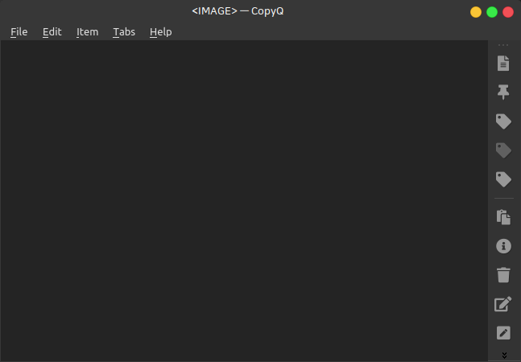
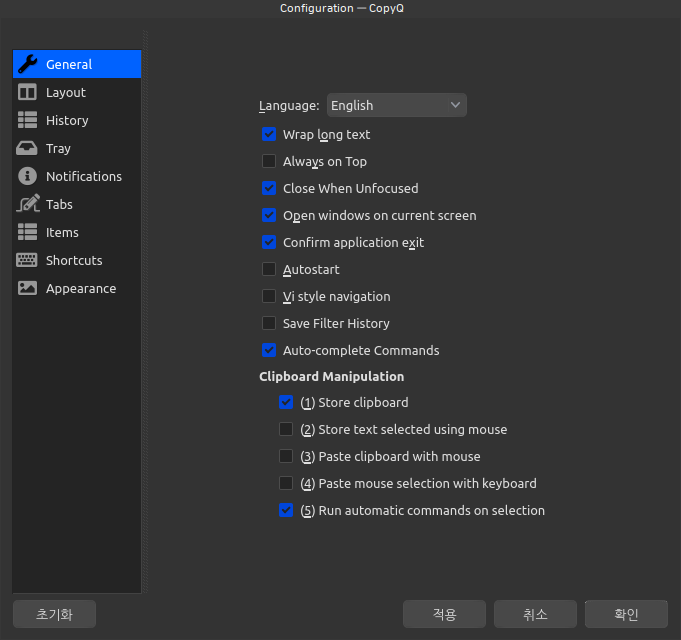
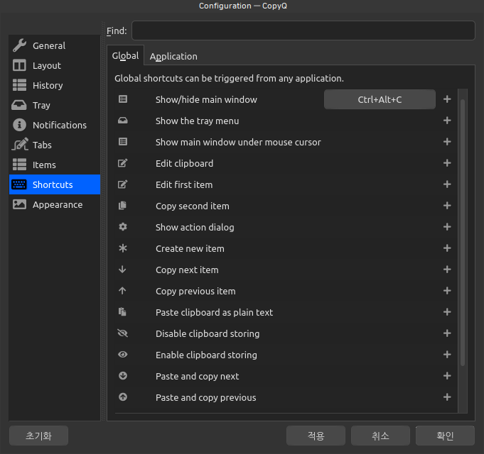
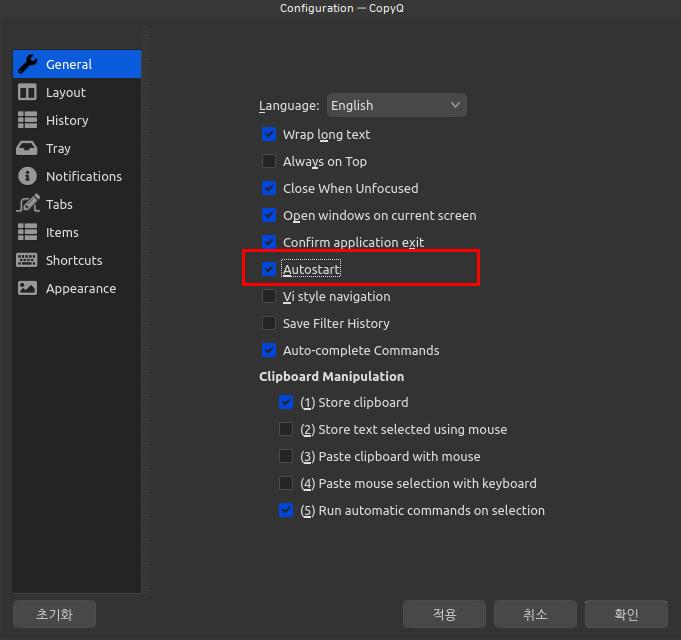

# 클립보드 매니저 CopyQ



PC를 사용하다보면 이전에 복사한 내용을 관리하며 작업해야 하는 경우가 생기는데

하모니카에서 여러개의 복사한 내용을 관리하며 작업해야 하는 경우에는 클립보드 매니저 CopyQ를 사용할 수 있습니다.

프로젝트 깃허브 : [https://github.com/hluk/CopyQ](https://github.com/hluk/CopyQ)

하지만 기본 프로그램으로 제공되는 것은 아니라서 추가 설치가 필요합니다.

터미널을 열고 아래의 명령어를 이용하여 프로그램을 설치해주세요.

```
sudo add-apt-repository ppa:hluk/copyq
sudo apt update
sudo apt install copyq
```

설치 후 프로그램 메뉴의 CopyQ 프로그램을 실행하면 시스템 트레이에 아래 이미지처럼 가위모양의 아이콘이 나타납니다.


해당 아이콘을 더블클릭하면 다음과 같은 프로그램 화면이 나오며 Ctrl+C 를 이용하여 여러분이 복사한 내용이 순서대로 보관되어 있습니다. (200개 까지 보관)

이제 클립보드 매니저의 해당 복사된 아이템을 이동하면서 선택하거나 복사한 내용을 수정하거나 하는 작업을 할 수 있습니다.



시스템 패널에 아이콘을 클릭하고 사용하는 것은 불편하니 시스템에서 사용하지 않는 단축키로 지정해서 사용하는 것을 추천합니다.

File > Preferences 메뉴를 이용하시면 아래와 같이 다양한 설정할 수 있는 화면이 나옵니다.

좋은 프로그램인데 아쉽게도 한글로 제공되지 않네요. 하모니카 개발팀에서 해당 프로젝트에 기여하여 한글로 사용할 수 있도록 만들겠습니다 !!!



왼쪽의 Shortcuts 메뉴를 선택하면 아래 화면과 같이 다양한 단축키를 설정할 수 있는 화면이 나오는데

저는 아래 이미지처럼 Ctrl + Alt + C 키를 이용하기로 설정했습니다.

이제 프로그램 화면을 단축키로 바로 열 수 있습니다.



이렇게 프로그램의 여러 기능을 살펴보시고 사용하기로 결정하셨다면

General 탭에서 아래 이미지처럼 "Autostart"를 체크해서 다음 컴퓨터 재시작시 부터는 자동으로 시작되도록 선택해줍니다.


