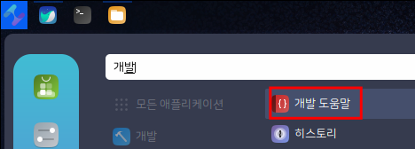
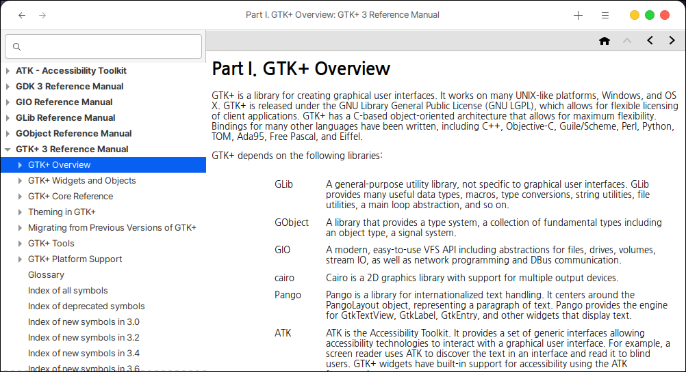

# 개발 도움말

개발 도움말은 개발할 때 간편하게 확인할 수 있도록 만들어진 도움말입니다.

## 설치

터미널에서 다음을 입력합니다.

```
sudo apt install devhelp
```

## 실행

시작 메뉴에서 간단하게 실행하실 수 있습니다.

<figure><figcaption></figcaption></figure>

개발에 필요한 환경변수, 예시 등 다양한 도움을 얻을 수 있습니다.

<figure><figcaption></figcaption></figure>
