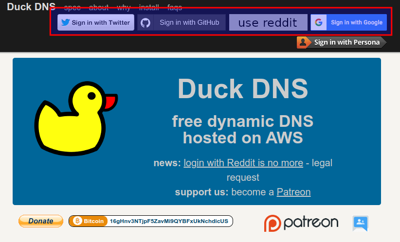
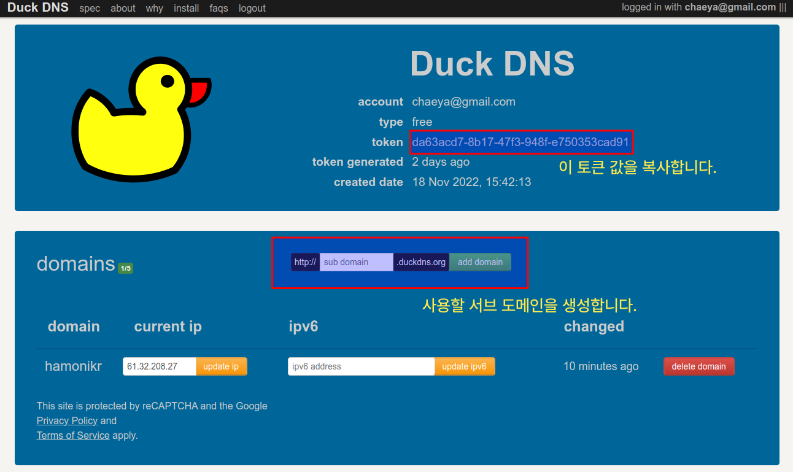
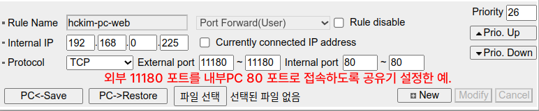
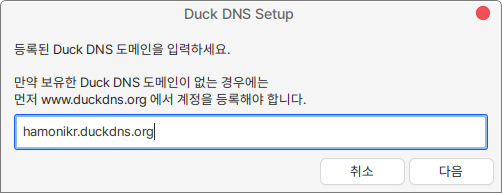
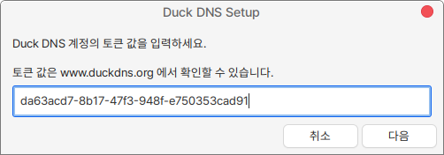
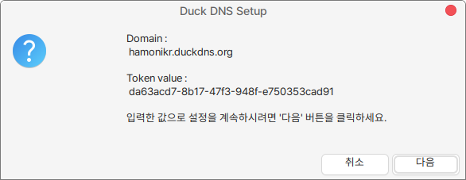
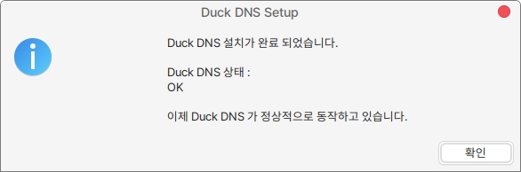

# Duck DNS 사용하기 (동적 DNS)

소프트웨어 개발을 하다보면 현재 사용하고 있는 PC를 서버로 테스트하는 경우가 생깁니다. IP만으로 테스트를 할 수 도 있지만 도메인이 필요한 경우에는 동적 DNS 서비스를 이용해서 도메인으로 서비스를 제공할 수 있습니다.

Duck DNS 는 무료로 제공되는 동적 DNS 서비스로 하모니카에서는 다음과 같이 사용할 수 있습니다.

1. 먼저 Duck DNS 서비스를 이용하기 위하여 계정을 가입합니다. 아래 가입 방법 중 선택하시면 됩니다.

<figure><figcaption><p>Duck DNS 가입</p></figcaption></figure>

2\. 가입 후 아래와 같은 마이 페이지에서 원하는 도메인을 생성하고, 토큰 값을 복사합니다.

<figure><figcaption><p>My Page</p></figcaption></figure>

3\. 공유기에서 아래와 같이 포트 포워딩 규칙을 추가합니다. 아래의 예는 내부PC(192.168.0.225) 80 포트를 공유기의 11180 과 연결하는 설정의 예입니다. 공유기에 따라서 설정 화면은 차이가 있을 수 있지만 대부분 유사합니다.

<figure><figcaption><p>Port Forwarding</p></figcaption></figure>

4\. 프로그램 > Duck DNS 설정 을 실행 후 다음과 같이 Duck DNS 에서 생성한 도메인을 입력합니다.

만약 프로그램이 없는 경우에는 다음과 같이 설치합니다. ([https://github.com/hamonikr/duckdns)](https://github.com/hamonikr/duckdns)

```
sudo apt-get install duckdns
```

<figure><figcaption></figcaption></figure>

5\. 다음 화면에서 Duck DNS 에서 복사한 토큰 값을 입력합니다.

<figure><figcaption></figcaption></figure>

6\. 설정이 맞는지 최종 확인합니다.

<figure><figcaption></figcaption></figure>

7\. 설치 상태를 확인합니다. 만일 정상 동작하지 않는 경우 도메인과 토큰값을 다시 확인하세요.

<figure><figcaption></figcaption></figure>

8\. Duck DNS 설치가 완료되었다면, 웹서비스 설정을 위해서 다음과 같이 필요한 패키지를 설치하고 방화벽 규칙을 추가합니다.

```
sudo apt-get install apache2
sudo ufw allow 80
```

9\. 이제 설정한 도메인으로 접속하면 웹서비스를 확인할 수 있습니다.
