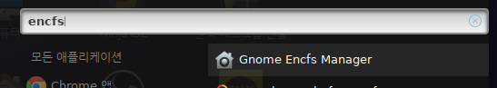
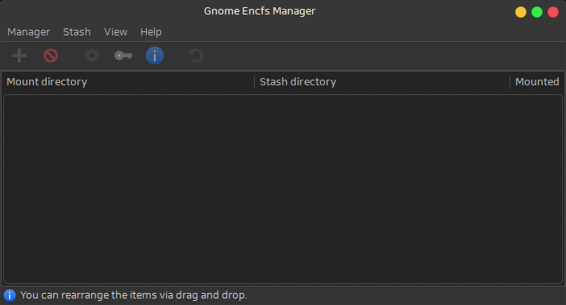
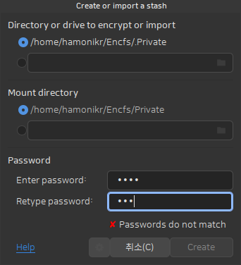
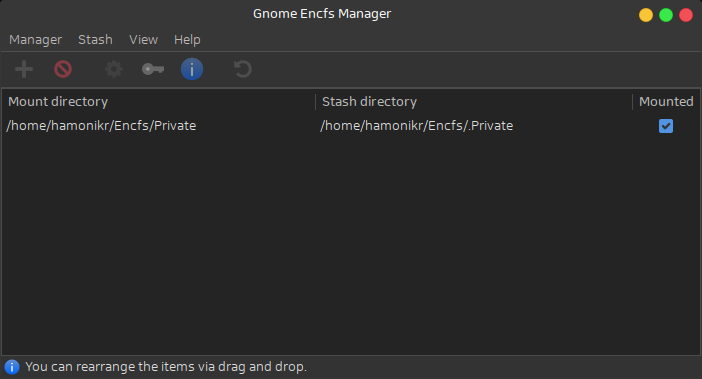
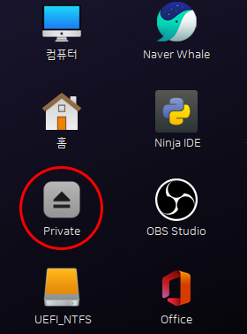
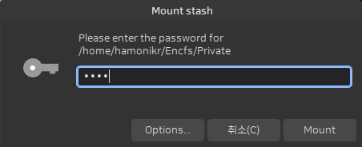

# 하모니카에서 폴더 암호화 사용

하모니카에서는 특정 폴더를 암호화 하는 기능을 사용하기 위해서 encfs 패키지와 gnome-encfs-manager 를 이용할 수 있습니다.

터미널 명령으로 사용할 수 있는 encfs 는 FUSE 를 사용해서 파일시스템을 암호화 할 수있는 프로그램입니다.

## EncFS <a href="#id-encfs" id="id-encfs"></a>

EncFS: an Encrypted Filesystem for FUSE.

[https://vgough.github.io/encfs/](https://vgough.github.io/encfs/)

## 설치 <a href="#id" id="id"></a>

$ apt install encfs&#x20;

## 사용법 <a href="#id" id="id"></a>

터미널을 열고 다음과 같이 실행합니다.

```
mkdir ~/.encrypted ~/encrypted
encfs ~/.encrypted ~/encrypted

위 명령을 실행 후 사용자 입력을 묻는 화면이 나오면 엔터를 치거나 옵션을 선택할 수 있습니다.


암호를 두번 입력합니다.

이제 암호로 보호된 폴더가 생겼으니 원하는 데이터를 작업 폴더로 이동합니다.

mv existing-directory ~/encrypted

모든 작업을 마쳤으면 다음과 같이 마운트를 해제합니다.

```

```
fusermount -u ~/encrypted
```

\
`이제 해당 폴더를 다시 사용하기 위해서는 암호가 필요합니다.`\
\
\
\


## `Gnome Encfs Manager` <a href="#id-gnomeencfsmanager" id="id-gnomeencfsmanager"></a>

`여기까지로 사용은 충분하지만 데스크톱 사용자가 보다 쉽게 사용하기 위해서는 GUI 프로그램이 제공되는 것이 좋습니다.`

\
`설치` <a href="#id-.1" id="id-.1"></a>
-------------------------------------

`터미널을 열고 아래의 명령어를 붙여넣으세요`

sudo add-apt-repository ppa:gencfsm && sudo apt-get update && sudo apt-get -y install gnome-encfs-manager

\
`프로그램 실행` <a href="#id" id="id"></a>
------------------------------------

`프로그램 > encfs 를 검색하면 다음 이미지와 같이 Gnome Encfs Manager 가 보입니다.`



`이 프로그램을 실행하면 아래와 같은 화면이 나옵니다.`



`상단 왼쪽의 메뉴 아이콘에서 + 모양을 누르면 암호를 설정할 폴더를 생성할 수 있습니다.`

`임의의 폴더를 지정해도 되지만 처음 사용자의 경우 위쪽의 메뉴는 그대로 두고 아래쪽의 Password 항목만 입력해도 됩니다.`



`원하는 비밀번호를 동일하게 입력해주면 Create 버튼이 활성화 됩니다.`

`Create 버튼을 누르면 아래와 같이 비밀번호로 보호된 폴더의 설정이 보이고`

`바탕화면에 암호화된 폴더가 자동으로 보입니다.`





## `암호화된 폴더 사용` <a href="#id" id="id"></a>

암호로 보호된 폴더를 사용하기 위해서는 아래 그림처럼 상태표시중의 열쇠모양 아이콘을 클릭합니다.


`클릭하면 이전에 설정한 폴더가 보이며 해당 폴더의 체크박스를 클릭하면 다음과 같이 암호를 묻는 창이 나옵니다.`



`정상적인 암호인 경우 바탕화면에 암호환된 폴더가 보이고 사용할 수 있습니다.`

`해당 폴더에 원하는 작업을 모두 마치면 다시 상태표시줄의 Mounted 체크박스를 해제합니다.`
