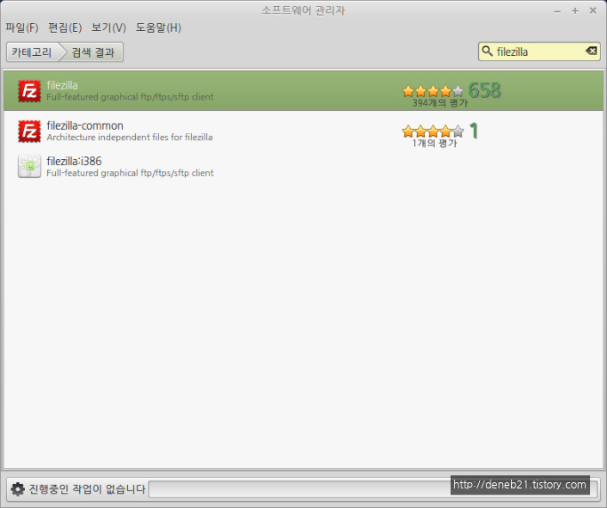
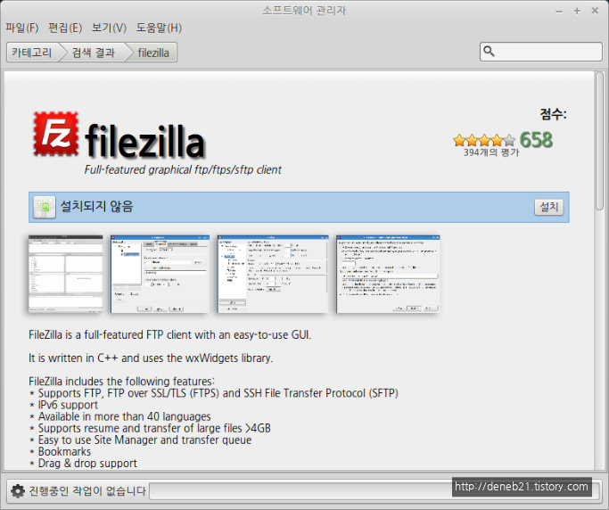
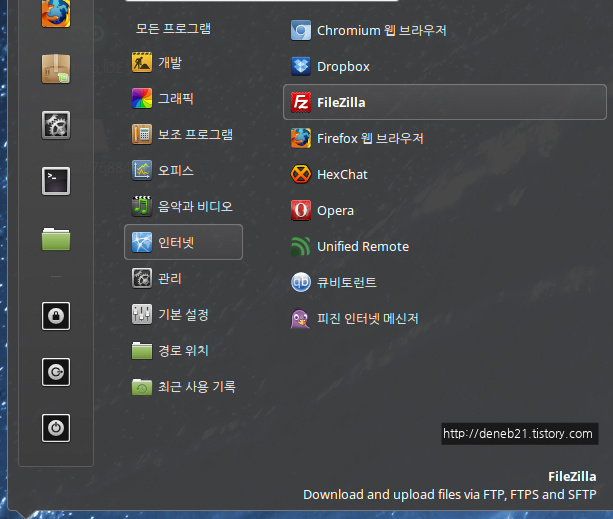
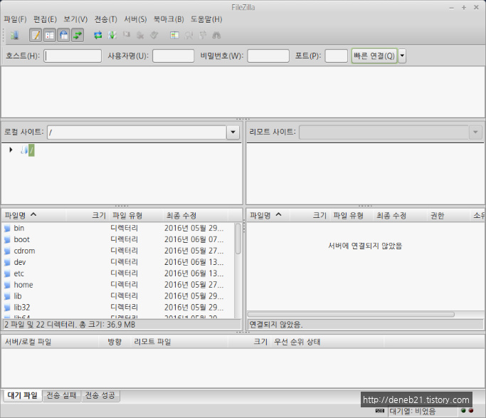
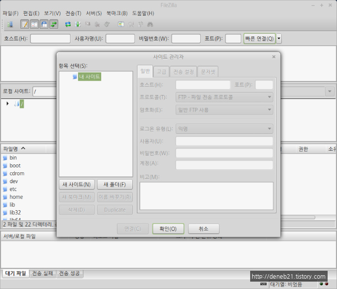
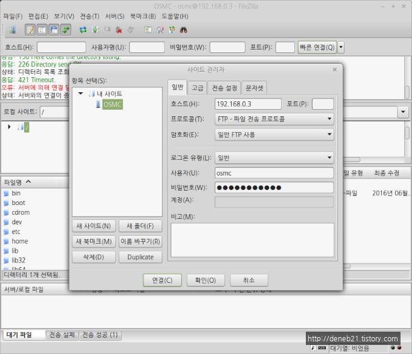
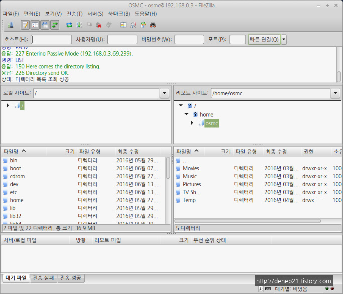
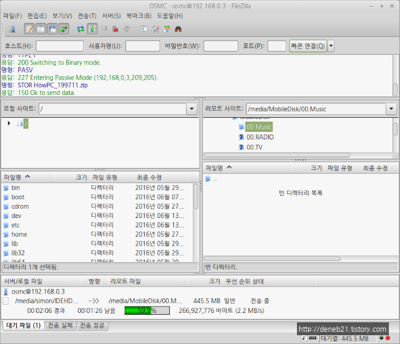
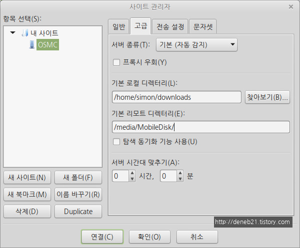

# FTP 클라이언트 프로그램 설치 및 사용 - FileZilla

리눅스 민트를 설치하고 PC를 윈도우 못지 않게 잘 사용하기 위해서 필수 프로그램들을 하나 둘 설치해 보고 있습니다. 이번에는 FTP 클라이언트 프로그램을 설치해 보겠습니다. 저희 집에서는 라즈베리파이에 OSMC(Open Source Media Center, XBMC -> Kodi -> OSMC 순으로 버전 업 되었음) 를 설치하고 외장 하드디스크를 연결해서 동영상, 사진, 음악 등의 파일들을 업로드해서 미디어서버이자 홈서버로 이용하고 있습니다. 라즈베리파이는 전력도 3W 밖에 먹지 않기 때문에 (외장하드가 있으니 좀 더 먹을 수 있습니다. 라즈베리파이 자체의 소비전력은 3W 입니다.) 하루 종일 켜 두고 있습니다. 라즈베리파이에 디스크가 달려 있고 이것을 FTP 로 접속해서 파일을 업로드 합니다. 물론 Samba 서버도 설치가 되어 있어서 굳이 FTP 프로그램 없이도 파일 업로드가 가능하지만 아무래도 FTP를 이용 하는게 안정성 면에서 더 좋은 것 같습니다. 용량이 적으면 상관 없지만 용량이 큰 파일을 업로드 하다가 중간에 에러가 나면 열 받거든요. FTP 클라이언트 설치를 알아보니 리눅스에도 윈도우 사용할 때 익숙했던 FileZilla 프로그램을 설치할 수가 있네요. 다른 좋은 프로그램들도 많지만 저에게 익숙한 FileZilla 를 설치하고 사용해 보았습니다.

언제나 그렇듯 소프트웨어 관리자부터 시작 합니다. 물론 터미널에서 apt-get 같은 명령어를 이용해서 프로그램을 설치해 주는 것이 리눅스에서는 좀 더 리눅스 다운(?) 방법 이겠지만 저는 이게 더 좋은거 같네요. ^^ FileZilla 를 검색하면 맨 위에 FIleZilla 가 나옵니다. 658건의 다운로드에 별 4개면 꽤 좋은 평가 같습니다.\

설치 버튼을 눌러서 설치해 줍니다.\

설치가 끝나고 메뉴를 눌러보면 인터넷 분류에 FileZilla 가 설치되어 있습니다. 실행해 봅니다.\

위와 같이 저에게는 친숙한 UI 가 나타납니다. 파일 -> 사이트 관리자를 선택해서 FTP 사이트를 추가해 보겠습니다. 물론 추가할 사이트는 저의 라즈베리파이 OSMC 서버 입니다.\

사이트 관리자가 뜨면 '새 사이트' 를 눌러서 사이트를 추가해 줍니다,\

OSMC 서버의 IP를 적고 프로토콜을 FTP로 선택해주고 User ID, Password  등의 접속을 위한 정보를 적어줍니다. 모두 이상 없이 적었으면 '연결' 버튼을 눌러 줍니다.\

위와 같이 OSMC 서버에 접속이 잘 되었습니다. \

파일을 하나 업로드 해 보았습니다. 2\~3MB/s 정도의 속도로 업로드가 잘 되네요.

팁을 하나 소개 하자면 위와 같이 사이트 관리자의 '고급' 탭에서 기본 로컬 디렉토리(업로드), 기존 리모트 디렉토리(서버측 디렉토리)를 지정해 두면 더욱 편리 합니다.

이상 리눅스 FTP 클라이언트 프로그램 FileZilla 에 대해서 알아보았습니다.

\
\
출처: [http://deneb21.tistory.com/375](http://deneb21.tistory.com/375)
