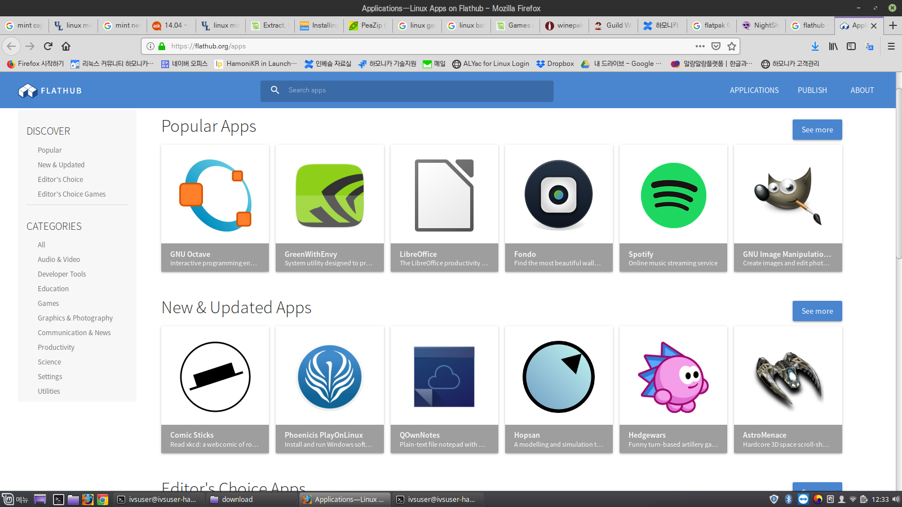
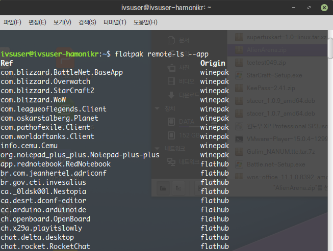
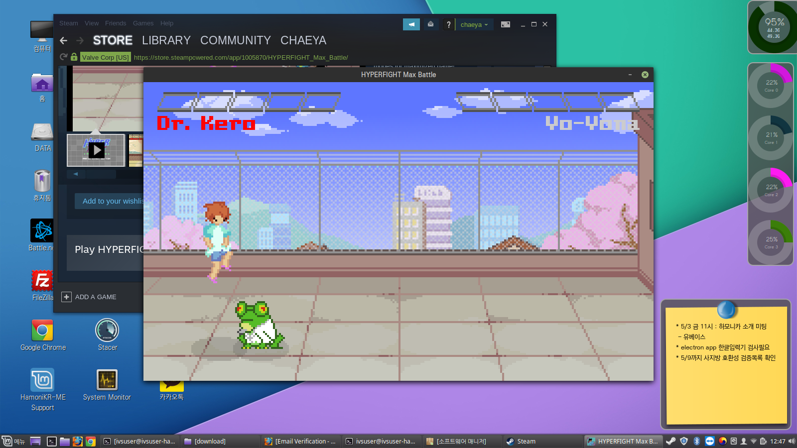

# 하모니카 리눅스에서 flatpak 으로 프로그램 설치 하는 방법

[https://nightshadow.tistory.com/entry/%EC%9A%B0%EB%B6%84%ED%88%AC-%EB%A6%AC%EB%88%85%EC%8A%A4%EC%97%90%EC%84%9C-flatpak-%EC%9C%BC%EB%A1%9C-%ED%94%84%EB%A1%9C%EA%B7%B8%EB%9E%A8-%EC%84%A4%EC%B9%98-%ED%95%98%EB%8A%94-%EB%B0%A9%EB%B2%95](https://nightshadow.tistory.com/entry/%EC%9A%B0%EB%B6%84%ED%88%AC-%EB%A6%AC%EB%88%85%EC%8A%A4%EC%97%90%EC%84%9C-flatpak-%EC%9C%BC%EB%A1%9C-%ED%94%84%EB%A1%9C%EA%B7%B8%EB%9E%A8-%EC%84%A4%EC%B9%98-%ED%95%98%EB%8A%94-%EB%B0%A9%EB%B2%95)

## flatpak 이란? 

latpak 으로 만들어 배포하면 어떠한 리눅스를 사용하던 flatpak 프로그램만 설치해 주면 프로그램을 쉽게 설치할 수 있습니다.

또한 flatpak 으로 설치된 프로그램들은 샌드박스에서 실행 되기때문에 보안문제의 걱정도 줄여줍니다.

비슷한 것으로 우분투에서 지원되는 snappy 라는 것도 있는데, 왠지 분위기는 flatpak 쪽이 좀 더 좋은것 같습니다.

하지만 둘다 같이 사용하는것도 가능하기 때문에 자신이 사용하려는 프로그램에 따라 사용하면 되겠습니다.

* [https://flathub.org](https://flathub.org) 공식 사이트 설치법 참고
* [https://www.winepak.org/](https://www.winepak.org/) 프로젝트에서는 기본 제공되는 flatpak 가 아닌 winepak 을 이용하여 설치하는 프로젝트도 추가할 수 있습니다.

## 프로그램 설치 

### flathub 사이트에서 설치가능한 프로그램 둘러보고 설치 

[https://flathub.org/apps](https://flathub.org/apps)

접속해서 원하는 프로그램의 설치버튼을 누르면 PC의 소프트웨어 매니저를 통해서 설치됩니다.

### 터미널에서 설치가능한 프로그램 확인 

flatpak remote-ls --app

터미널에서 위명령을 실행하면 설치가능한 프로그램 목록이 다음과 같이 나옵니다.

저는 테스트를 위해 steam 을 설치하고 확인했습니다.

아래는 스팀을 설치하고 게임을 하나 구동한 화면

