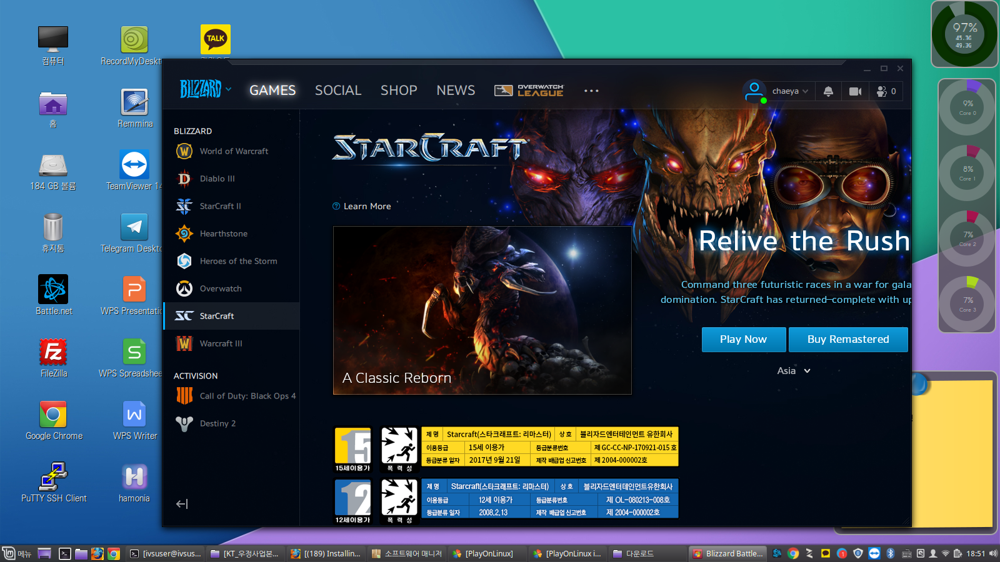
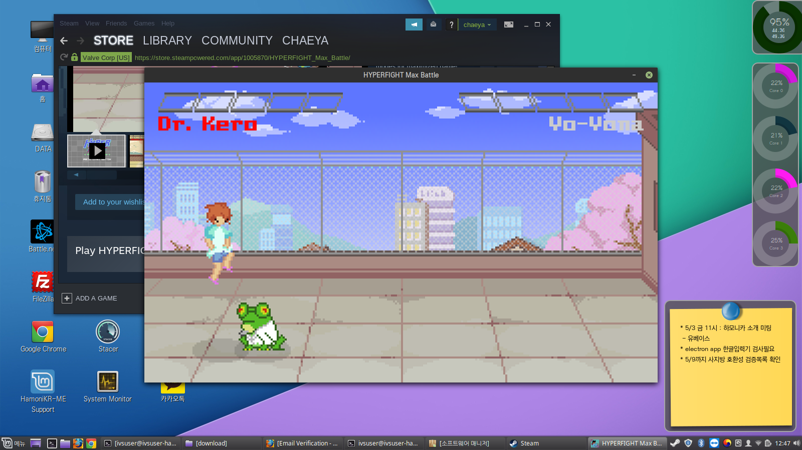
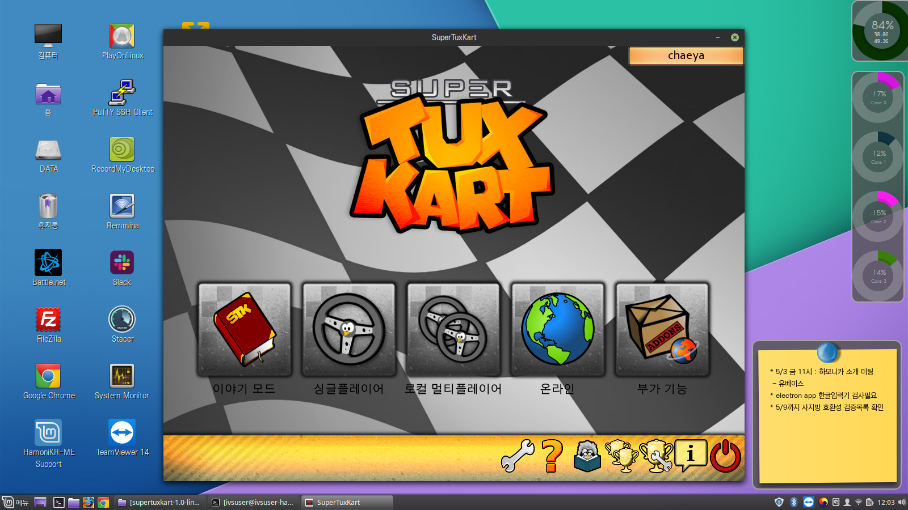
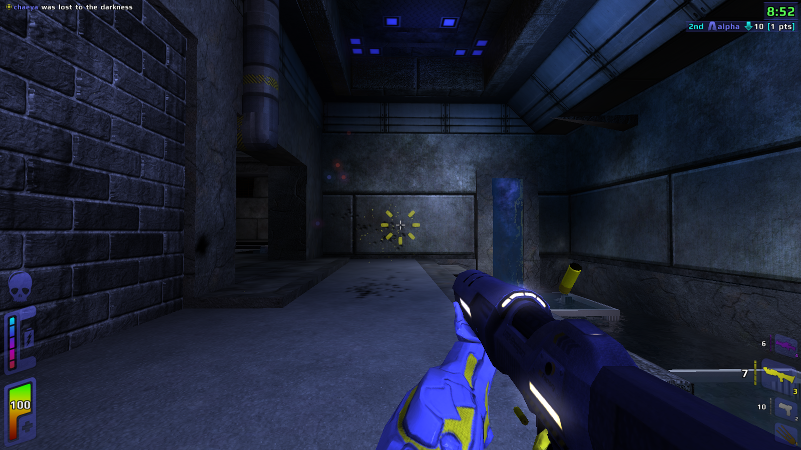

# 하모니카 리눅스에서 게임하기

## 와인을 이용한 배틀넷 게임 

* [https://wiki.guildwars2.com/wiki/Guild\_Wars\_2\_on\_Wine](https://wiki.guildwars2.com/wiki/Guild\_Wars\_2\_on\_Wine)
* [https://www.winepak.org/](https://www.winepak.org/) - 와인을 이용한 윈도우 프로그램 구동하는 프로젝트

## steam 을 설치하고 제공되는 게임하기 

* [http://www.linuxandubuntu.com/home/install-steam-in-ubuntu-linux-mint-and-play-amazing-games-on-linux](http://www.linuxandubuntu.com/home/install-steam-in-ubuntu-linux-mint-and-play-amazing-games-on-linux)

## PC에서 설치되는 게임들 

* [https://itsfoss.com/free-linux-games/](https://itsfoss.com/free-linux-games/)

