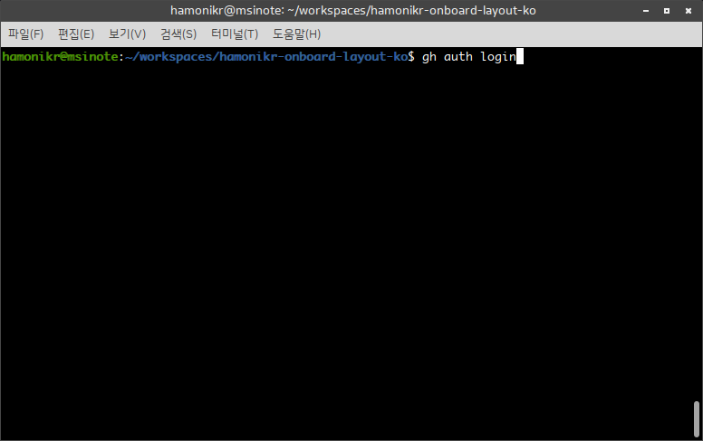
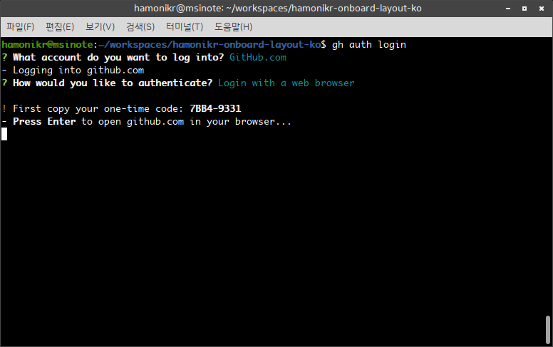
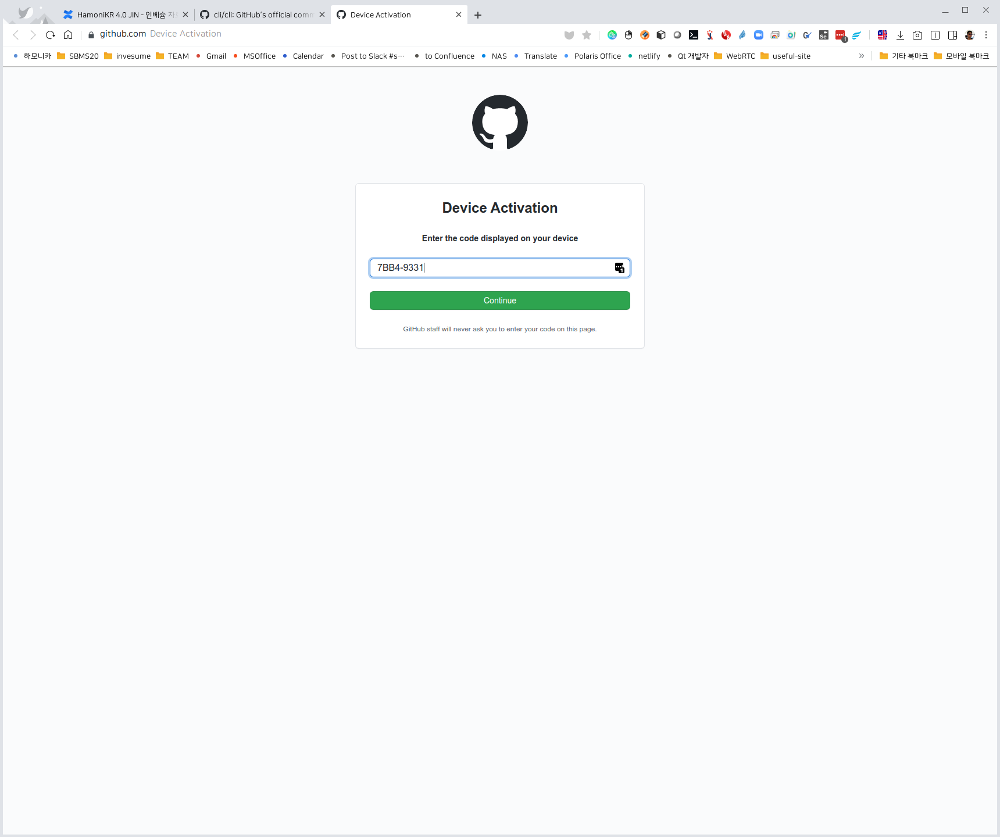
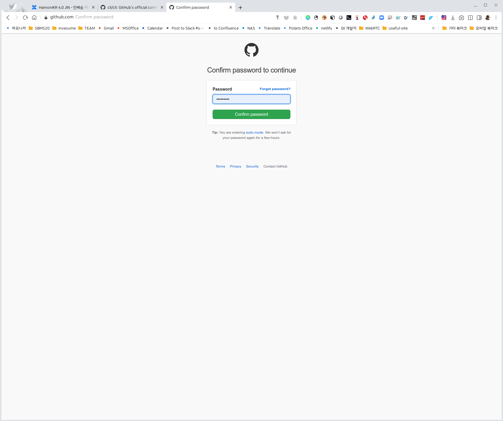
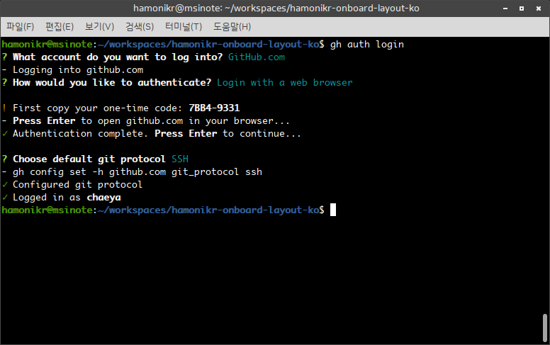
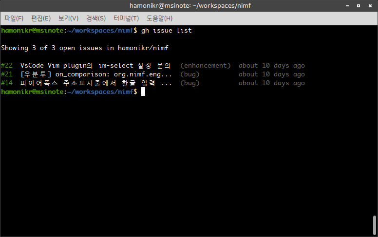

# Github CLI 사용법

깃헙 사용을 터미널에서 쉽게 할 수 있도록 도와주는 도구가 얼마전 출시되었습니다.

터미널에서 깃허브 저장소의 이슈 처리, PR 관리, 릴리즈 관리들의 유용한 기능을 제공합니다.

## 설치하기 <a href="#githubcli" id="githubcli"></a>

```
sudo apt-key adv --keyserver keyserver.ubuntu.com --recv-key C99B11DEB97541F0
sudo apt-add-repository https://cli.github.com/packages
sudo apt update
sudo apt install gh
```

## 사용전 준비사항 <a href="#githubcli" id="githubcli"></a>

먼저 자신의 깃허브 계정으로 로그인과정을 거쳐야 합니다.

$ gh auth login



어떤 방식으로 로그인할지 묻는 화면이 나오면 브라우저로 로그인을 선택하고 엔터를 치세요.

화면과 같이 일회용 디바이스 인증코드가 나오는데 이걸 복사합니다.



엔터를 치면 웹브라우저가 열리고 아래와 같은 화면이 나옵니다.

이전에 복사한 인증코드를 붙여넣기 하세요.



깃허브 계정으로 로그인 후 권한을 설정합니다.



마지막으로 어떤 프로토콜로 깃허브를 사용할지 http 또는 ssh 를 선택합니다.

정상적으로 로그인이 완료되면 다음과 같이 나타납니다.



## Github CLI 기본 사용법 <a href="#githubcli-githubcli" id="githubcli-githubcli"></a>

### 이슈 관리 <a href="#githubcli" id="githubcli"></a>

다음과 같이 이슈를 확인하고 처리할 수 있습니다.



이슈 목록 확인

```
# Viewing a list of open issues
~/Projects/my-project$ gh issue list

Issues for owner/repo

#14  Update the remote url if it changed  (bug)
#14  PR commands on a detached head       (enhancement)
#13  Support for GitHub Enterprise        (wontfix)
#8   Add an easier upgrade command        (bug)

~/Projects/my-project$
```

이슈를 터미널에서 대화형으로 생성

```
# Create an issue interactively
~/Projects/my-project$ gh issue create
Creating pull request for feature-branch into main in owner/repo
? Title My new issue
? Body [(e) to launch nano, enter to skip]
http://github.com/owner/repo/issues/1
~/Projects/my-project$
```

이슈를 명령줄에서 한줄로 생성

```
# Create an issue using flags
~/Projects/my-project$ gh issue create --title "Issue title" --body "Issue body"
http://github.com/owner/repo/issues/1
~/Projects/my-project$
```

이슈를 웹브라우저로 생성

```
// Quickly navigate to the issue creation page
~/Projects/my-project$ gh issue create --web
Opening https://github.com/owner/repo/issues/new in your browser.
~/Projects/my-project$
```

이슈 닫기

```
gh issue close {<number> | <url>} [flags]
```

### 풀리퀘스트(PR) 관리 <a href="#githubcli-pr" id="githubcli-pr"></a>

요청된 PR을 체크아웃

```
// Checking out a pull request locally
~/Projects/my-project$ gh pr checkout 12
remote: Enumerating objects: 66, done.
remote: Counting objects: 100% (66/66), done.
remote: Total 83 (delta 66), reused 66 (delta 66), pack-reused 17
Unpacking objects: 100% (83/83), done.
From https://github.com/owner/repo
 * [new ref]             refs/pull/8896/head -> patch-2
M       README.md
Switched to branch 'patch-2'

~/Projects/my-project$
```

PR의 변경내용 확인

```
gh pr diff [<number> | <url> | <branch>] [flags]
```

PR 머지하기

기본값으로 PR을 머지한 후에는 원격 저장소와 로컬 저장소의 PR 브랜치를 삭제하게 되어있습니다. 유지하려면 ‘–delete-branch=false’ 을 사용하세요.

```
gh pr merge [<number> | <url> | <branch>] [flags]
```

PR Close

```
gh pr close {<number> | <url> | <branch>} [flags]
```

더 많은 기능에 대한 자세한 사용법은 [여기](https://cli.github.com/manual/)를 참고하세요.
