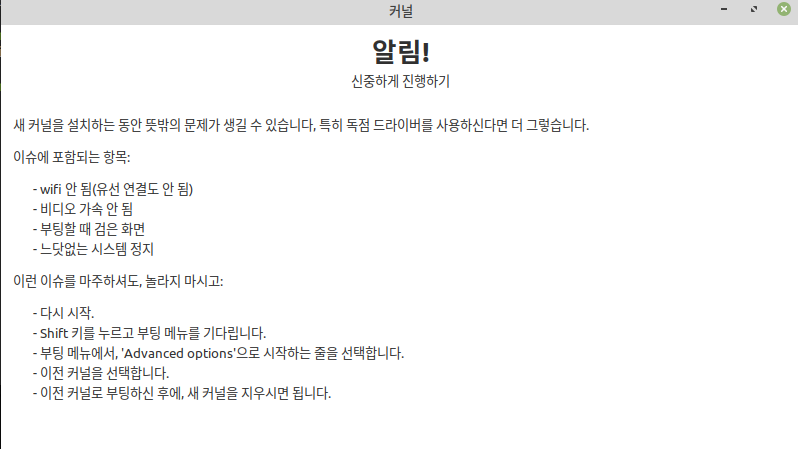

# 하모니카 커널 변경 방법



* [하모니카 3.0 지원 커널 목록](kernel.md#id-하모니카커널변경방법-하모니카3.0지원커널목록)
* [개요](kernel.md#id-하모니카커널변경방법-개요)
* [커널이란](kernel.md#id-하모니카커널변경방법-커널이란)
* [커널 종류](kernel.md#id-하모니카커널변경방법-커널종류)
* [커널 확인 방법](kernel.md#id-하모니카커널변경방법-커널확인방법)
* [설치된 커널 패키지 확인](kernel.md#id-하모니카커널변경방법-설치된커널패키지확인)
  * [linux-kernel-generic](kernel.md#id-하모니카커널변경방법-linux-kernel-generic)
  * [linux-headers , linux-headers-generic](kernel.md#id-하모니카커널변경방법-linux-headers,linux-headers-generic)
  * [linux-image-generic](kernel.md#id-하모니카커널변경방법-linux-image-generic)
  * [linux-modules-generic , linux-modules-extra-generic](kernel.md#id-하모니카커널변경방법-linux-modules-generic,linux-modules-extra-generic)
* [커널 설치](kernel.md#id-하모니카커널변경방법-커널설치)
* [설치 확인](kernel.md#id-하모니카커널변경방법-설치확인)
* [커널 삭제](kernel.md#id-하모니카커널변경방법-커널삭제)

**※ 해당 문서는 하모니카 3.0를 기준으로 작성되었습니다.**

**※ 커널 변경 전 Timeshift 를 이용하여 백업한 뒤 진행하는 것을 권장 드립니다.**

**※ 순서대로 진행하지 않는 경우 에러가 발생하여 장치에 이상이 생길 수 있습니다. 주의하시기 바랍니다.**

## **하모니카 3.0 지원 커널 목록** <a href="#id-3.0" id="id-3.0"></a>

* [https://pms.invesume.com:8444/x/QoWHAg](https://pms.invesume.com:8444/x/QoWHAg)

## **개요** <a href="#id" id="id"></a>

협력업체에서 하모니카에서 지원하는 커널 버전 정보를 요청하였고 보다 상위 버전의 커널을 사용할 수 있는 방법에 대한 문의를 전달 받음

이와 관련된 기술 지원을 위한 안내 문서 작성 필요가 있음

## **커널이란** <a href="#id" id="id"></a>

리눅스 커널은 운영체제에서 가장 중요한 부분이다.

프로세서와 시스템 메모리에 상주하면서 디바이스나 메모리 같은 하드웨어 자원을 관리하고,

프로세스의 스케줄을 관리하여 다중 프로세스를 구현하고, 시스템에 연결된 입출력을 처리하는 운영체제의 핵심 역할을 수행한다.

## **커널 종류** <a href="#id" id="id"></a>

linux-image-4.18.0 을 기준으로 커널을 확인해 보면 아래와 같은 목록을 확인할 수 있다

```
linux-image-4.18.0-1004-gcp       linux-image-4.18.0-1013-azure     linux-image-4.18.0-15-generic
linux-image-4.18.0-1005-gcp       linux-image-4.18.0-1013-gcp       linux-image-4.18.0-15-lowlatency
linux-image-4.18.0-1006-aws       linux-image-4.18.0-1014-azure     linux-image-4.18.0-16-generic
linux-image-4.18.0-1006-azure     linux-image-4.18.0-1015-gcp       linux-image-4.18.0-16-lowlatency
linux-image-4.18.0-1006-gcp       linux-image-4.18.0-1016-aws       linux-image-4.18.0-17-generic
linux-image-4.18.0-1007-aws       linux-image-4.18.0-1017-aws       linux-image-4.18.0-17-lowlatency
linux-image-4.18.0-1007-azure     linux-image-4.18.0-1018-aws       linux-image-4.18.0-18-generic
linux-image-4.18.0-1007-gcp       linux-image-4.18.0-1018-azure     linux-image-4.18.0-18-lowlatency
linux-image-4.18.0-1008-aws       linux-image-4.18.0-1019-azure     linux-image-4.18.0-20-generic
linux-image-4.18.0-1008-azure     linux-image-4.18.0-1020-aws       linux-image-4.18.0-20-lowlatency
linux-image-4.18.0-1008-gcp       linux-image-4.18.0-1020-azure     linux-image-4.18.0-21-generic
linux-image-4.18.0-1009-gcp       linux-image-4.18.0-1023-azure     linux-image-4.18.0-21-lowlatency
linux-image-4.18.0-1011-aws       linux-image-4.18.0-1024-azure     linux-image-4.18.0-22-generic
linux-image-4.18.0-1011-azure     linux-image-4.18.0-1025-azure     linux-image-4.18.0-22-lowlatency
linux-image-4.18.0-1011-gcp       linux-image-4.18.0-13-generic     linux-image-4.18.0-24-generic
linux-image-4.18.0-1012-aws       linux-image-4.18.0-13-lowlatency  linux-image-4.18.0-24-lowlatency
linux-image-4.18.0-1012-gcp       linux-image-4.18.0-14-generic     linux-image-4.18.0-25-generic
linux-image-4.18.0-1013-aws       linux-image-4.18.0-14-lowlatency  linux-image-4.18.0-25-lowlatency
```

목록을 보면 크게 5종류로 나뉘는 것을 확인 할 수 있다

* **gcp :** Google Cloud Platform 구글 클라우드 플랫폼 지원 버전
* **aws :** Amazon Web Services 아마존 웹 서비스 지원 버전
* **azure :** Microsoft Azure 지원 버전
* **generic :** 일반적인 버전
* **lowlatency :** 대기시간이 짧은 버전으로 일반 커널에 비해 성능이 약간 낮고 베터리 수명이 짧다

## **커널 확인 방법** <a href="#id" id="id"></a>

```
# 커널 확인
uname -a

# 하모니카 1.4 커널 버전
Linux hamo 4.15.0-20-generic #21-Ubuntu SMP Tue Apr 24 06:16:15 UTC 2018 x86_64 x86_64 x86_64 GNU/Linux

# 하모니카 3.0 커널 버전
Linux nhis-X556UAK 4.15.0-54-generic #58-Ubuntu SMP Mon Jun 24 10:55:24 UTC 2019 x86_64 x86_64 x86_64 GNU/Linux
```

## **설치된 커널 패키지 확인** <a href="#id" id="id"></a>

```
# ex) dpkg -l | grep 커널버전
dpkg -l | grep 4.15.0-54

# output
ii  linux-headers-4.15.0-54                    4.15.0-54.58                                 all          Header files related to Linux kernel version 4.15.0
ii  linux-headers-4.15.0-54-generic            4.15.0-54.58                                 amd64        Linux kernel headers for version 4.15.0 on 64 bit x86 SMP
ii  linux-image-4.15.0-54-generic              4.15.0-54.58                                 amd64        Signed kernel image generic
ii  linux-kernel-generic                       4.15.0-54                                    all          The Linux kernel.
ii  linux-modules-4.15.0-54-generic            4.15.0-54.58                                 amd64        Linux kernel extra modules for version 4.15.0 on 64 bit x86 SMP
ii  linux-modules-extra-4.15.0-54-generic      4.15.0-54.58                                 amd64        Linux kernel extra modules for version 4.15.0 on 64 bit x86 SMP
```

### **linux-kernel-generic** <a href="#id-linux-kernel-generic" id="id-linux-kernel-generic"></a>

릴리스 커널을 가리키는 메타 패키지([메타 패키지?](https://pms.invesume.com:8444/x/OYWHAg))로 LinuxMint 에서 제공하는 패키지 이며

커널과 관련된 패키지를 그룹화 하여 일괄적으로 업데이트 할 수 있도록 지원해 준다.

LinuxMint 에선 4.15.0-54 버전 이후 5.0.0-32 버전을 지원하고 있으며

다른 버전의 커널을 설치하고 싶다면 linux-kernel-generic 을 무시하고 수동으로 다른 버전의 커널을 설치 해야 한다.

### **linux-headers , linux-headers-generic** <a href="#id-linux-headers-linux-headers-generic" id="id-linux-headers-linux-headers-generic"></a>

헤더는 내부 커널 구성 요소간 및 사용자 공간과 커널간 인터페이스 역활을 하며, 소스 파일의 함수가 정의되는 방식을 지정합니다.

C에서는 함수를 사용하기 전에 함수를 선언해야 합니다. 즉, 함수에 대한 설명, 매개 변수 및 반환되는 데이터 종류의 선언을 header 라는 단일 파일에 넣는 것이 일반적입니다.

linux-headers 는 리눅스 커널이 제공하는 기능을 포함하는 모든 파일입니다.

### **linux-image-generic** <a href="#id-linux-image-generic" id="id-linux-image-generic"></a>

일반적인 리눅스 커널 이미지

### **linux-modules-generic , linux-modules-extra-generic** <a href="#id-linux-modules-generic-linux-modules-extra-generic" id="id-linux-modules-generic-linux-modules-extra-generic"></a>

패키저가 빌드 한 모듈 및 업데이트 후 시스템을 부팅 할 수없는 상태로 두지 않도록하는 스크립트를 포함합니다.

## **커널 설치** <a href="#id" id="id"></a>

```
# 설치
sudo apt-get install -y linux-image-4.18.0-25-generic
sudo apt-get install -y linux-headers-4.18.0-25-generic
sudo apt-get install -y linux-modules-extra-4.18.0-25-generic

# 재부팅 필요
reboot
```

※ 부팅시 shift 키를 누르고 있으면 grub 모드로 접속이 가능하며 **'HamoniKR용 고급 설정'** 메뉴에서 설치된 커널을 선택하여 부팅이 가능하다.

## **설치 확인** <a href="#id" id="id"></a>

```
# 확인
dpkg -l *4.18.0-25*

# output
희망상태=알수없음(U)/설치(I)/지우기(R)/깨끗이(P)/고정(H)
| 상태=아님(N)/설치(I)/설정(C)/풀림(U)/절반설정(F)/일부설치(H)/트리거대기(W)/
| /    트리거밀림(T)
|/ 오류?=(없음)/다시설치필요(R) (상태, 오류가 대문자=불량)
||/ 이름                                      버전                      Architecture              설명
+++-=========================================-=========================-=========================-=======================================================================================
ii  linux-headers-4.18.0-25                   4.18.0-25.26~18.04.1      all                       Header files related to Linux kernel version 4.18.0
ii  linux-headers-4.18.0-25-generic           4.18.0-25.26~18.04.1      amd64                     Linux kernel headers for version 4.18.0 on 64 bit x86 SMP
ii  linux-image-4.18.0-25-generic             4.18.0-25.26~18.04.1      amd64                     Signed kernel image generic
un  linux-image-unsigned-4.18.0-25-generic    <none>                    <none>                    (설명 없음)
ii  linux-modules-4.18.0-25-generic           4.18.0-25.26~18.04.1      amd64                     Linux kernel extra modules for version 4.18.0 on 64 bit x86 SMP
ii  linux-modules-extra-4.18.0-25-generic     4.18.0-25.26~18.04.1      amd64                     Linux kernel extra modules for version 4.18.0 on 64 bit x86 SMP
```

## **커널 삭제** <a href="#id" id="id"></a>

아래와 같이 삭제 하지 않는 경우 OS 일부 기능이 정상적으로 동작하지 않을 수 있습니다. (ex 터치패드, 네트워크 등의 장비 제어)

```
# 삭제
sudo apt-get --purge remove -y linux-image-4.15.0-54-generic
sudo apt-get --purge remove -y linux-image-unsigned-4.15.0-54-generic
sudo apt-get --purge remove -y linux-headers-4.15.0-54-generic
sudo apt-get --purge remove -y linux-headers-4.15.0-54
sudo apt-get --purge remove -y linux-modules-4.15.0-54-generic
sudo apt-get --purge remove -y linux-modules-extra-4.15.0-54-generic

# 재시작
reboot
```
