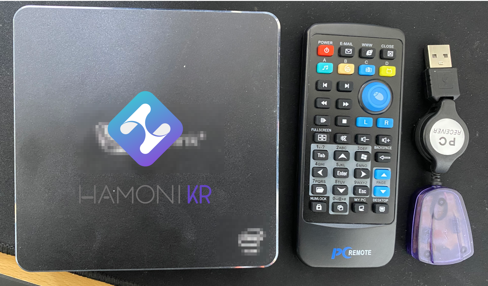
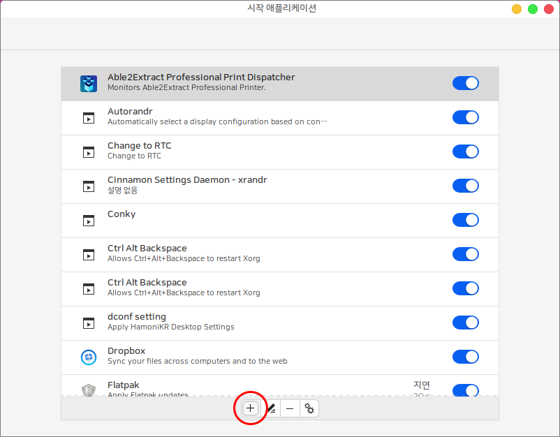
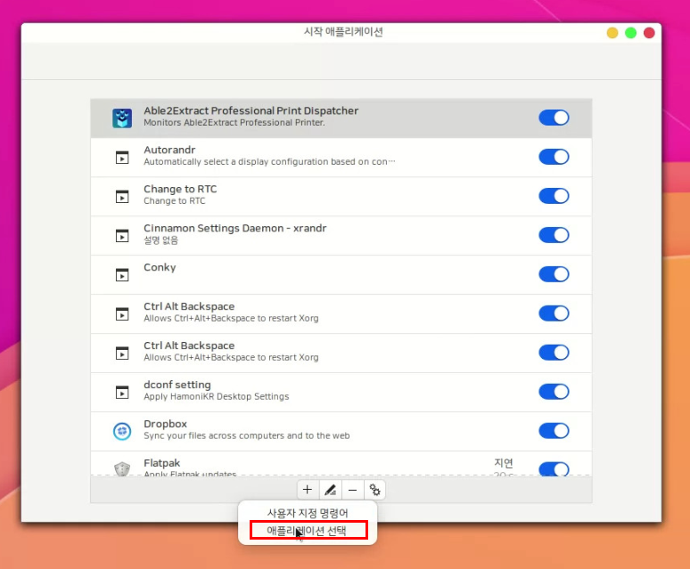
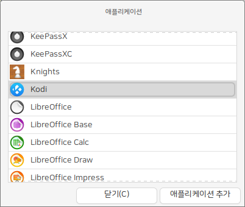
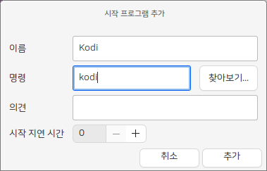
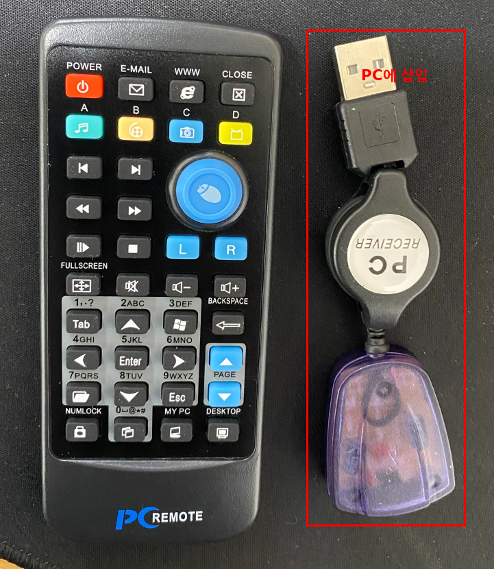

# 하모니카로 홈시어터를 구축하는 방법

스마트 TV를 구매하거나 별도의 IPTV 셋탑박스를 이용해서 집에서 사용할 수 있는 홈시어터 환경을 많이 사용하고 있는데 하모니카를 이용하면 집에서 사용하지 않는 컴퓨터를 이용해서 IPTV 나 홈시어터를 쉽게 구축할 수 있습니다.

PC를 이용해서 홈시어터 환경을 구축하면 크롬캐스트나 OTA 스틱과 같은 스트리밍 전용 기기가 수행할 수 있는 작업을 하면서 더 많은 기능을 유연하게 사용할 수 있는 장점이 있습니다.

하모니카를 이용해서 홈시어터를 구축해보세요.

## 준비물 <a href="#id" id="id"></a>




* 화면 크기가 크고 보기 좋은 모니터 (40인치 이상의 모니터 정도면 거실  TV로 보기 좋습니다.)
* 사용하지 않는 구형 컴퓨터나 노트북 또는 미니PC
* 하모니카 OS 부팅 USB : [https://hamonikr.org/menuDownload\_JIN](https://hamonikr.org/menuDownload\_JIN)
* 리모컨 : [https://www.aliexpress.com/item/4000627861401.html?spm=a2g0s.9042311.0.0.31dd4c4dIcOMQ9](https://www.aliexpress.com/item/4000627861401.html?spm=a2g0s.9042311.0.0.31dd4c4dIcOMQ9) (2,214원)

리모컨이 없는 경우에는 KODI 를 스마트폰으로 조작할 수 있는 앱 yaste 를 이용해서 리모컨처럼 활용할 수 있습니다.

### 1) PC에 하모니카OS 설치하기 <a href="#id-1-pc-os" id="id-1-pc-os"></a>

하모니카 ISO 를 다운로드 받아서 부팅 USB를 제작하고 PC에 하모니카를 설치합니다.

자세한 설치 방법은 아래 링크한 문서를 참고하세요

[https://docs.hamonikr.org/hamonikr/hamonikr-guide-2](https://docs.hamonikr.org/hamonikr/hamonikr-guide-2)

### 2) 시작 어플리케이션으로 미디어 센터 KODI  또는 Hypnotix 등록하기 <a href="#id-2-kodi-hypnotix" id="id-2-kodi-hypnotix"></a>

PC를 홈시어터로 사용하기 위해서 컴퓨터가 시작될 때 실행될 프로그램을 등록합니다.

미디어 센터의 다양한 기능을 제공하는 KODI 또는 IPTV 기능만 제공하는 Hypnotix 를 선택해서 등록할 수 있습니다.

#### **KODI** <a href="#id-kodi" id="id-kodi"></a>

KODI는 기본으로 제공하는 프로그램이므로 다음과 같이 시작 어플리케이션으로 등록합니다.

프로그램 메뉴 > 시작 어플리케이션을 실행하고 다음 이미지와 같이 + 아이콘을 클릭합니다.



아이콘을 클릭하면 다음과 같이 두가지 선택 메뉴가 나옵니다. 여기서 애플리케이션 선택을 클릭합니다.



애플리케이션 목록에서 Kodi 프로그램을 선택하고 애플리케이션 추가 버튼을 클릭합니다.



사용자 지정 명령어를 선택해서 추가하는 경우에는 다음과 같이 입력합니다.



#### **Hypnotix** <a href="#id-hypnotix" id="id-hypnotix"></a>

이 프로그램은 누구나 무료로 IPTV를 볼 수 있는 프로그램으로 기본으로 제공되지 않기 때문에 추가로 설치가 필요합니다.

하모니카 4.0 사용자는 다음과 같이 설치해주세요.

터미널을 열고(Ctrl+Alt+T) 다음과 같이 한줄씩 입력하세요.

```
sudo apt update
sudo apt install -y hypnotix
```

프로그램에 대한 내용은 아래 링크한 문서를 참고하세요.

[https://hamonikr.org/hamoni\_notice/84004](https://hamonikr.org/hamoni\_notice/84004)

### 3) 리모컨 리시버 장착 <a href="#id-3" id="id-3"></a>

IR방식 또는 USB 방식 등 호환되는 여러가지 리모컨을 사용할 수 있지만 하모니카 팀에서 테스트를 완료한 아래의 리모컨을 추천합니다.

아래 제품의 경우 별도의 설정없이 리모컨 리시버를 USB에 꼽기만 하면 대부분의 조작이 가능합니다.

* 리모컨 : [https://www.aliexpress.com/item/4000627861401.html?spm=a2g0s.9042311.0.0.31dd4c4dIcOMQ9](https://www.aliexpress.com/item/4000627861401.html?spm=a2g0s.9042311.0.0.31dd4c4dIcOMQ9) (2,214원)



### 4) 컴퓨터 재시작 <a href="#id-4" id="id-4"></a>

이제 컴퓨터를 재시작하면 KODI 를 리모컨으로 조작하면서 사용할 수 있습니다.

KODI 사용방법은 아래의 링크를 참고해주세요.

* KODI 를 이용해서 넷플릭스를 설정하는 방법 : [https://hamonikr.org/used\_hamonikr/86425](https://hamonikr.org/used\_hamonikr/86425)
* 다운받은 미디어파일을 KODI 라이브러리로 설정 : [https://anchoki.tistory.com/127](https://anchoki.tistory.com/127)
* 영화 애드온 EXODUS : [https://blog.naver.com/helper7737/221490569342](https://blog.naver.com/helper7737/221490569342)
* KODI 구글 드라이브 연결하기 : [https://wild7.tistory.com/412](https://wild7.tistory.com/412)
