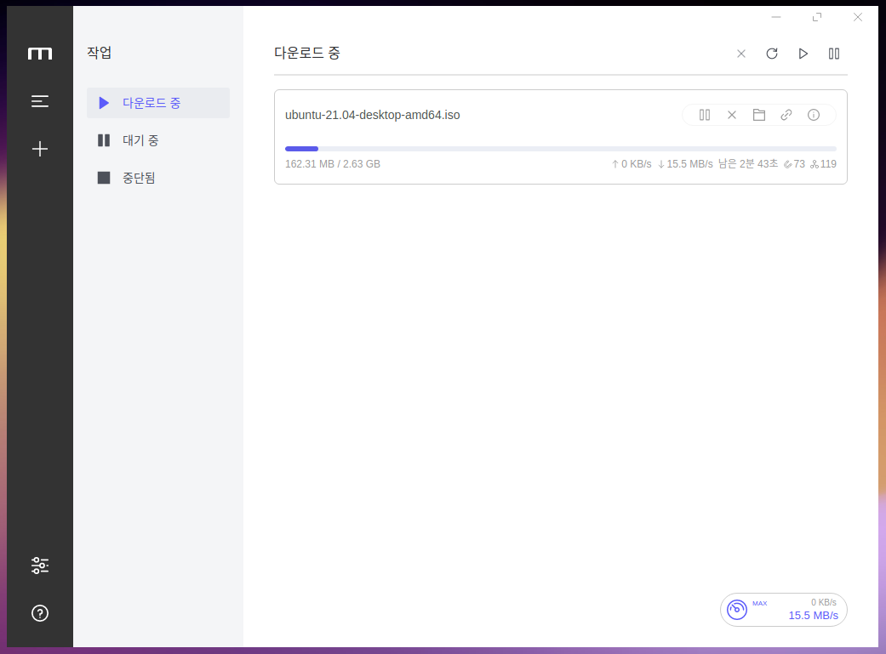

# Motrix 매뉴얼

## Motrix란?

* Motrix는 HTTP, FTP, 비트 토렌트, 마그넷 등의 다운로드를 지원하는 다운로드 매니저 입니다.
* 사용자가 사용하기 쉽게 직관적이고 간단한 인터페이스를 제공하고 있습니다.
* [https://github.com/agalwood/Motrix](https://github.com/agalwood/Motrix)

## Motrix 설치

```bash
sudo apt update
```

## Motrix 간단 설명

처음 Motrix를 실행하면 나오는 화면입니다.


토렌트 파일을 더블클릭하면 다음과 같이 다운로드 받는 창이 뜹니다.

추가로 이름을 변경하거나 고급 설정을 통해 프록시 설정 등을 할 수 있습니다.


제출 버튼을 누르면 다운로드를 시작합니다.

우측 상단에 일시중지, 취소, 폴더로 이동 등의 항목이 있습니다.



설정을 통해 테마, 다운로드 폴더, 전송 속도 등을 변경할 수 있습니다.


다운로드 위치로 이동하면 다음과 같이 다운로드 받은 파일과 해시코드 이름으로 된 토렌트 파일이 같이 생성됩니다.

해당 파일은 기존에 더블 클릭하였던 토렌트 파일과 같은 파일입니다.

윈도우에서도 토렌트를 다운받을 때 특정 폴더에 생기게 되는 파일이므로 지워주시면 됩니다.


다운로드가 완료되면 기존 토렌트와 마찬가지로 시더로 변하게 됩니다.

X 버튼을 통하여 제거를 할 수 있습니다.

'파일과 삭제' 에 체크를 하면 다운로드 받은 파일 까지 삭제가 되니 주의해야 합니다.


