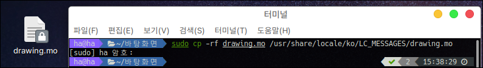

# Poedit

오픈소스는 글로벌로 사용할 수 있도록 번역 파일이 존재합니다.

하지만 대부분의 오픈소스가 모든 국가가 번역되어 있는 것이 아닌 일부분만 번역되어 있거나 번역되지 않은 경우가 많습니다.

그 이유는 개발자가 모든 언어의 번역을 하기 어렵기 때문입니다.

만약 오픈소스에 기여를 하고 싶다면 가장 먼저 봐야할 것은 번역 파일이라고 볼 수 있습니다.

가장 대표적인 번역 방법으로는 po 파일을 번역하는 것에 있습니다.

## 설치

po 파일을 그냥 번역할 수도 있지만 에디터를 사용하면 좀 더 쉽고 빠르게 번역을 진행할 수 있습니다.

```bash
sudo apt install poedit
```

## 실행

시작메뉴에서 poedit를 검색합니다.

<figure><figcaption></figcaption></figure>

기본 실행화면입니다.

<figure><figcaption></figcaption></figure>

번역을 하는 예시입니다.

예를들면 drawing 프로그램의 일부가 번역이 안되어 있는것을 보실 수 있습니다.

<figure><figcaption></figcaption></figure>

프로그램이 이미 설치되어 있기 때문에 해당 파일을 /usr/share/locale/ko/LC\_MESSAGES/drawing.mo 파일로 존재합니다.

mo 파일을 열어볼 경우 암호화 되어 있는 것을 보실 수 있습니다.

이를 풀기위해서 다음 명령어를 사용합니다.

```
# /usr~ 경로는 sudo 권한이 필요합니다.

# mo > po 변환
sudo msgunfmt 'mo파일 이름' -o 'mo 파일 확장자만 po로바꿈'
# ex) sudo msgunfmt drawing.mo -o drawing.po

# po > mo 변환
sudo msgfmt 'po파일 이름' -o 'po 파일 확장자만 mo로 바꿈'
# ex) sudo msgunfmt drawing.po -o drawing.mo
```

<figure><figcaption></figcaption></figure>

드래그드롭으로 파일을 쉽게 여실 수 있습니다.

<figure><figcaption></figcaption></figure>

Ctrl + F 찾기 기능을 이용하여 쉽게 번역이 안된 문구를 찾을 수 있습니다.

<figure><figcaption></figcaption></figure>

저장 후 po 파일을 위에서 설명한 방식으로 mo 파일로 변환합니다.

<figure><figcaption></figcaption></figure>

원래 mo 파일이 있던 위치로 복사 또는 이동합니다.

<figure><figcaption></figcaption></figure>

기존 프로그램을 실행하여 번역이 잘 되어있는지 확인해봅니다.

<figure><figcaption></figcaption></figure>
