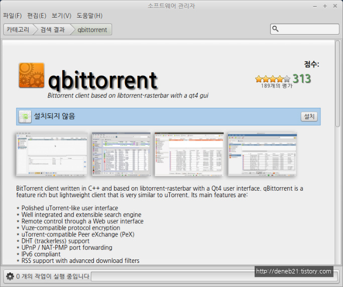
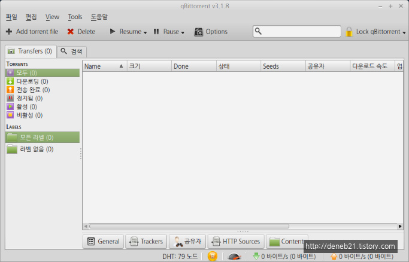
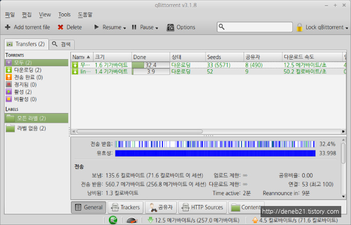

# 토렌트 프로그램 추천 - qbittorrent

리눅스 민트를 설치하면 토렌트 클라이언트(Torrent Client) 프로그램도 기본으로 설치가 되어 있습니다. 트랜스미션(Transmission) 이라는 프로그램 인데 Mac 에서도 많이 사용하는 나름 괜찮은 프로그램 이지만 uTorrent 같은 프로그램을 사용하던 사람들에게는 UI 가 조금 생소 합니다. 그렇다고 utorrent를 설치하기에는 좀 그렇습니다. 유료버전이 나오면서 무료버전은 Ad Ware화 되었거든요. 그래서 그 대용 프로그램으로 예전에 [윈도우용 qbittorrent 에 대해서 포스팅](http://deneb21.tistory.com/303) 한 적이 있습니다. 이 qbittorrent 를 리눅스에서도 그대로 사용할 수 있습니다.

.jpg>)

메뉴 -> 소프트웨어 관리자를 들어가서 torrent 로 검색합니다. 위와 같이 qbittorrent 가 검색이 됩니다. 더블클릭 합니다.

설치 버튼을 눌러서 설치를 합니다.\

메뉴 -> 인터넷에 들어가면 '큐비토런트' 라는 이름으로 설치가 되어 있습니다. 그런데 토렌트가 맞는지? 토런트가 맞는지 모르겠네요. ㅋ  아무튼 큐비토런트 라는 이름으로 설치가 됩니다.\

.jpg>)

옵션을 먼저 확인해 줍니다. Tools -> Options\

.jpg>)

다운로드 탭에서 다운로드 할 폴더를 선택해 줍니다. 기본설정은 다운로드 폴더로 지정이 되어 있습니다.\

BitTorrent 탭에서 qbittorrent 의 특징 기능인 익명모드 기능 'Enable anonymous mode' 도 체크해 줍니다. 뭐 원하지 않으면 안해도 됩니다.\

.jpeg>)

토렌트 파일을 하나 다운로드 받아서 실행해 보았습니다. 바로 qbittorrent 가 실행됩니다. 원래 설치되어 있던 트랜스미션은 소프트웨어 관리자에서 삭제해 주었습니다. 그래서 qbittorrent 가 기본 토렌트 클라이언트로 자동으로 지정이 되었습니다.\

다운로드가 잘 되네요. 윈도우 버전과 사용법은 99% 똑같습니다.

\
\
출처: [http://deneb21.tistory.com/366](http://deneb21.tistory.com/366)
