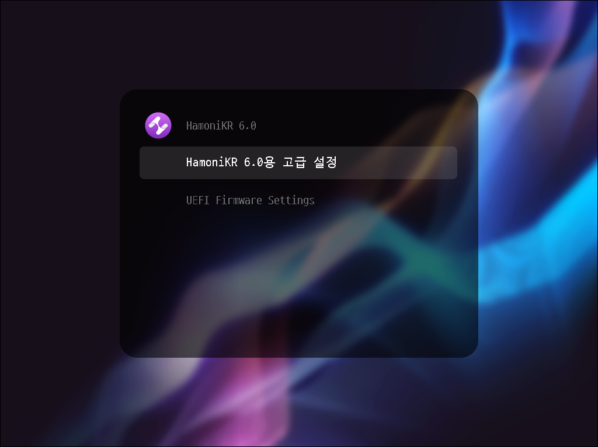
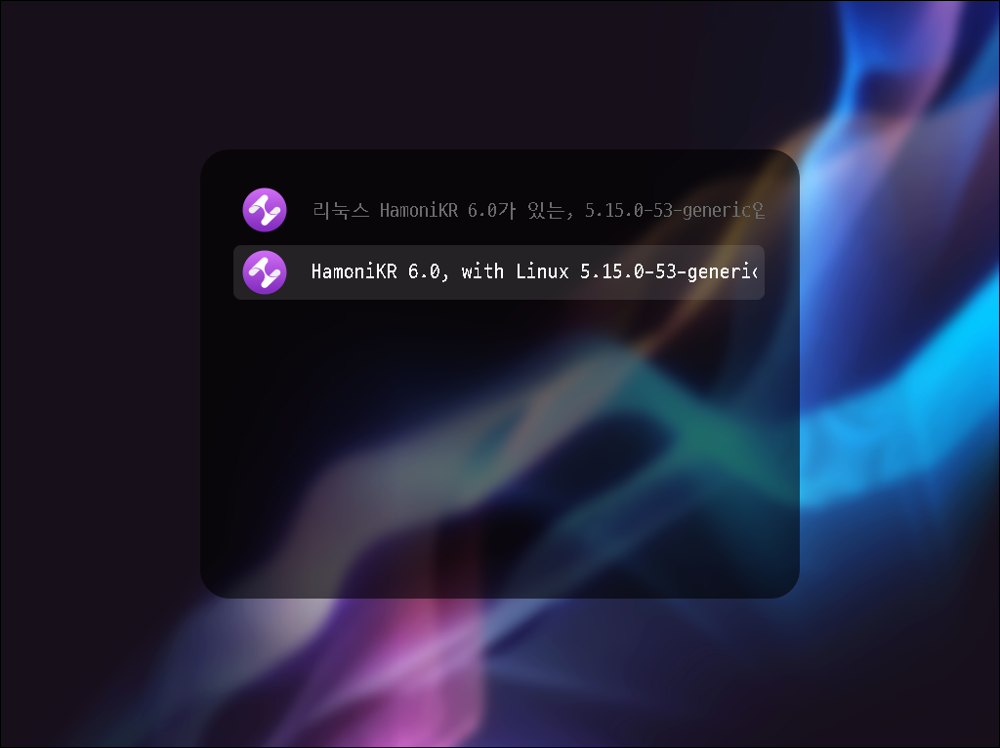
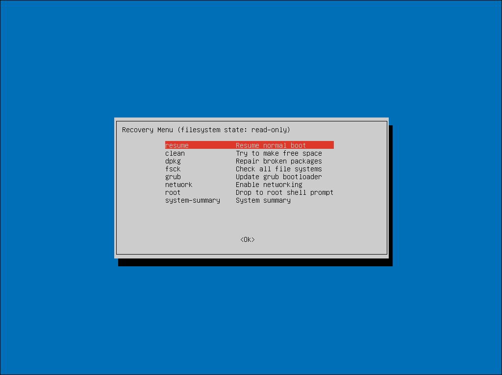
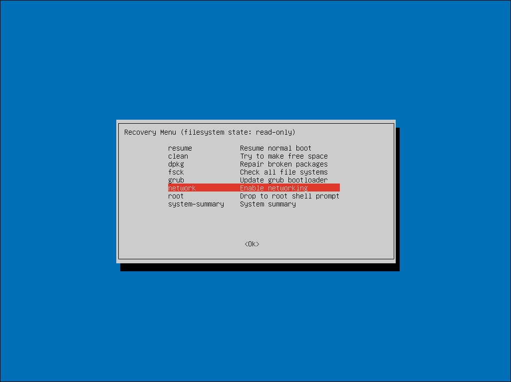
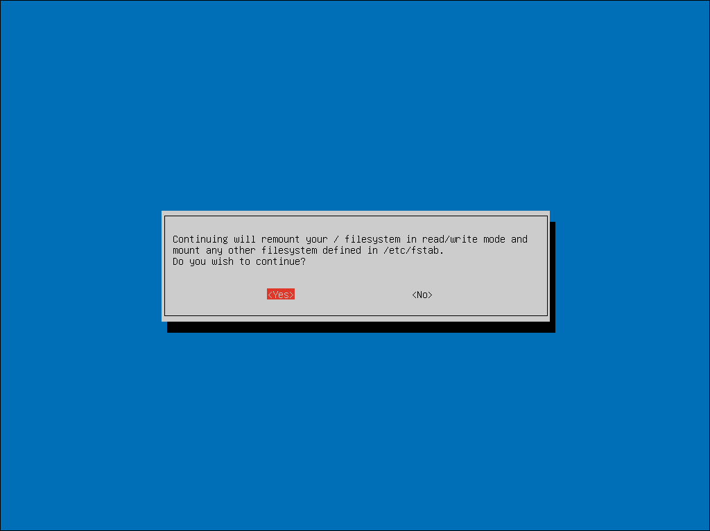
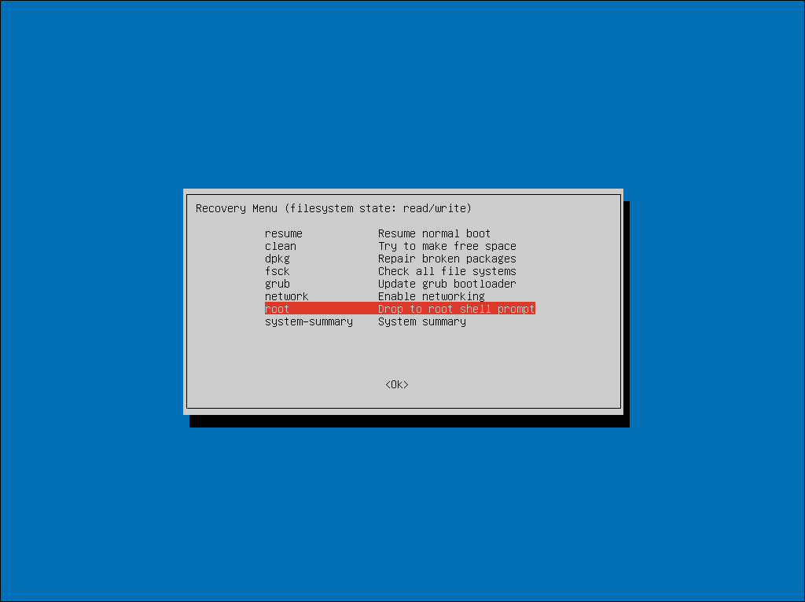
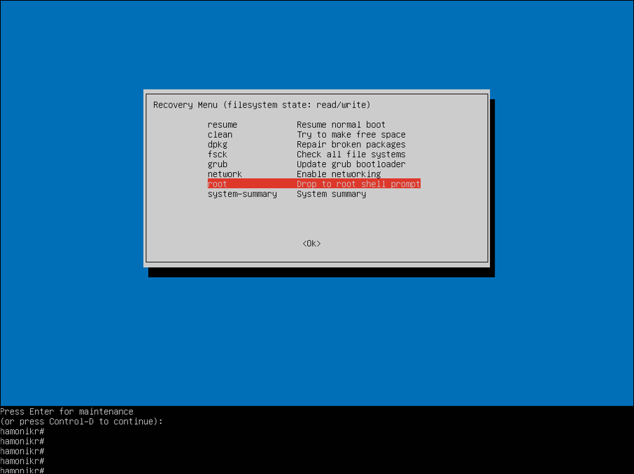
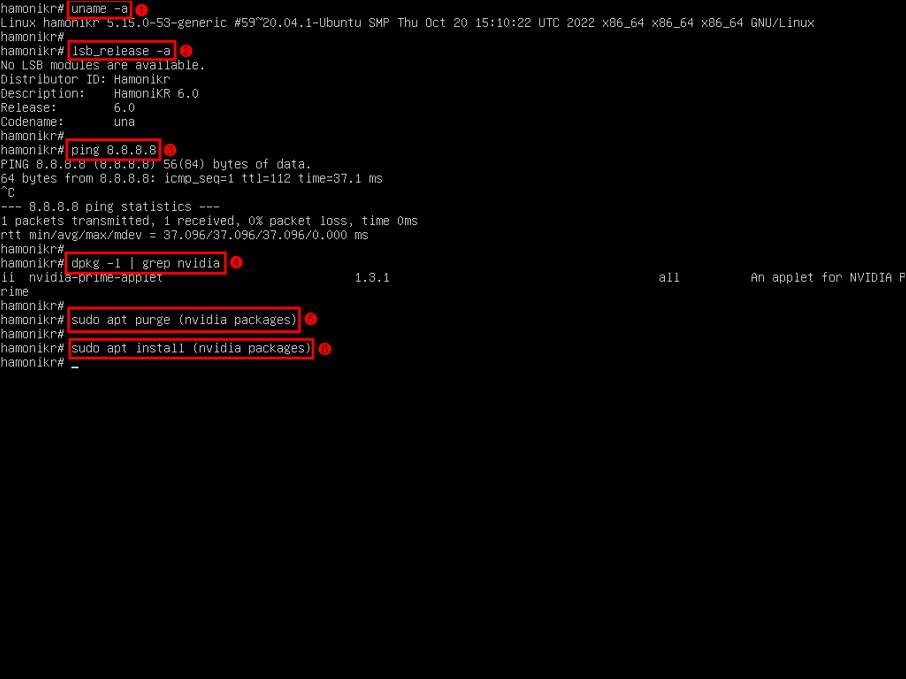
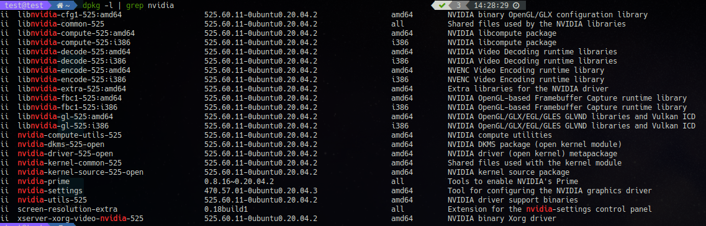
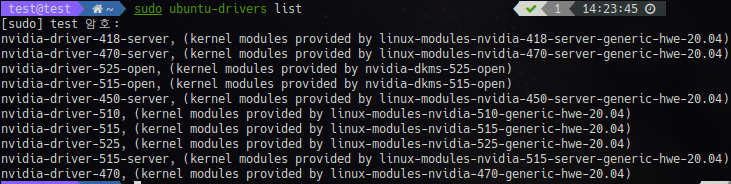

# 하모니카 그래픽 드라이버 재설치하기

하모니카 OS와 다른 기타 OS에는 nvidia 그래픽 드라이버 설치를 지원합니다.

하지만 최신 기종의 노트북이나 컴퓨터에서는 일부 최신 그래픽 드라이버를 적용할 경우 부팅시 화면이 보이지 않는 등 기타 문제가 발생할 수 있습니다.

부팅을 해도 GUI 화면이 보이지 않고 일반적으로 알고 있던 터미널을 쓰지 못하기 때문에 제거도 할 수 없어 당황할 수 있지만 다음 가이드를 통해 이 문제를 해결하는 방법에 대해 말씀드리겠습니다.


## Recovery Mode 사용하기

우선 컴퓨터를 부팅하실 때 다음과 같은 부팅 grub 선택화면이 나와야 합니다.

윈도우와의 듀얼 부팅 환경이라면 따로 조치할 필요 없이 해당 화면이 나오지만

하모니카 단일 OS 환경이라면 다음과 같이 시도합니다.

**방법 1** : 컴퓨터가 부팅될 때 (검은화면) 하모니카 로고가 나오기 전에 ESC 키를 한번만 누릅니다.

(해당 방법은 연타할 경우 grub 이라고 적힌 터미널 환경을 보실 수 있는데 그럴 경우 재부팅을 해줍니다.)

**방법 2** : 컴퓨터가 부팅될 때 Shift 키를 꾹 누르고 있습니다.

(OS 환경이나 기타 상황으로 인해 동작을 안할 수 있습니다.)

다음 화면이 나오면 고급 설정으로 들어갑니다.

<figure><figcaption></figcaption></figure>

고급설정으로 들어가게 되면 설치되어 있는 커널에 따라 리스트 목록이 표시됩니다.

첫번 째를 선택하면 해당 커널로 OS를 부팅하겠다는 내용이고

**두번 째를 선택해야 recovery mode 로 진입합니다.**

만약 커널로 인해 더 많은 내용이 리스트에 표시된다면

현재 사용하고 있는 커널 버전이 표시된 항목의 2번째를 선택하시면 됩니다.

<figure><figcaption></figcaption></figure>

recovery mode를 선택하고 부팅하면 다음과 같이 Recovery Menu가 나오게 됩니다.

<figure><figcaption></figcaption></figure>

우선 터미널을 사용하기 전에 network를 먼저 연결해 주어야 합니다.

network 항목을 선택하고 엔터를 누릅니다.

<figure><figcaption></figcaption></figure>

쓰기 권한이 필요하기 때문에 허용한다는 메세지 입니다.

Yes를 선택합니다.

<figure><figcaption></figcaption></figure>

네트워크가 연결되었다면 root를 선택하여 터미널 환경으로 진입합니다.

<figure><figcaption></figcaption></figure>

root 환경을 선택하면 하단에 입력할 수 있는 창이 나오게 됩니다.

<figure><figcaption></figcaption></figure>

① 현재 커널 환경을 확인하실 수 있습니다.

```
uname -a
```

② 현재 하모니카 OS 릴리즈 이름 정보를 확인하실 수 있습니다.

```
lsb_release -a
```

③ 네트워크가 잘 연결되어 있는지 확인하실 수 있습니다.

입력 후 종료는 Ctrl + C 버튼을 이용하시면 됩니다.

```
ping 8.8.8.8
```

④ nvidia 그래픽 드라이버 정보를 확인하실 수 있습니다.

VM 환경이기 때문에 패키지가 나오지 않았습니다.

하단에 추가한 이미지를 참고해주세요.

```
dpkg -l | grep nvidia
```

⑤ nvidia 관련 패키지를 모두 제거합니다.

약 24개의 패키지가 제거되며 추후 그래픽 드라이버 설치시 다시 설치됩니다.

```
sudo apt purge $(dpkg -l | grep nvidia | awk '{print $2}')
```

⑥ nvidia 관련 패키지를 설치합니다.

먼저 설치 가능한 nvidia 목록을 확인합니다.

```
sudo ubuntu-drivers list
```

리스트 목록에서 문제가 있었던 그래픽 드라이버를 제외한 다른 그래픽 드라이버를 설치합니다.

```
sudo apt install (그래픽 드라이버 패키지명)
```

설치가 완료되었다면 재부팅을 해주시면 됩니다.

<figure><figcaption></figcaption></figure>

### 설치된 nvidia 패키지 확인하는 법

```
dpkg -l | grep nvidia
```

<figure><figcaption></figcaption></figure>

### 설치 가능한 nvidia 패키지 확인하는법

<figure><figcaption></figcaption></figure>
