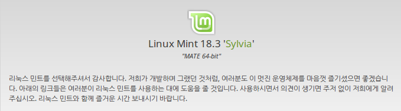
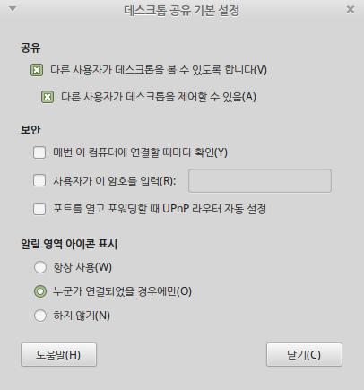
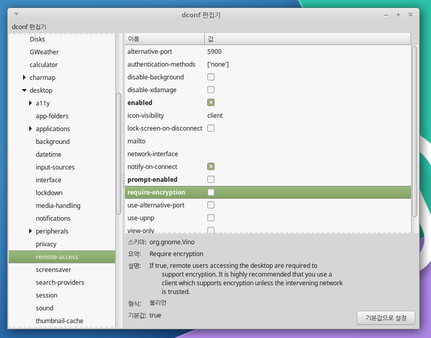
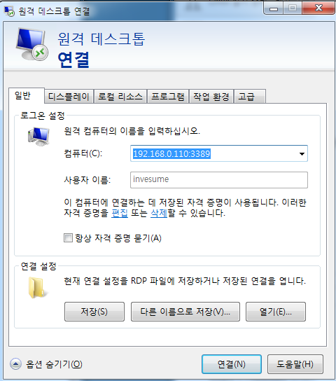
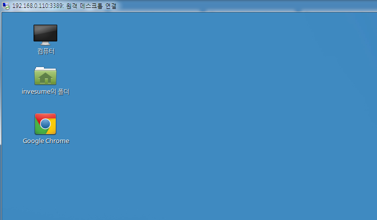
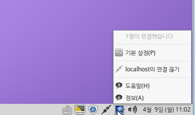

# 하모니카 리눅스 원격 데스크탑 접속

윈도우에서 하모니카 리눅스에 터미널 방식이 아닌 원격 데스크탑으로 접속이 필요한 경우에는 다음과 같이 사용할 수 있습니다.

테스트 환경 : 하모니카 커뮤니티 에디션, Linux Mint 18.3&#x20;

## **패키지 설치** 

먼저 다음과 같이 필요한 패키지를 설치해야 합니다.

**#sudo apt-get install xrdp vino**

## **설정** 

루트가 아닌 일반 사용자 계정으로 다음 명령을 실행하고 다음과 같은 데스크톱 공유 설정화면에서 공유를 허용해 줍니다.

**#vino-preferences**

설치한 xrdp 환경설정 파일을 다음과 같이 수정해 줍니다.

&#x20;**#sudo vi /etc/xrdp/xrdp.ini**

\[globals]\
bitmap\_cache=yes\
bitmap\_compression=yes\
port=3389\
crypt\_level=low\
channel\_code=1\
max\_bpp=32

\[xrdp1]\
name=sesman-Xvnc\
lib=[libvnc.so](http://libvnc.so)\
username=ask\
password=ask\
ip=127.0.0.1\
port=5900

원격에서 접속이 가능하도록 방화벽을 추가해 줍니다

**# sudo ufw allow 3389**

### 트러블슈팅) security level 관련 문제로 접속이 안되는 경우 

security level is 0 문제

> started connecting\
> connecting to 127.0.0.1 5900\
> tcp connected\
> security level is 0 (1 = none, 2 = standard)\
> error - problem connecting

먼저 설정을 쉽게 고칠 수 있는 프로그램을 설치합니다.

**#sudo apt-get install dconf-editor**

설치가 완료되었으면 일반 사용자로 다음 명령을 실행합니다.

**#dconf-editor**

* org > gnome > desktop > remote-access 메뉴를 찾아서
* require-encryption 체크를 해제 합니다.

## **원격 데스크탑 접속** 

윈도우의 원격 데스크탑 접속프로그램을 실행해서 접속을 원하는 원격 데스크탑의 ip를 다음과 같이 입력합니다.

만일 다른 포트를 사용하도록 설정한 경우 아이피:포트 로 접속을 시도할 수 있습니다.

## 접속 완료 

한영키 전환은 ctrl+space 키를 사용할 수 있습니다.

