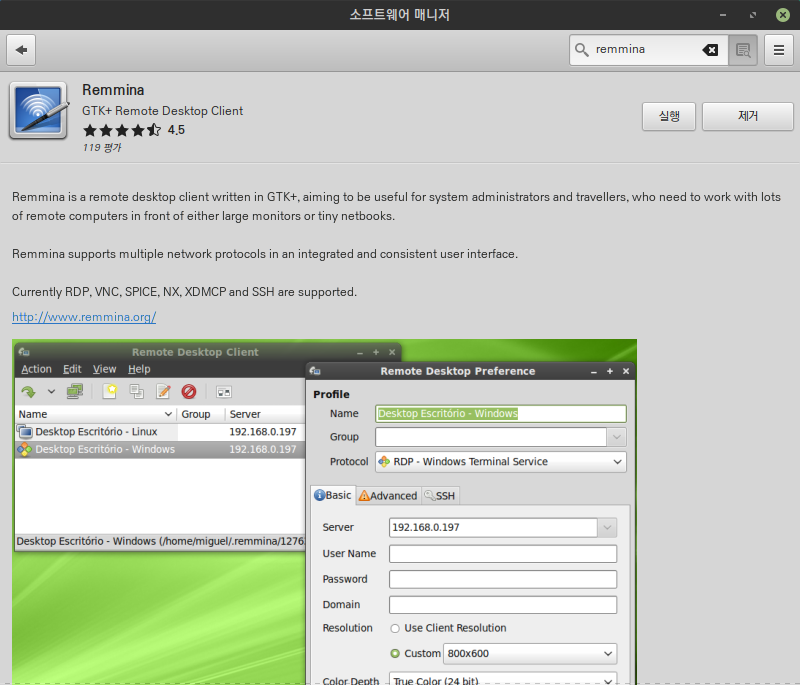
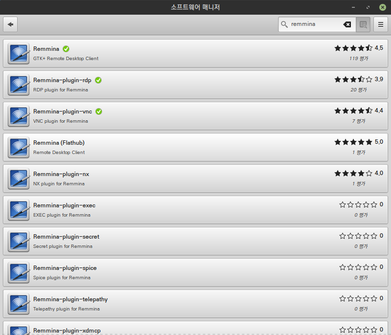
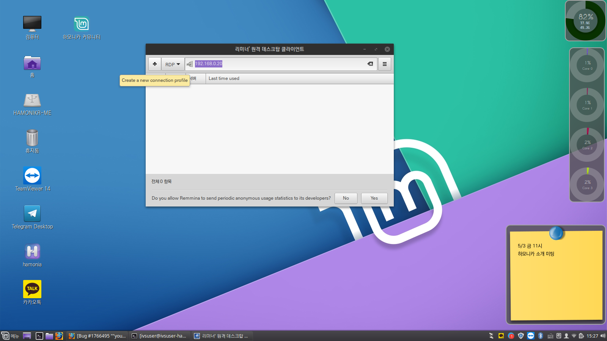
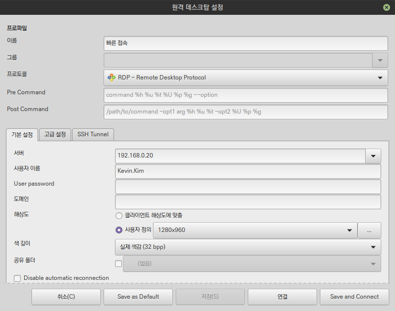
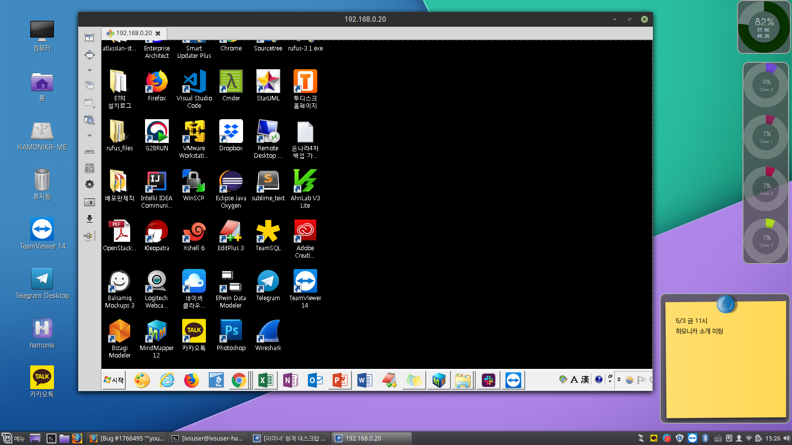

# 윈도우 PC 원격데스크톱 접속하기

하모니카 리눅스에서 윈도우 PC에 접속하여 사용하기 위해서 remmnia 프로그램을 이용하면 쉽게 접속이 가능합니다.

테스트환경 : 하모니카 ME 1.2 와 윈도우 7

## 설치 

소프트웨어 센터에서 아래의 3가지 프로그램을 설치한다.

* remmina
* remmina-rdp-plugin
* remmina-vnc-plugin

## 설정 

프로그램을 실행 후 접속에 필요한 설정을 하고 접속을 시도한 후, 클라이언트 해상도 사용 설정으로 오류가 나는 경우 다음과 같이 해상도 조정을 해준다.

## 접속 

윈도우 PC에서 원격데스크톱 접속을 허용해 준 후 하모니카 PC에서 원격 데스크톱을 접속하면 다음과 같이 사용할 수 있습니다.

