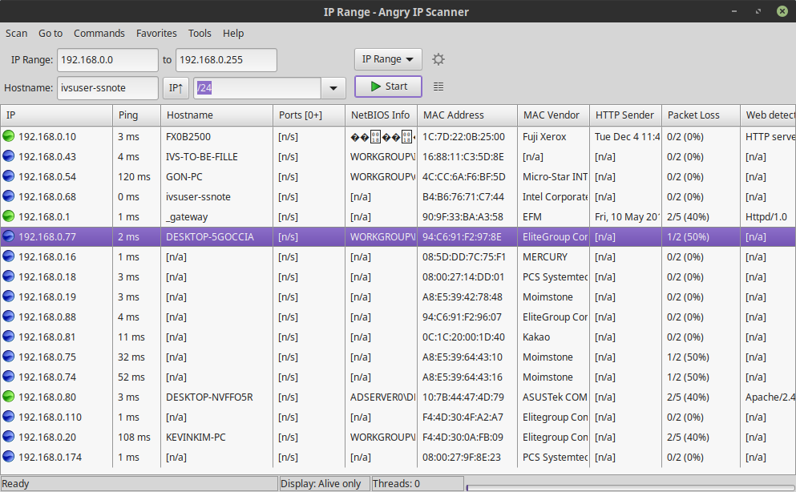

# 하모니카 PC 에서 네트워크 스캐너 사용하기

윈도우, 리눅스, 맥 용 모두 제공되는 네트워크 스캐너는 아래의 링크에서 다운로드 받을 수 있습니다.

[https://angryip.org/download/#linux](https://angryip.org/download/#linux)

다운로드 받은 파일을 더블클릭하면 설치프로그램이 떠서 설치할 수 있으며

설치 후 프로그램을 실행하면 다음과 같은 화면이 나타납니다.

IP Range 에 검색하고 싶은 주소의 대역을 적고 Start 버튼을 누르면 네트워크 스캔의 검색 결과를 확인할 수 있습니다.

